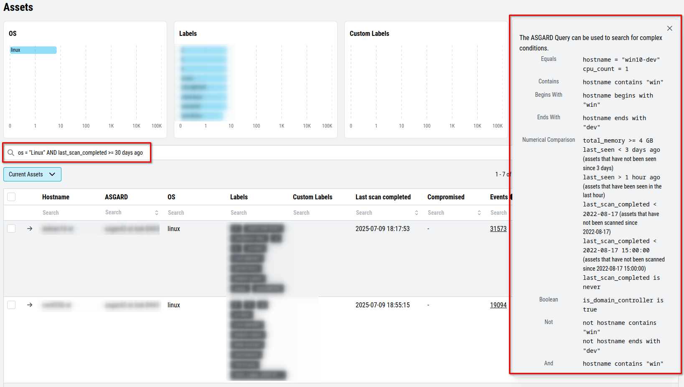

.. Index:: Link Management Center

Link ASGARD Management Center
-----------------------------

``>Settings\Connected Systems\Management Center``

In order to receive log data from your ASGARD Management Center(s), add
them in the corresponding section in the system settings:

.. figure:: ../images/cockpit_link_asgard_mc.png
   :alt: Link ASGARD Management Center

   Link ASGARD Management Center

After you have connected the two components, all assets along with additional
information from ASGARD will show up in the ``Assets`` section of your Analysis
Cockpit.

.. figure:: ../images/cockpit_assets.png
   :alt: Asset View after a Successful Connection

   Asset View after a Successful Connection

Asset View
----------

``>Assets``

In most cases working with the ``Baselining`` section and the ``Cases`` section
can be seen as the best practice approach for setting baselines and
dealing with alerts and warnings.

However, in some cases it makes sense to change perspective and rather
go for a host centric approach. The Analysis Cockpit will calculate
numbers of lines in different case types (Incident, Suspicious, Anomaly,
etc.) on a per host basis for a given time frame. Information from the
ASGARD, such as last scan dates, labels, host availability, and many more
can allow for an entirely different perspective.

By using the "Asset View" you can easily answer questions like:

-  Which systems appear most often in **Incident** cases?
-  Which systems haven't reported a single event for more than a month?
-  Which Domain Controllers have not been scanned yet?
-  Which systems in the subnet "192.168.0.0/16" appear in
   **Incident** cases?

You can also set a time when an asset was compromised. This is useful
when you want to see which systems were compromised in the last 30 days.

In combination with the ``ASGARD Query`` and ``Labels``, which are identical
to your ASGARD, you can even narrow down the events by system group
(e.g., Domain Controllers, or certain locations).

   Filtering within the Assets view
