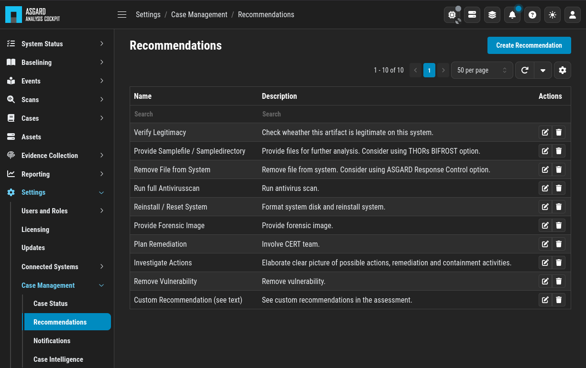

.. Index:: Canned Recommendations

Configure Canned Recommendations
--------------------------------

Canned recommendations are predefined actions that can be used within a
case. The recommendations are fully configurable and are aimed to
facilitate choice making regarding the action that should be applied for
a specific case. There is no need to set this up, but we suggest doing
some planning and provide recommendations that are suitable for your
organization. Some recommendations such as ``Verify Legitimacy``, ``Provide
Sample File / Sample Directory``, ``Run full Antivirus Scan`` are already
generated by default. You are free to use, modify or delete them.
Recommendations can also be added by any user from within a case.

   Case Management- Recommendations
