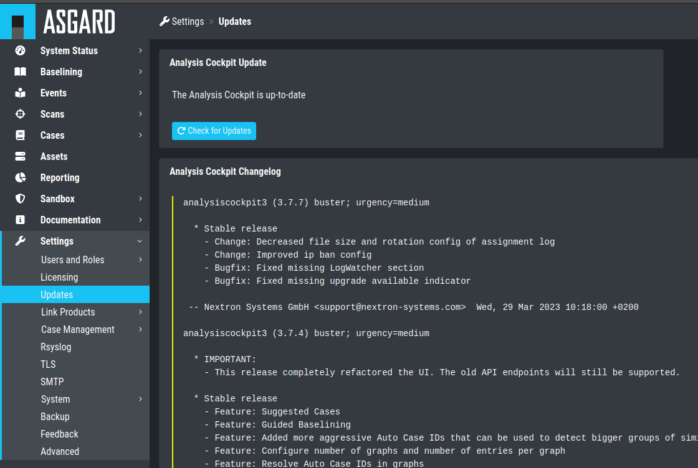
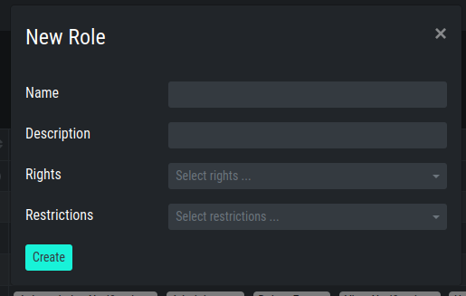

.. Index:: Initial Configuration

Administration
==============

License Installation
--------------------

Before you can use the cockpit, you must install a license. Navigate to
the Licensing section, click the ``Upload License`` Button, select your
license file and click the ``Upload`` Button.

.. figure:: ../images/cockpit_license.png
   :alt: Licensing 

   Licensing

System Update
-------------

All updates can be done from the Web GUI. Simply navigate to the Updates
section, review the release notes and click the update button. You can
also check for new updates by clicking the ``Check for Updates`` Button.

   Updating the System

Set Users and User Rights
-------------------------

The chapter :ref:`basic-concepts/permissions:understanding users, roles, rights and case status`
already described how to set up a 2-level analyst model for working with cases.
The roles defined in that section are non-administrative roles, meaning
they are only allowed to access cases based on the respective status of
a ticket.

Additionally, roles can have the following rights:

* Administrator
* Universal
* View Notifications
* Acknowledge Notifications
* Upload Events
* Delete Events
* Upload File(s) for Sandbox Analysis
* Download File(s) for Sandbox Analysis

Roles can be granted these privileges by choosing them in the ``New Role``
dialogue.

   New Role
