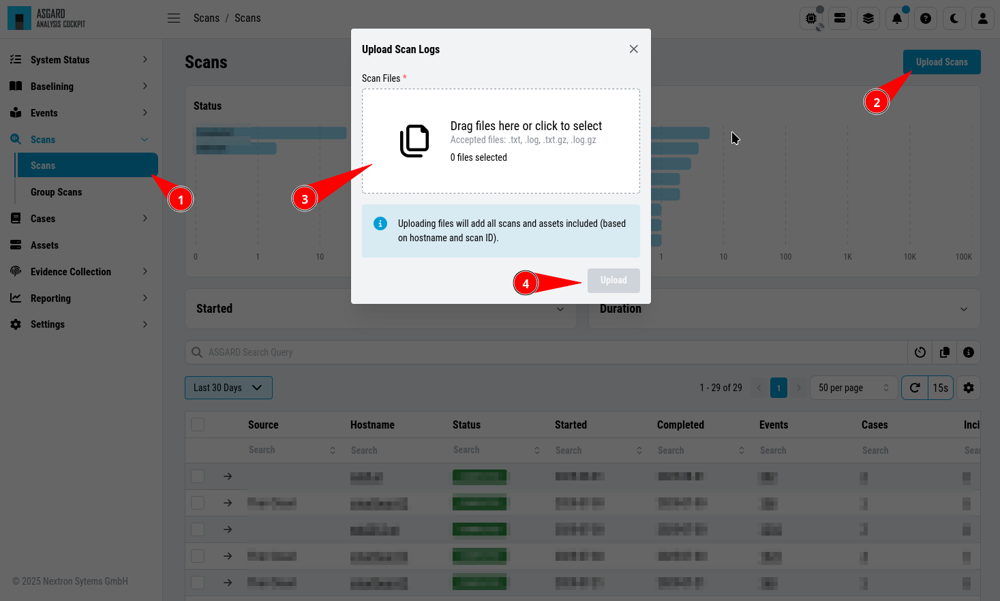
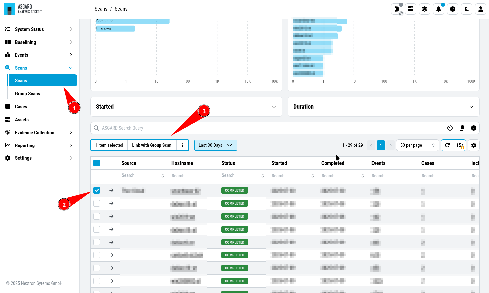

.. Index:: Log File Import

Log File Import
---------------

Basic Concepts
^^^^^^^^^^^^^^

In general, all logs show up in the Events section. Additionally, all
Alerts and Warnings that are not matching a particular case will show up
in the ``Baselining`` section. Notices and informational events will NOT
show up in the Baselining Section as they match the predefined default
cases for these events.

All logs are tagged with a specific scan id – regardless of how the log
was integrated. This enables filtering down to all logs contained in a
specific scan.

If ASGARD Management Center is connected and the events was generated as
part of a group scan the event is also tagged with this particular group
scan id. This allows for filtering down to all logs a particular group
scan.

Assets are identified through the asset ID that was issued by ASGARD
Management Center during the setup of the ASGARD Agent. If this ID is
not available to the Analysis Cockpit (e.g. log has been uploaded
manually or sent through syslog) the hostname (NOT the FQDN) will be
used instead.

Direct Integration with ASGARD Management Center
^^^^^^^^^^^^^^^^^^^^^^^^^^^^^^^^^^^^^^^^^^^^^^^^

If the Analysis Cockpit is linked to one or more ASGARD Management
Centers, all THOR logs get integrated automatically and will show up in
the Baselining and/or the Events section. Aurora Events will also
automatically show up.

To see how to connect an ASGARD Management Center with your Analysis
Cockpit, follow the instructions in the chapter
:ref:`administration/amc:connect to asgard management center`.

You can retrieve old scans performed by ASGARD Management Center before
connecting it to Analysis Cockpit using the ``Request Events`` button in
the ``Scans`` section.

.. figure:: ../images/cockpit_scan_request_events.png
   :alt: Request Events from Scan

   Request Events from Scan

Syslog Input
^^^^^^^^^^^^

Another way to import log data is by using SYSLOG messages.

The ANALYSIS COCKPIT listens on port 514/udp and 514/tcp for incoming
log data and all logs will show up in the Baselining and/or the Events
section.

Incoming syslog messages get assigned to single scan using the "ScanID"
value that's unique in each scan.

File Import Through Web-Based GUI
^^^^^^^^^^^^^^^^^^^^^^^^^^^^^^^^^

Alternatively, logs can be uploaded through the web-based interface by
selecting the particular log file (must be the .txt format, html import
is not supported) and clicking the ``Upload Scans`` button within the
Scans section.

.. note::
   You can upload one or more THOR scans in one or more text files.
   The Analysis Cockpit will automatically generate scans in the database,
   based on the scanned assets and the SCAN_IDs in the events. Only .txt,
   .log, .txt.gz and .log.gz files are supported.

   Upload logs using the web-based interface

After a successful upload, the scans should appear in the list below.

.. important::
   If you can not see events in the ``Events`` or ``Baselining`` views,
   please make sure that you've selected the correct time frame as filter.
   Often times manually uploaded scans happened days or weeks before the
   upload. The log data gets indexed with the timestamp of their creation
   and not the import, and can therefore be hidden in the default view.

After the upload, you're able to link the recently uploaded scans with
an existing or new group scan. You can also unlink scans from a group scan.

   Link/Unlink scans with an existing or new group scan

File Import Using the Command Line
^^^^^^^^^^^^^^^^^^^^^^^^^^^^^^^^^^

This option can be helpful in an environment where you scan without
ASGARD Management Center but want to automate analysis by dropping the
log data into that import directory.

Log files can be imported by placing the files in the following
directory:

``/var/lib/nextron/analysiscockpit3/events``

Make sure that user and group of these files is set to ``cockpit``.

You can change the owner and group manually by using:

.. code:: console
   
   nextron@asgard-ac:~$ sudo chown cockpit:cockpit <file>

Successfully imported files get a new extension named ``.ok``.

When the file is moved to that folder with the wrong permissions,
Analysis Cockpit tries to handle these situations in the appropriate way.
If the Analysis cockpit had read access but no rights to
write/delete/rotate/rename the file, the file gets blacklisted in memory
and will not be imported as long as the service doesn't get restarted. A
restart of the service would cause the service to re-index the log data
placed in that folder.

.. important::
   We highly recommend not to directly copy (scp, rsync) files
   into that folder, but use a staging folder in which you set the right
   permissions and then copy the files to the import folder.

Copying files directly to that folder has many problematic side effects,
e.g. files partly composed of binary zeros because the file transfer is
still in progress.
