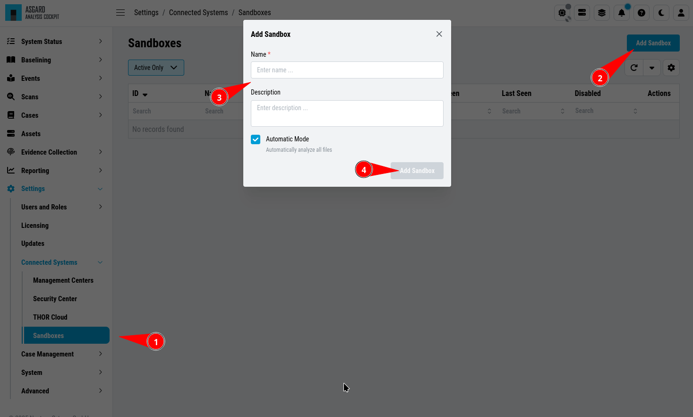

.. Index:: Sandbox Integration

Sandbox Integration
-------------------

You can configure your Analysis Cockpit to upload files to a local sandbox.
Currently you can use `CAPEv2 <https://github.com/kevoreilly/CAPEv2>`_ only.

Additionally, you can look at the following ``python`` file and write
your own connector, for a different sandbox, if you need to:
``/usr/share/asgard-analysis-cockpit/sandbox/connector/capev2.py``

.. note:: 
   This section only focuses on the integration of your Analysis Cockpit
   with an existing sandbox. We will not cover how to set up the sandbox.
   Since the CPAEv2 Sandbox is an open source tool provided by the broader
   community, we encourage you to read through the extensive documentation
   to get an overview of the setup process.

Analysis Cockpit Sandbox Configuration
^^^^^^^^^^^^^^^^^^^^^^^^^^^^^^^^^^^^^^

``>Settings\Connected Systems\Sandboxes``

Click ``Add Sandbox`` in the top right corner to add a new sandbox. Keep the 
``Name`` short and add a proper ``Description``.

   Adding a new Sandbox

If you wish to enable automatic scanning for uploaded files
(`Bifrost <https://asgard-manual.nextron-systems.com/latest/administration/evidence.html>`_),
you can do so by checking the ``Automatic Mode``.

Once you click ``Add`` the page will display an API token. Copy this token, you will need it later.

.. figure:: ../images/cockpit_sandbox_token.png
   :alt: Sandbox API Token

   Sandbox API Token

Connect to your Analysis Cockpit via SSH and follow the steps below.

Change the user to the root user:

.. code:: console

   nextron@cockpit:~$ sudo su -
   [sudo] password for nextron:
   root@cockpit:~# 

We change into the configuration directory of the Analysis Cockpit:

.. code:: console
   
   root@cockpit:~# cd /usr/share/asgard-analysis-cockpit/sandbox/connector
   root@cockpit:/usr/share/asgard-analysis-cockpit/sandbox/connector#

Here you can find multiple files and folders. The ``.py`` and ``.ini``
files each represent the type of sandbox you want to integrate with. In
this example, we will configure the CAPEv2 sandbox with our Analysis Cockpit.

.. code:: console
   
   root@cockpit:/usr/share/asgard-analysis-cockpit/sandbox/connector# ls -lA
   total 40
   drwxr-xr-x 2 root root 4096 16. Jan 11:20 analysiscockpit
   -rw-r--r-- 1 root root  252 16. Jan 10:26 capev2.ini
   -rwxr-xr-x 1 root root 9834 16. Jan 10:26 capev2.py
   -rw-r--r-- 1 root root  277 16. Jan 10:26 cuckoo.ini
   -rw-r--r-- 1 root root 9867 16. Jan 10:26 cuckoo.py
   drwxr-xr-x 2 root root 4096 16. Jan 11:20 sandboxapi

Here we have two files which are of relevance to us:

- capev2.ini

  - This holds the configuration for both the sandbox and your Analysis Cockpit

- capev2.py
      
  - This has the systemd configuration to create the actual service on the system (we don't change anything in here)

Change the ``capev2.ini`` with a text editor. The important lines, which need to
be changed accordingly to your environment, are marked:

.. code-block:: console
   
   root@cockpit:/usr/share/asgard-analysis-cockpit/sandbox/connector# nano capev2.ini

.. code-block:: ini
   :linenos:
   :emphasize-lines: 6-10, 16-17

   [DEFAULT]
   debug = yes
   tmp_directory = /usr/share/asgard-analysis-cockpit/sandbox/capev2

   [capev2]
   protocol = http
   host = 192.168.0.50
   port = 8000
   token = <your CAPEv2 API token here>
   verify = no
   all = yes
   html = yes

   [analysis-cockpit]
   host = localhost:443
   apikey = <your API Key here>
   verify = no

For lines 6-10, please fill the information accordingly. ``host`` is the IP/FQDN
of your sandbox. ``port`` is the listening port of the web interface of your sandbox.
``token`` is the API token generated in the user management of your sandbox.
``verify`` is for verification of the TLS certificate (if you don't use TLS or don't
want to verify the certificate, set this option to ``no``).

For lines 16-17 you have to set the ``apikey`` of your Analysis Cockpit (see "Add
Sandbox" step in the beginning of this section) and ``verify``, which can be set to
``no``; this will verify the TLS certificate.

Save your files after you made your changes.

Now you have to create a new directory and give the ``analysiscockpit`` user permission:

.. code:: console
   
   root@cockpit:/usr/share/asgard-analysis-cockpit/sandbox/connector# mkdir /usr/share/asgard-analysis-cockpit/sandbox/capev2
   root@cockpit:/usr/share/asgard-analysis-cockpit/sandbox/connector# chown -R analysiscockpit: /usr/share/asgard-analysis-cockpit/sandbox/

We need to create a systemd service file in order to run the CAPEv2 connector on your
Analysis Cockpit. Below you can find a predefined service file which we will use: 

.. code-block:: ini
   :linenos:

   [Unit]
   Description=CAPEv2 Sandbox Connector
   After=network.target
   
   [Service]
   ExecStart=/usr/bin/python3 /usr/share/asgard-analysis-cockpit/sandbox/connector/capev2.py
   Restart=on-failure
   User=analysiscockpit
   Group=analysiscockpit
   SyslogIdentifier=capev2_connector
   
   [Install]
   WantedBy=multi-user.target

Now we run the following command and paste the content from the output earlier into it:

.. code-block:: console

   root@cockpit:/usr/share/asgard-analysis-cockpit/sandbox/connector# nano /lib/systemd/system/capev2-connector.service

The file should now look like this:

.. code-block:: console

   root@cockpit:/usr/share/asgard-analysis-cockpit/sandbox/connector# cat /lib/systemd/system/capev2-connector.service
   [Unit]
   Description=CAPEv2 Sandbox Connector
   After=network.target

   [Service]
   ExecStart=/usr/bin/python3 /usr/share/asgard-analysis-cockpit/sandbox/connector/capev2.py
   Restart=on-failure
   User=analysiscockpit
   Group=analysiscockpit
   SyslogIdentifier=capev2_connector

   [Install]
   WantedBy=multi-user.target

   root@cockpit:/usr/share/asgard-analysis-cockpit/sandbox/connector#

Now that the systemd service file is created, we need to activate it. Run the following command:

.. code-block:: console

   root@cockpit:/usr/share/asgard-analysis-cockpit/sandbox/connector# systemctl daemon-reload && systemctl enable capev2-connector && systemctl start capev2-connector
   Created symlink /etc/systemd/system/multi-user.target.wants/capev2-connector.service → /lib/systemd/system/capev2-connector.service.

The connection to your sandbox should work now. You can see the ``capev2.log`` for debug output and troubleshooting:

.. code-block:: console

   root@cockpit:~# tail /usr/share/asgard-analysis-cockpit/sandbox/capev2.log
   22-11-15 12:07:46 DEBUG: Starting new HTTPS connection (1): localhost:443
   22-11-15 12:07:46 DEBUG: https://localhost:443 "GET /api/sandboxes/a/reports/pending?limit=10&offset=0 HTTP/1.1" 200 13
   22-11-15 12:07:46 DEBUG: no pending references found
   22-11-15 12:08:46 DEBUG: Starting new HTTP connection (1): 192.168.0.50:8000
   22-11-15 12:08:46 DEBUG: http://192.168.0.50:8000 "GET /apiv2/cuckoo/status/ HTTP/1.1" 200 289
   22-11-15 12:08:46 DEBUG: Starting new HTTPS connection (1): localhost:443
   22-11-15 12:08:46 DEBUG: https://localhost:443 "GET /api/sandboxes/a/get-sha256s-without-report?limit=10 HTTP/1.1" 200 13
   22-11-15 12:08:46 DEBUG: Starting new HTTPS connection (1): localhost:443
   22-11-15 12:08:46 DEBUG: https://localhost:443 "GET /api/sandboxes/a/reports/pending?limit=10&offset=0 HTTP/1.1" 200 13
   22-11-15 12:08:46 DEBUG: no pending references found
   root@cockpit:~# 

Analysis Cockpit Sandbox Usage
^^^^^^^^^^^^^^^^^^^^^^^^^^^^^^

| ``>Evidence Collection\Collected Evidences``
| ``>Evidence Collection\Sandbox Reports``

In the ``Collected Evidences`` view you can see previously analyzed files or
upload files for analysis by yourself:

After your file has been uploaded, you have to wait until your sandbox
is finished with analyzing the file. Change to the ``Sandbox Reports`` view
to see the status of the files.

Once the file was analyzed and the reports are ready, you will see that
the status of the file changed to ``SUCCESS`` and the buttons ``REPORT``,
``JSON`` and ``HTML`` can be clicked. You can now download the report.
