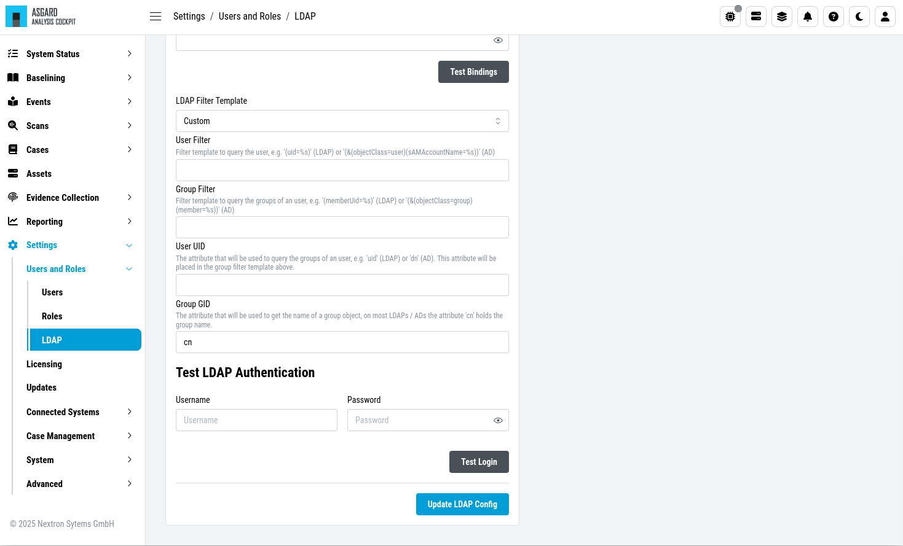

.. Index:: System Settings

TLS Certificate Installation
----------------------------

``>Settings\System\TLS``

Instead of using the self-signed TLS certificate which comes pre-installed
on your Analysis Cockpit, you should consider using your own TLS certificate.
This will avoid browser warnings when navigating to your Analysis Cockpit's
web interface.

You can click ``Generate CSR`` to open the following modal which
lets you specify the information needed for the CSR.

.. figure:: ../images/cockpit_new_csr.png
   :alt: Generate a Certificate Signing Request (CSR)

   Generate a Certificate Signing Request (CSR)

.. hint::
   In order to achieve the best possible compatibility with most browsers, we
   recommend using the system's FQDN in both fields ``Common Name`` AND ``Hostnames``. 

The generated CSR can be used to generate a TLS certificate via your
Certificate Authority. The resulting TLS certificate can then be
uploaded in the in the same section of your Analysis Cockpit.

.. figure:: ../images/cockpit_upload_certificate.png
   :alt: Upload a TLS Certificate

   Upload a TLS Certificate

Configure LDAP
--------------

``>Settings\Users and Roles\LDAP``

This section lets you configure a remote LDAP server to integrate with your
Analysis Cockpit. This lets you use existing LDAP/Windows Domain users to log
into the Analysis Cockpit, as well as define mappings between LDAP groups and
roles within the Analysis Cockpit.

   Configure LDAP

   Configure LDAP

Cockpit Notifications
---------------------

``>Settings\Case Management\Notifications``

You can define custom notifications for the following types:

- **Case Intelligence Match**
  
  * Case Intelligence Notifications are triggered when incoming events
    match a template for the first time. You can configure what kind
    of suggested cases trigger a notification, based on the case's type.

- **Case Change**

  * Case Change Notifications are triggered when a new case is created
    or an existing case is updated. You can configure what kind of cases
    trigger a notification, based on the case's status or type.

- **Unassigned Event**

  * Unassigned Event Notifications are triggered when newly incoming events
    are not automatically assigned to existing cases. You can configure what
    kind of events trigger a notification, based on the event's level or score.

- **Event Assignment**

  * Event Assignment Notifications are triggered when newly incoming events are
    automatically assigned to existing cases. You can configure what kind of
    cases trigger a notification, based on the case's status or type.

- **New Asset Affected**

  * Asset Affected Notifications are triggered when an asset is affected by a
    case for the first time. You can configure what kind of cases trigger a
    notification, based on the case's status or type.

The notification targets can be the following:

- Application (This shows a notification in the Analysis Cockpit)
- Syslog
- Email (SMTP has to be configured to use this)
- Webhook

.. figure:: ../images/cockpit_notifications.png
   :alt: Case Management - Notifications

   Case Management - Notifications

.. note::
   The Analysis Cockpit will collect all triggering events and send only
   one email every 15 minutes. Syslog and Webhooks are triggered in real
   time for every single event.

Below you can see how **Application Notifications** look like. You can see
the bell icon in the top right corner and view all ``unread`` notifications
by clicking the icon. ``Unread`` notifications can be ``Acknowledged`` by
selecting one or more notification and clicking ``Acknowledge``. The
notification bell in the status bar will only show an indicator if you
have unread notifications.

   UI Notification Bell

   UI Notifications

It is recommended to configure an *Event Assignment Notification* for events
that get added to existing **Incident** cases.

Configure Notifications
^^^^^^^^^^^^^^^^^^^^^^^

``>Settings\Case Management\Notifications``

To configure notifications, click the ``Create Notification`` button.
This leads you to a form that allows you to set a name for your
notification, the notification type (syslog, email, webhook or notification
within the Analysis Cockpit) and the condition that will trigger your notification.

   Example Notification Creation

You can have multiple **Notifications**, also of the same type.