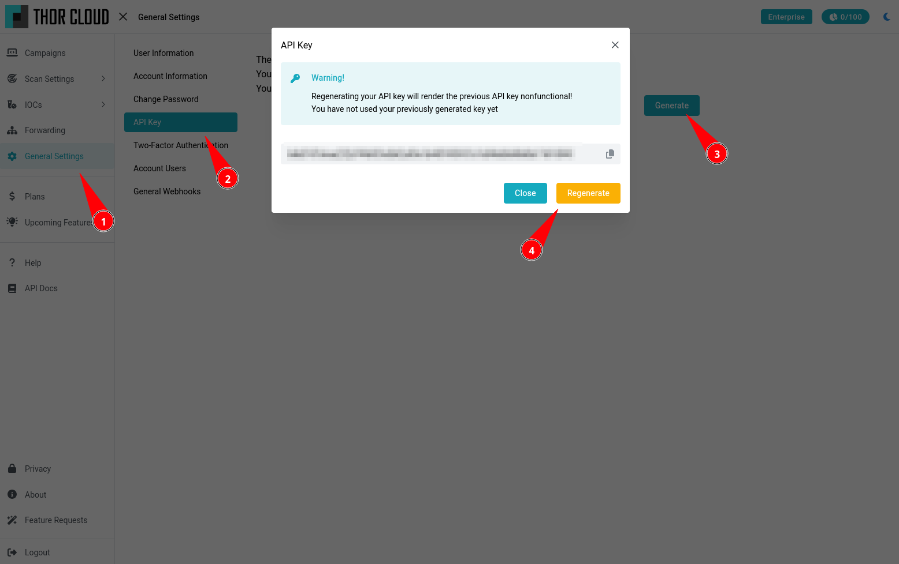
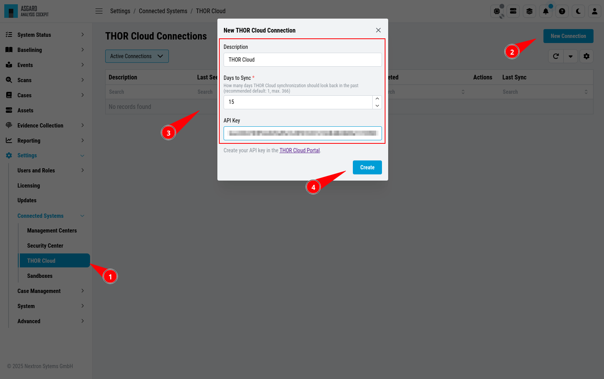
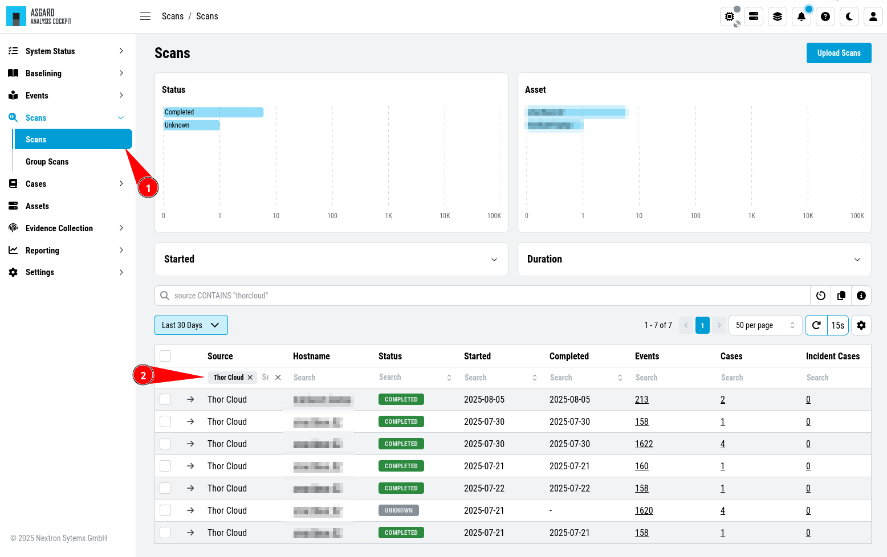

.. Index:: THOR Cloud

THOR Cloud Integration
----------------------

This chapter contains any relevant information to integrate
your THOR Cloud Account - and subsequently your THOR
scans - into your Analysis Cockpit.

What is THOR Cloud?
^^^^^^^^^^^^^^^^^^^

**THOR Cloud** is a central online service for deploying THOR,
collecting scan results, and storing them - without requiring
any agent on the target systems. You simply run the THOR Cloud
Launcher, which handles the entire process automatically.

THOR Cloud lets you focus on running your scans, without the
overhead of managing the infrastructure needed to deploy them
at scale.

For more information, visit https://www.nextron-systems.com/thor-cloud/

Connecting your Account
^^^^^^^^^^^^^^^^^^^^^^^

``>Settings\Connected Systems\THOR Cloud``

To connect your THOR account, please log into THOR Cloud and
generate an API key for your user.

   (Re)generating THOR Cloud API Key

.. warning::
   The API key has the same permissions as the user, so make
   sure not to share this key with anyone.

After you generated your API key, head to back to the Analysis
Cockpit and click ``New Connection``. Enter a description, set
how many days to sync, and paste your API key.

   New THOR Cloud Connection

If you delete a connection, the scans originating from that
connection will **not** be deleted. You have to do this manually.

Analysing THOR Cloud Logs
^^^^^^^^^^^^^^^^^^^^^^^^^

``>Scans\Scans``

If you filter for ``Thor Cloud`` in your scans, you can find the
scans originating from THOR Cloud. You can also find those events
in your normal Baselining or Events view, though the events themselves
do not indicate from which system they originate. If you want to trace
single events, you should work with Scan-IDs.

   THOR Cloud Scans