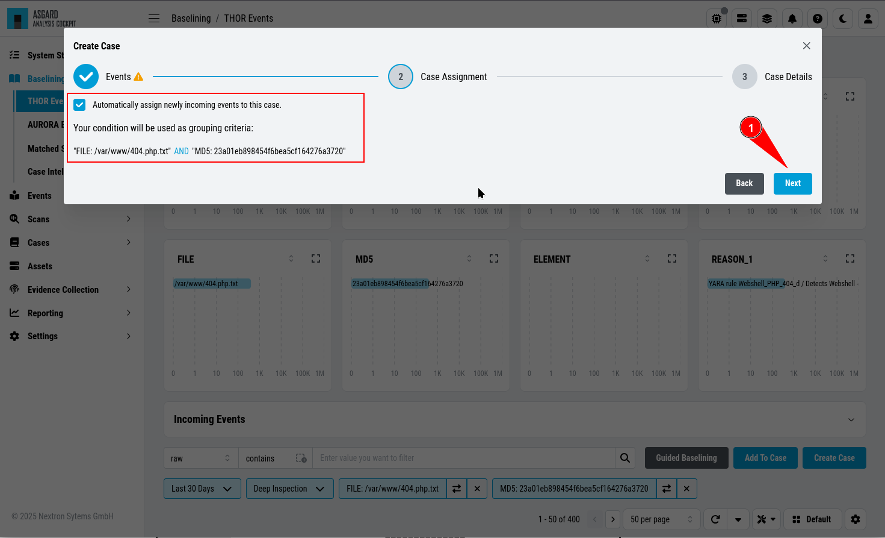

.. Index:: Case Creation Part 1

Manual Case Creation
--------------------

This section walks you through the manual case creation.
This method gives you more flexibility in terms of conditions
and details regarding the cases, but is more time consuming.

The results of the cases depending on specific settings you
are setting during the case creation.

Case Creation Basics
^^^^^^^^^^^^^^^^^^^^

Create a new case following these steps: 

1. Select on which conditions the case should be built. ``Search Result``

   will take your filters from the baselining view into consideration, and 
   build a case with the condition of your search.

.. figure:: ../images/cockpit_case_creation1.png

1. Inspect the Case Assignment and Conditions. Set Auto Assign if needed.

.. figure:: ../images/cockpit_case_creation2.png

3. Set a case **name**, which serves as title - use keywords that make it
   easy for other analysts to find it based on a few terms (e.g. if a false
   positive was caused by matches in **savedsearch.conf**, use this filename
   in the title of your case)
4. Select a sample event for the **summary** field 
5. Add your **assessment**
6. Choose one or more **recommendations**
7. Select a **case type** (see the :ref:`glossary/case-glossary:case types` for a detailed description of every case type)
8. Select a **case status** (usually used to mark it as 'work in progress' or to forward it to the next team)
9. Select a **case priority** (usually used to mark the importance of the case)
10. Submit case by clicking the **Create Case** button

Select Log Messages for a Case
^^^^^^^^^^^^^^^^^^^^^^^^^^^^^^

In order to create a meaningful case, you typically start with selecting
logs or groups of logs that you want to be contained in the case. This
can be done in various ways:

* by adding a custom filter in the search bar
* by clicking on one of the bars in the bar chart
* by clicking on the filter symbol in a field in a log line
* by using the Lucene Search Query

You can generate a filter condition using an expression in the search
field, choosing a category, deciding whether the expression should be
contained, equal etc. and clicking the search button. Clicking on one
of the bars in the bar chart or on the filter symbol in a field in a
log line will generate a filter condition, too.

.. figure:: ../images/cockpit_active_filters.png
   :alt: Active Filters

   Active Filters

.. hint::
   Filters can be negated by clicking on the two arrows symbol or delete it by clicking on the cross symbol.

Using the built-in custom filters is the most common and easiest way to
select groups of logs.

For those who prefer Lucene, an additional Lucene search bar can be
activated and can even be combined with the built-in custom search.

In order to activate the Lucene Query search just click the ``contains`` button and
choose ``Lucene Query``.

.. figure:: ../images/cockpit_lucene_filter.png
   :alt: Lucene Query

   Lucene Query

.. note:: 
   You can Alt/Shift click items in the top field view to add them as a ``NOT`` filter to your search. 

Case Creation from Search Results
^^^^^^^^^^^^^^^^^^^^^^^^^^^^^^^^^

This is the most relevant way to create a case. Create the filters, so
that you only see the logs you want to be contained in your case. Then
click the ``Create Case`` button, select ``Search results`` and add a name,
that makes sense to you.

If you want future incoming logs with the same log lines automatically assigned to this
case, you have to tick the checkbox ``Automatically assign newly incoming events to this case.``.

.. figure:: ../images/cockpit_assign_new_events_to_case.png
   :alt: Assign New Events to Cases

You may add a summary to your case.

.. figure:: ../images/cockpit_create_baseline_case.png
   :alt: Baselining - Create Case

   Baselining – Create Case

You may or may not add assessment, case type, recommendations or a
comment. After closing you will find the log section empty, as it is
still using your filter, but the matching log lines have been removed
from this section and added to the case.

.. figure:: ../images/cockpit_create_baseline_case_empty_search.png
   :alt: Log Section empty

   Log Section empty

Simply remove the filter and the remaining log lines will show up.

Case Creation from Selection
^^^^^^^^^^^^^^^^^^^^^^^^^^^^

In order to create a case from a specific selection of logs simply use
the checkboxes at the very left side of the table and click the ``Create Case`` button 
select ``Selected events`` and add a name, that makes sense
to you.

.. figure:: ../images/cockpit_case_creation_selection1.png
   :alt: Creating Cases from Selection

   Creating Cases from Selection

After closing you will find the selected logs have been removed from the
logs section.

Case Creation Using a Custom Condition
^^^^^^^^^^^^^^^^^^^^^^^^^^^^^^^^^^^^^^

To create a case with a condition, click the ``Create Case`` button and
select ``Condition``. Now you can build a condition by entering keywords
in the field.

Keywords in the same field are combined by **OR**, you can negate them by
clicking the ``NOT`` button or combine them with **AND** by clicking the
``Add AND Condition`` button. The filter bubbles you have generated before
will be used as default. You are free to use, modify or delete them.
Conditions only match on the ``raw`` field.

The ``Test Condition / Regular Expression`` button will calculate the
numbers of hits and return some matching and some non-matching events as
an example.

   Creating Cases through Condition

Again, you may or may not add auto assignment for future incoming
log lines, summary, assessment, case type, recommendations or a comment.
After closing you will find the selected logs have been removed from the
logs section.

Case Creation Using a Regular Expressions
^^^^^^^^^^^^^^^^^^^^^^^^^^^^^^^^^^^^^^^^^

In order to create a case from a regular expression just click the
``Create Case`` button and select 
``Regular Expression``. This lets you
write and test your regular expression.

The ``Test Condition / Regular Expression`` button will calculate the
numbers of hits and return some matching and some non-matching events as
an example.

   Creating Cases through Regular Expressions

Again, you may or may not add auto assignment for future incoming
log lines, summary, assessment, case type, recommendations or a comment.
After clicking the ``Create Case`` button, the matching lines will get
removed from the log management view.

.. warning:: 
   It is recommended to use regular expressions only rarely and with
   caution. This feature can severely impact the performance of the system.

ChatGPT Integration
^^^^^^^^^^^^^^^^^^^

You can use our ChatGPT integration to help with case creation. To do this
you need to have a ChatGPT API key. Navigate to ``Settings`` > ``Advanced`` >
``ChatGPT Integration``. Here you can enter your API key. You can test the
ChatGPT integration in the prompt at the bottom, to make sure everything is
working.

.. figure:: ../images/cockpit_chatgpt-integration.png
   :alt: ChatGPT Integration

   ChatGPT Integration

.. hint::
   If you wish to interact with ChatGPT while safeguarding sensitive information,
   consider using the :ref:`baselining/case-creation1:event anonymization` feature.

After you configured the ChatGPT integration, you can use it in the case creation
dialog. Click on the ChatGPT icon in the case creation dialog to gain more insights
regarding the events you are working with.

.. figure:: ../images/cockpit_chatgpt-case-creation.png
   :alt: ChatGPT Case Creation

   ChatGPT Case Creation

Once you clicked the button, a new dialog will open. Here you can see which information
will be send to ChatGPT. Once you are confident with the information, click on the
``Approve`` button. The Analysis Cockpit will now send the information to ChatGPT and
display the results after a short moment.

.. figure:: ../images/cockpit_chatgpt-case-confirmation.png
   :alt: ChatGPT Case Confirmation

   ChatGPT Case Confirmation

Once the analysis is done, you will see the results in the dialog. You can now use the
information to create a case.

.. figure:: ../images/cockpit_chatgpt-case-results.png
   :alt: ChatGPT Case Results

   ChatGPT Case Results

.. hint::
   Please note that ChatGPT will give you a summary and recommendations based on the
   information you provided. It is always recommended to review the information and
   adjust it if necessary.

Event Anonymization
~~~~~~~~~~~~~~~~~~~

Event Anonymization Rules can be used to replace any text in your events when
sending a request to ChatGPT. This is useful when you want to interact with
ChatGPT while safeguarding sensitive information. You can create a new rule by
clicking on the ``Create Rule`` button in ``Settings`` > ``Advanced`` > ``Event
Anonymization``. You can add multiple rules and test them in the prompt at the
bottom.

.. figure:: ../images/cockpit_event-anon-rule.png
   :alt: Event Anonymization Rule

   Event Anonymization Rule