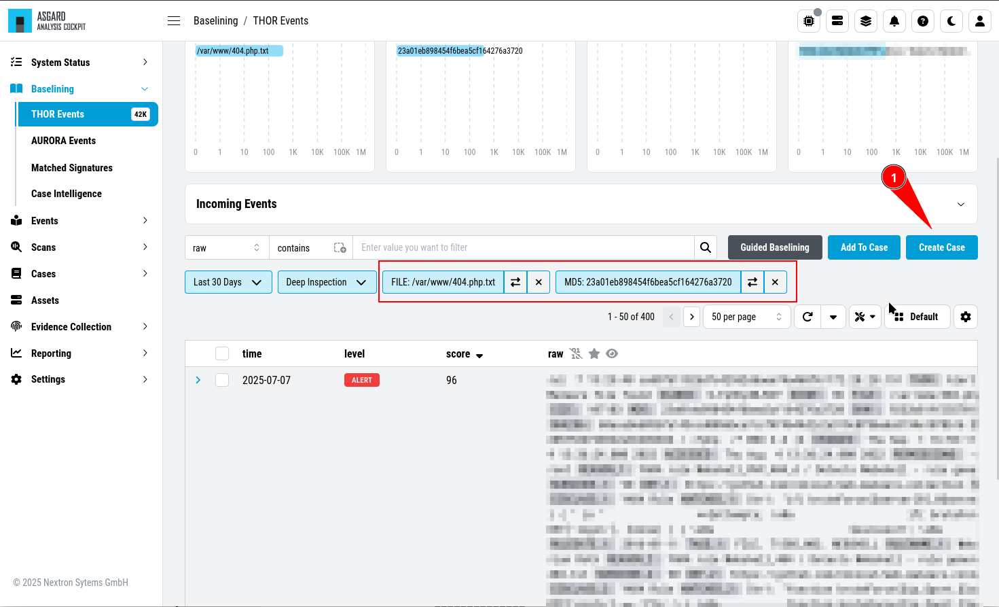
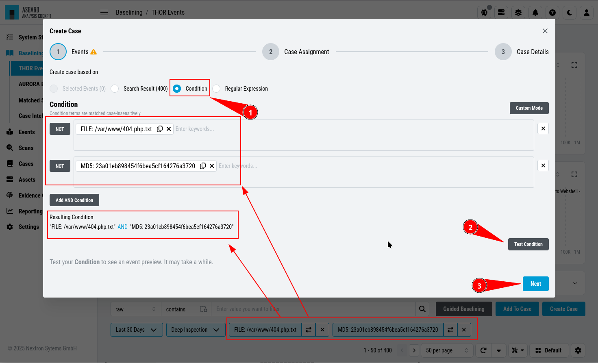
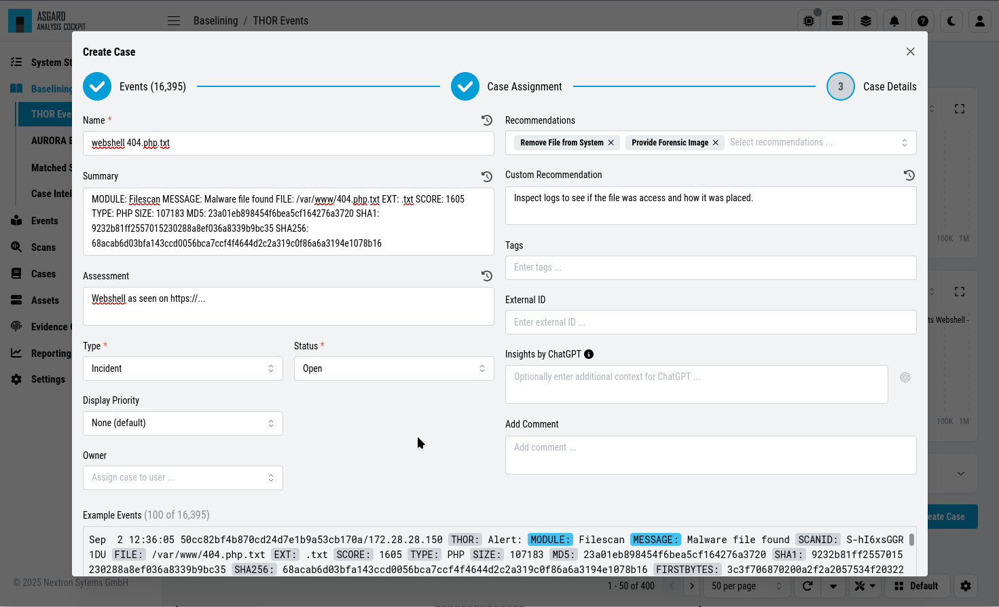
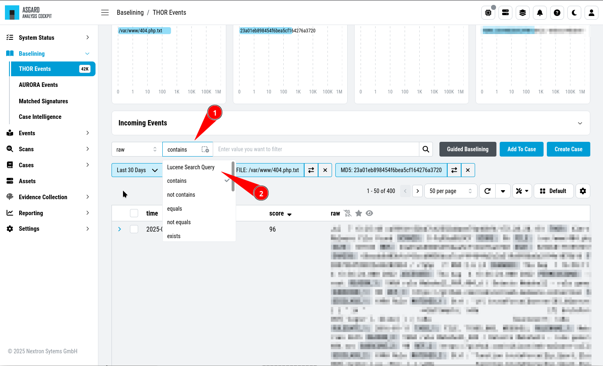
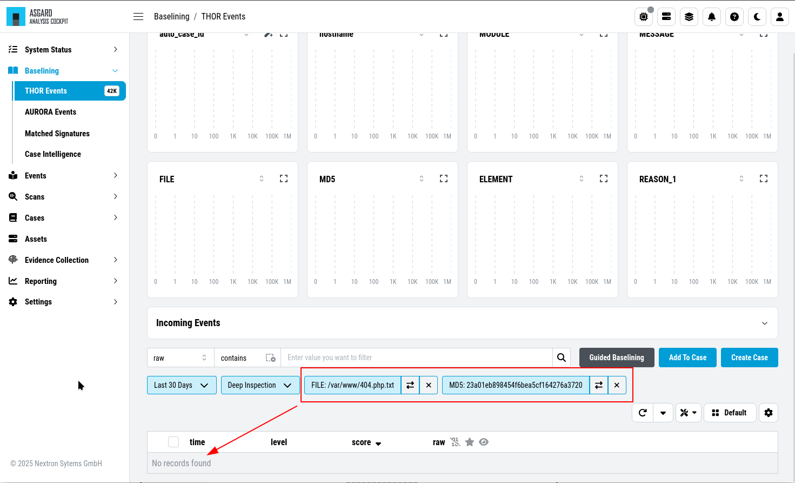

.. Index:: Case Creation Part 1

Manual Case Creation
--------------------

``>Baselining\THOR Events``

This section walks you through the manual case creation.
This method gives you more flexibility in terms of conditions
and details regarding the cases, but is more time consuming.

The results of the cases depending on specific settings you
are setting during the case creation.

Case Creation Basics
^^^^^^^^^^^^^^^^^^^^

Create a new case following these steps: 

1. Filter your Baselining Events accordingly. In our example, we searched for
   a specific file name with a unique hash. Click ``Create Case``

2. Select on which criteria you want to base the case on. The default ``Search Result``
   is sufficient enough for beginners, but for advanced analysts this might not be the
   best way to create a case. ``Condition`` is the most flexible and readable, whereas
   ``Regular Expression`` gives you the ultimate flexibility with a heavy performance
   impact (we recommend to not use Regular Expression for this reason)

3. Click next and you will see your resulting ``Case Assignment`` logic. Set ``Automatically
   assign newly incoming events to this case.`` to automatically move new incoming events to this
   case. If you want to create a case which will not receive new events, remove the checkbox.

.. figure:: ../images/cockpit_case_creation3.png

4. Set a case **name**, which serves as title - use keywords that make it
   easy for other analysts to find it based on a few terms (e.g. if a false
   positive was caused by matches in **savedsearch.conf**, use this filename
   in the title of your case)

5. Select a sample event for the **summary** field 
6. Add your **assessment**
7. Choose one or more **recommendations**
8. Select a **case type** (see the :ref:`glossary/case-glossary:case types` for a detailed description of every case type)
9. Select a **case status** (usually used to mark it as 'work in progress' or to forward it to the next team)
10. Select a **display priority** (usually used to mark the importance of the case)
11. Submit case by clicking the **Create Case** button

Select Log Messages for a Case
^^^^^^^^^^^^^^^^^^^^^^^^^^^^^^

In order to create a meaningful case, you typically start with selecting
logs or groups of logs that you want to be contained in the case. This
can be done in various ways:

* by adding a custom filter in the search bar
* by clicking on one of the bars in the bar chart
* by clicking on the filter symbol in a field in a log line
* by using the Lucene Search Query

You can generate a filter condition using an expression in the search
field, choosing a category, deciding whether the expression should be
contained, equal etc. and clicking the search button. Clicking on one
of the bars in the bar chart or on the filter symbol in a field in a
log line will generate a filter condition, too.

.. figure:: ../images/cockpit_active_filters.png
   :alt: Active Filters

   Active Filters

.. hint::
   Filters can be negated by clicking on the two arrows symbol or delete it by clicking on the cross symbol.

Using the built-in custom filters is the most common and easiest way to
select groups of logs.

For those who prefer Lucene, an additional Lucene search bar can be
activated and can even be combined with the built-in custom search.

In order to activate the Lucene Query search just click the ``contains`` button and
choose ``Lucene Query``.

   Lucene Query

.. note:: 
   You can Alt/Shift click items in the top field view to add them as a ``NOT`` filter to your search.

Case Creation Using a Condition
^^^^^^^^^^^^^^^^^^^^^^^^^^^^^^^

.. note::
   ``Condition`` Cases are widely used since their Condition is easier
   to read and can be modify. This is why we recommend to use them, especially
   in bigger organizations, with multiple people working on multiple cases.

To create a case with a condition, click the ``Create Case`` button and
select ``Condition``. Any filter set before clicking the ``Create Case``
button will appear automatically in this view. This makes it very easy to work with.

Keywords in the same field are combined by **OR**, you can negate them by
clicking the ``NOT`` button or combine them with **AND** by clicking the
``Add AND Condition`` button. The filter bubbles you have generated before
will be used as default. You are free to use, modify or delete them.
Conditions only match on the ``raw`` field.

The ``Test Condition`` button will calculate the numbers of hits and
return some matching and some non-matching events as an example.

   Creating Cases through Condition

Again, you may or may not add auto assignment for future incoming
log lines, summary, assessment, case type, recommendations or a comment.
After closing you will find the selected logs have been removed from the
logs section.

Case Creation from Search Results
^^^^^^^^^^^^^^^^^^^^^^^^^^^^^^^^^

.. note::
   Since the ``Event Assignment`` logic of ``Search Result`` cases cannot be modified,
   we do not recommend to use this method to create cases in bigger organizations.
   If you do not need to change the logic how events are assigned to certain cases,
   this is the best method to use.

This is the easiest way to create a case. Create the filters, so
that you only see the logs you want to be contained in your case. Then
click the ``Create Case`` button, select ``Search results`` and add a name,
that makes sense to you.

If you want future incoming logs with the same log lines automatically assigned to this
case, you have to tick the checkbox ``Automatically assign newly incoming events to this case.``

The ``Case Details`` screen is the same regardless of which ``Event Assignment``
logic you chose to use for your chase. After creating your case, you will find the log section
empty. This is because the view is still using your filter, but the matching log lines
have been removed from this section and added to the case (again, the baselining view only
shows events which are not part of a case).

   Log Section empty

Simply remove the filter and the remaining log lines will show up.

Case Creation from Selection
^^^^^^^^^^^^^^^^^^^^^^^^^^^^

In order to create a case from a specific selection of logs simply use
the checkboxes at the very left side of the table and click the ``Create Case`` button 
select ``Selected events`` and add a name, that makes sense
to you.

   Creating Cases from Selection

After closing you will find the selected logs have been removed from the
logs section.

Case Creation Using a Regular Expressions
^^^^^^^^^^^^^^^^^^^^^^^^^^^^^^^^^^^^^^^^^

In order to create a case from a regular expression just click the
``Create Case`` button and select ``Regular Expression``. This lets you
write and test your regular expression.

The ``Test Regular Expression`` button will calculate the
numbers of hits and return some matching and some non-matching events as
an example.

.. figure:: ../images/cockpit_case_creation_regex.png
   :alt: Creating Cases through Regular Expressions

   Creating Cases through Regular Expressions

Again, you may or may not add auto assignment for future incoming
log lines, summary, assessment, case type, recommendations or a comment.
After clicking the ``Create Case`` button, the matching lines will get
removed from the log management view.

.. warning:: 
   It is recommended to use regular expressions only rarely and with
   caution. This feature can severely impact the performance of the system.
   Regex from cases will be applied to every single event on import.

Elasticsearch uses Apache Lucene's regular expression engine to parse these
queries. Please take a look at the Elasticsearch manual for further
information about the regular expression syntax:  
https://www.elastic.co/guide/en/elasticsearch/reference/current/regexp-syntax.html