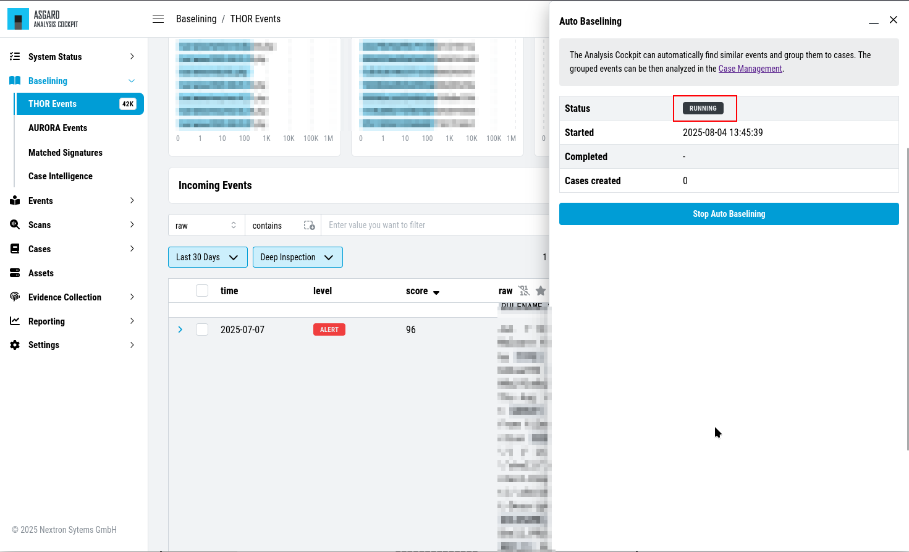
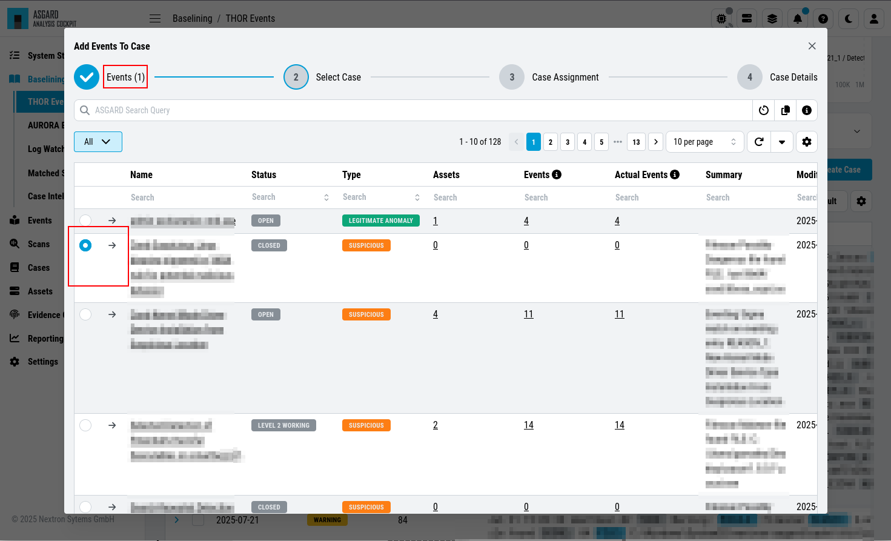
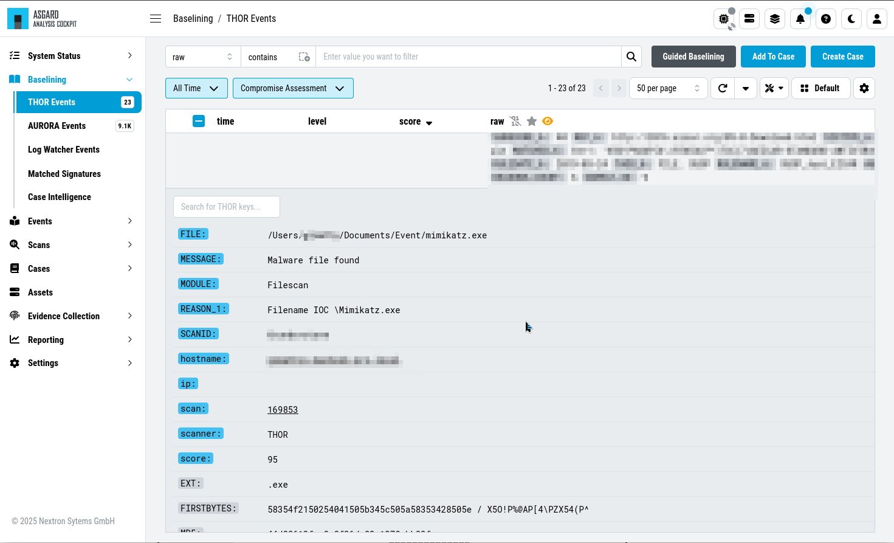

.. Index:: Case Creation Part 2

Automated Case Creation
-----------------------

``>Baselining\THOR Events``

With Auto Baselining, the Cockpit will automatically generate cases for
groups of logs that are similar, or in other words: Have the same
auto\_case\_id.

After clicking the button ``Automatically generate Cases`` button in the
``Auto Baselining`` tab you will be prompted for a threshold. This means:
Do only create a case when you find at least that many similar logs. In
our example below the Cockpit will now generate cases for all groups of
at least 2000 similar events.

   Automatically create cases

   Automatically create cases

After pressing the ``Start`` button, the Cockpit will start calculating
and create cases. Depending on the data volume this may take a while and
you will be presented a page that shows that Auto Cases is still running
along with the current number of cases.

   Auto Cases Status

It is safe to leave this page, once the status in ``Running``. It will
continue in the background.

.. important::
  The Analysis Cockpit generates auto\_case\_ids only for Alerts and
  Warnings. Don't use the Autocase feature for Notice and Info level
  events.

Add to Case
-----------

Sometimes you may want to add log lines to an already existing case
because they represent the same security context. To do this you can
select any events you would like to add to a specific case and click
the ``Add to Case`` button and select the suitable case. It is also
possible to add an additional comment to this case for the addition.

   Add to Case

Customizing the Detailed View of Log Lines
------------------------------------------

The detailed view for log lines opens by clicking on a log line. Within
this view you can select some fields as favorite fields by clicking on
the star symbol. They will always be shown at the top of this view. ``MESSAGE``,
``MODULE`` and ``hostname`` are selected by default.

To search for all log lines with the same entry as this log line in a
particular field, you can click the dropdown on the left hand side of 
the field.

   Customizing the detailed view for log lines

Additionally, you can find a ``VIRUSTOTAL`` button in every hash field and a
``VALHALLA`` button in every reason field. By clicking ``VIRUSTOTAL`` the hash
will be searched on Virustotal. By clicking ``VALHALLA`` you will get more
information about the matching rule from valhalla.nextron-systems.com.

Usage of the Context Menu
-------------------------

You can use the context menu on any **value** in your logs to get an action menu.
Within this menu, you can do different actions:

   Context Menu

You can filter, search for similar events, or even create cases based on the
value you right-clicked.