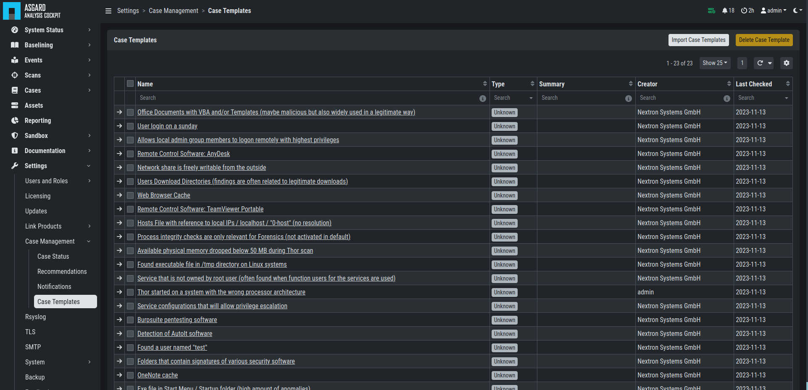
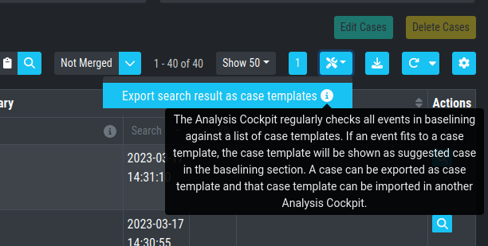
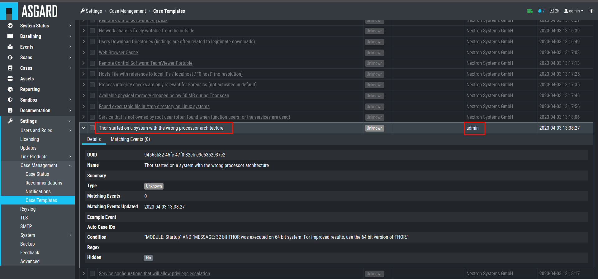

.. Index:: Case Intelligence

Case Intelligence
~~~~~~~~~~~~~~~~~

| ``>Baselining\Case Intelligence``
| ``>Settings\Case Management\Case Intelligence``

Case Templates can be used to suggest new cases in the ``Suggested Cases``
section. If there are no Suggested Cases in the view, no events match
the Case Templates in your Analysis Cockpit.

   Case Templates Overview

To import new Case Templates, you need to create a ``.yaml`` file with
the conditions first. This can be done by navigating to the ``Cases``
view and exporting your search results as Case Templates. You will
be able to download a ``.yaml`` file from here, which can be used to
import as a Case Template.

   Exporting Search Results as Case Templates

.. code-block:: yaml
   :linenos:
   :caption: Exported Case Template

   uuid: 94565b82-45fc-47f8-82eb-e9c5352c37c2
   name: Thor started on a system with the wrong processor architecture
   summary: ""
   type: 5
   scanner: THOR
   creator: admin
   condition: "\"MODULE: Startup\" AND \"MESSAGE: 32 bit THOR was executed on 64 bit
     system. For improved results, use the 64 bit version of THOR.\"\r\n"

After you downloaded the Case Templates, you can import them in the ``Case
Templates`` view.

.. figure:: ../images/cockpit_import_case_templates.png
   :alt: Import Case Template

   Import Case Template

You can now inspect the Case Template. You can find it by either looking
for the name or filter by who created it. You can see that the conditions
match the contents of your exported Case Template (``.yaml`` file).

   Inspect Imported Case Template
