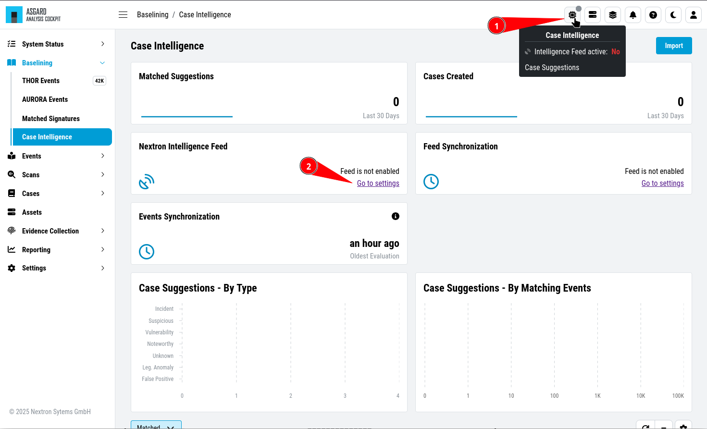
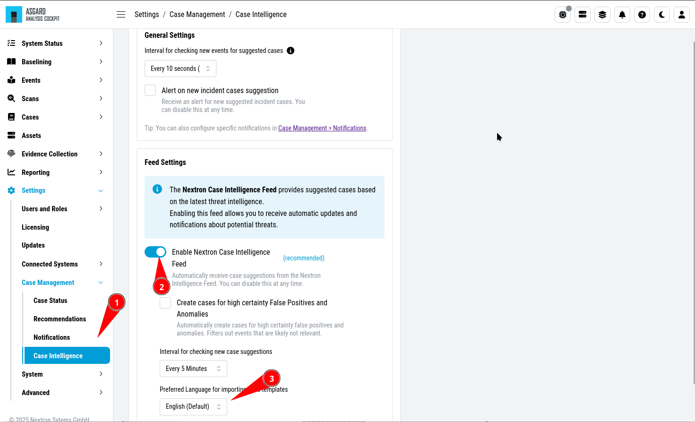
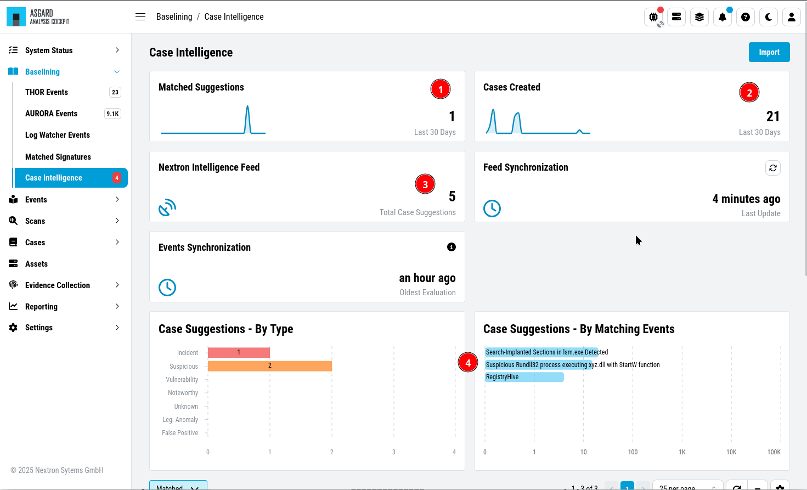
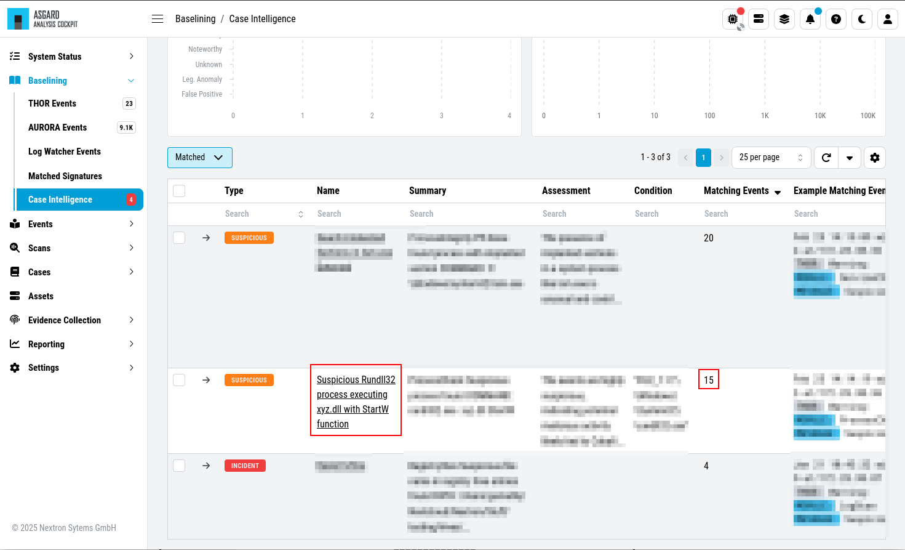
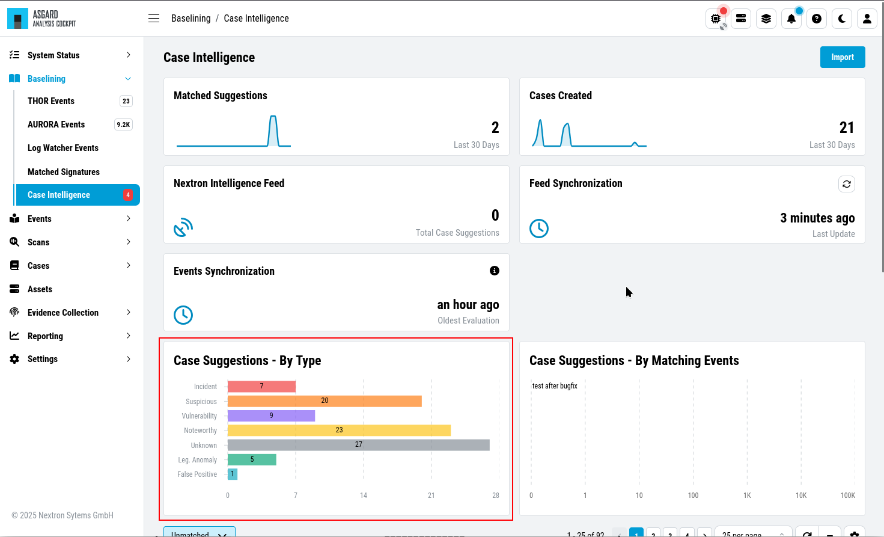
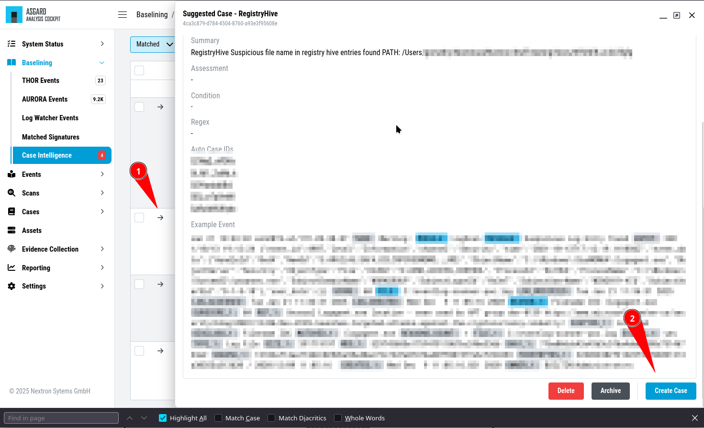

.. Index:: Case Intelligence

Case Intelligence
~~~~~~~~~~~~~~~~~

| ``>Baselining\Case Intelligence``
| ``>Settings\Case Management\Case Intelligence``

.. note::
   The **Nextron Intelligence Feed** provides suggested cases based
   on the latest threat intelligence. Enabling this feed allows you
   to receive automatic updates and notifications about potential threats.

You can integrate the ``Nextron Intelligence Feed`` into your Analysis
Cockpit. To do so, click on the ``Case Intelligence`` button in the status
bar. This will open up the ``Case Intelligence`` section. If you have not
configured the ``Case Intelligence``, you can do so by clicking ``Go to settings``.

   First Time View - Case Intelligence

In the ``Case Intelligence`` settings, you can enable the integration and
change a few settings to your liking.

   Case Intelligence Settings

Once the **Case Intelligence** feature has been activated, you will see
information about the integrated feed. You can see how many of our suggested
cases match at least one event in your environment (1). You can also see how
many cases have been created from our suggestions (2). A total number of suggested
cases from our feed will also be displayed (3). Additionally you will see a few
statistics in the graphs as well (4).

   Case Intelligence Overview

If you scroll further down, you can see any ``Matched`` case suggestions.
This means that at least one event in your Analysis Cockpit matches the
displayed cases from the **Nextron Intelligence Feed**.

   Case Intelligence Overview

You will additionally see a visual indicator in the status bar if
a case from the **Nextron Intelligence Feed** matches in your
Analysis Cockpit. The color indicates the matched case with the
highest severity. The colors are identical to the ``Case Type`` colors.

- Red: Incident
- Orange: Suspicious
- Purple: Vulnerability
- Yellow: Noteworthy
- Grey: Unknown
- Green: Legitimate Anomaly
- Blue: False Positive

   Case Intelligence Overview

To create a case from the Case Intelligence, click on the name or the left
arrow of a case. This will open the summary of the suggested case, including
an example event. Verify the information and click ``Create Case``.

   Case Intelligence - Case Details

After clicking ``Create Case`` the usual case creation modal will open, with
a few details already filled. Change any details accordingly and click ``Create
Case``.