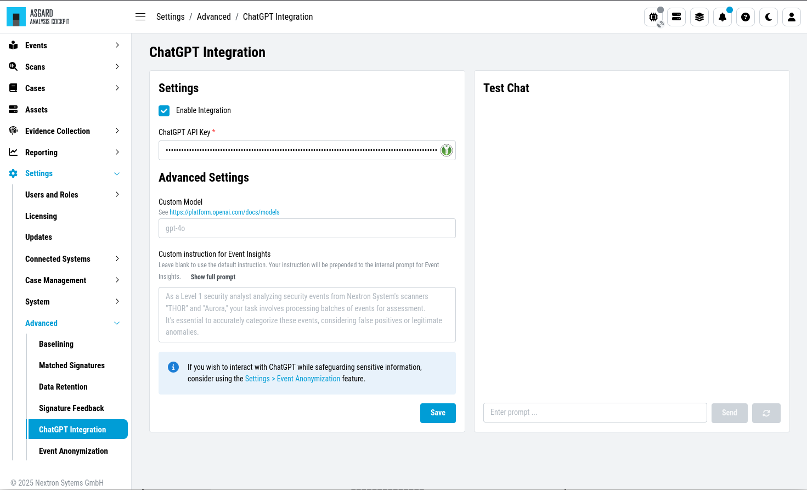
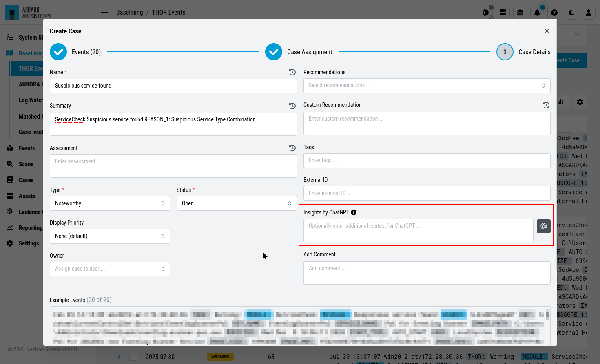
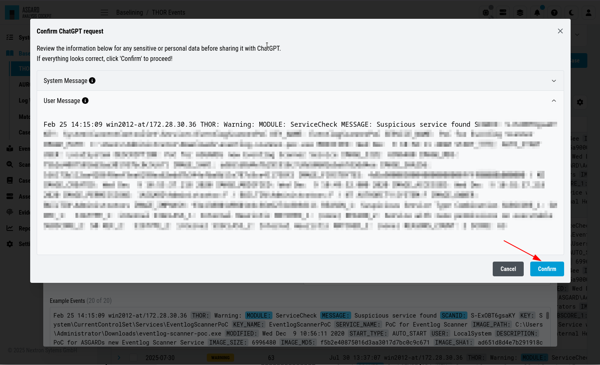
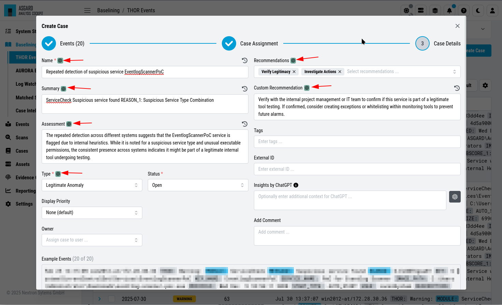
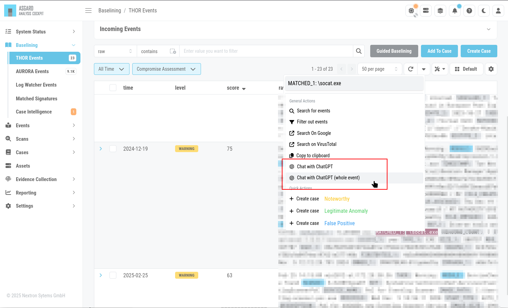
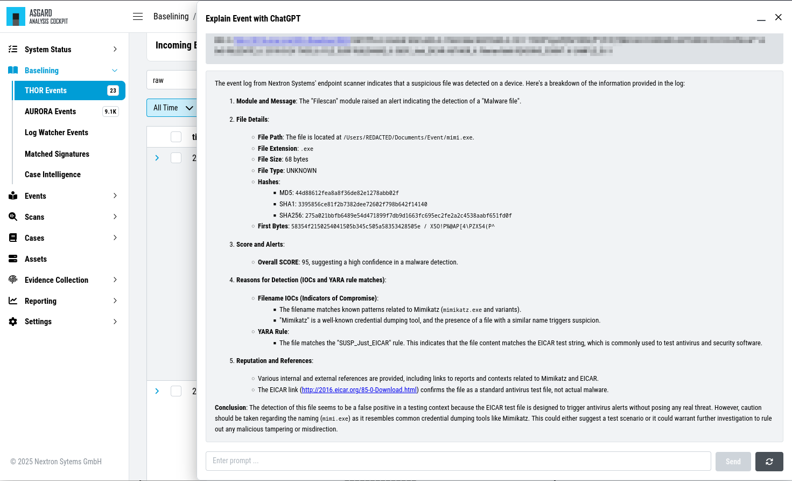
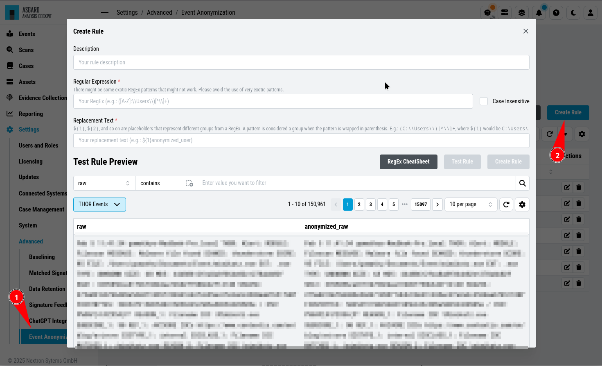

.. Index:: ChatGPT Integration

ChatGPT Integration
^^^^^^^^^^^^^^^^^^^

``>Settings\Advanced\ChatGPT Integration``

You can use our ChatGPT integration to help with case creation. To do this
you need to have a ChatGPT API key, which will be used when configuring the
ChatGPT integration in your Analysis Cockpit. You can test the integration
in the prompt at the bottom to make sure everything is working.

   ChatGPT Integration

.. hint::
   If you wish to interact with ChatGPT while safeguarding sensitive information,
   consider using the :ref:`baselining/chatgpt:event anonymization` feature.

ChatGPT Case Creation Insights
~~~~~~~~~~~~~~~~~~~~~~~~~~~~~~

After you configured the ChatGPT integration, you can use it in the case creation
dialog. Click on the ChatGPT icon in the case creation dialog to gain more insights
regarding the events you are working with.

   ChatGPT Case Creation

Once you clicked the button, a new dialog will open. Here you can see which information
will be send to ChatGPT. Once you are confident with the information, click on the
``Approve`` button. The Analysis Cockpit will now send the information to ChatGPT and
display the results after a short moment.

   ChatGPT Case Confirmation

Once the analysis is done, you will see the results in the dialog. You can now use the
information to create a case.

   ChatGPT Case Results

.. hint::
   Please note that ChatGPT will give you a summary and recommendations based on the
   information you provided. It is always recommended to review the information and
   adjust it if necessary.

ChatGPT Event Explanation
~~~~~~~~~~~~~~~~~~~~~~~~~

You can use ChatGPT in your Baselining or All Events view to get more insights
regarding the events you are working with. To do this you can either:

- Mark the selected information within your event (for example ``MATCHED_1``) and
  right click on it. You will see an option in the context menu called ``Chat with ChatGPT``
- Just right click an event and select ``Chat with ChatGPT (whole event)`` from the context
  menu

You will see a sidebar which has already the information you selected or the whole event
filled in. You can now click on the ``Send`` button to send the information to ChatGPT.
If you need further information you can interact with ChatGPT in the sidebar.

   Chat with ChatGPT

The results will look something like this:

   ChatGPT Event Explanation

Please make sure to either review the information before sending it to ChatGPT or
use the :ref:`baselining/chatgpt:event anonymization` feature to safeguard
sensitive information.

Event Anonymization
~~~~~~~~~~~~~~~~~~~

``>Settings\Advanced\Event Anonymization``

Event Anonymization Rules can be used to replace any text in your events when
sending a request to ChatGPT. This is useful when you want to interact with
ChatGPT while safeguarding sensitive information. You can create a new rule by
clicking on the ``Create Rule``. You can add multiple rules and test them in
the prompt at the bottom.

   Event Anonymization Rule
