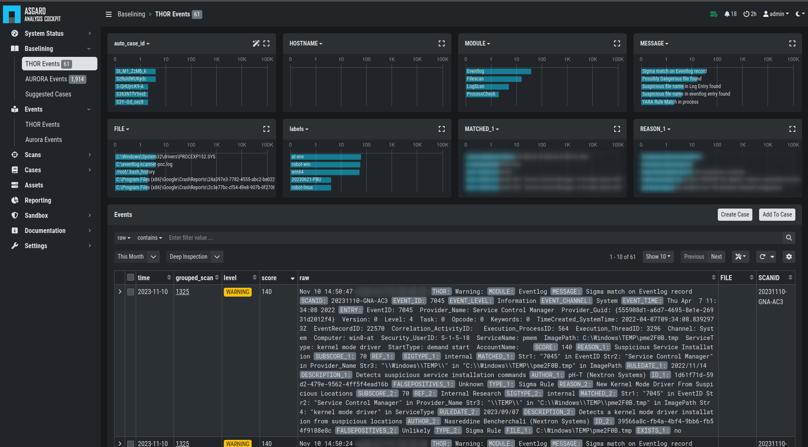

.. index:: Baselining Best Practices

Baselining
==========

This section assumes, that you have read the chapter
:ref:`basic-concepts/index:basic concepts`.

All incoming logs, that do not match an existing case, will show up in
the ``Baselining`` section.

While importing the logs, the cockpit will already try to find logs are
that similar and represent the same type of alert or warning. It will
group these logs and assign an ``auto_case_id``.

   Baselining Overview

.. toctree::
    :caption: Contents

    view
    case-creation1
    case-creation2
