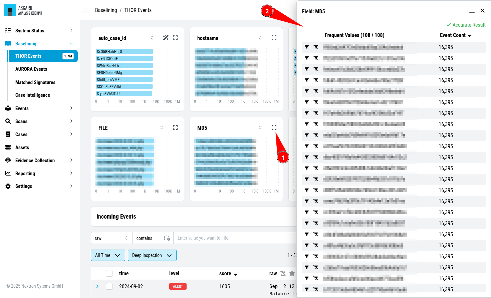

.. Index:: Baselining View

Customize Your View
-------------------

By default, the Analysis Cockpit ``Baselining`` view ships with multiple bar
charts and a table with the most relevant columns in order to help you find
meaningful groups of logs. You can add additional bar charts by clicking on
the ``Advanced Tools`` button and selecting ``Chart Preferences``.

.. figure:: ../images/cockpit_chart_preferences.png
   :alt: Chart Preferences

.. figure:: ../images/cockpit_chart_preferences2.png
   :alt: Chart Preferences

   Chart Preferences

You can also modify which bar charts are shown by the name/field-name of the chart
and choose the category you want to see. To get more details about a bar chart, you
can click on square symbol in the heading of the bar chart.

.. figure:: ../images/cockpit_bar_chart_selector.png
   :alt: Bar Chart Selector

   Bar Chart Selector

   Bar Chart Details

Click the ``Columns`` button to manage which columns are shown.

.. figure:: ../images/cockpit_column_preferences.png
   :alt: Column Preferences

   Column Preferences

.. hint:: 
   All views are personalized and changes will only affect your user.
