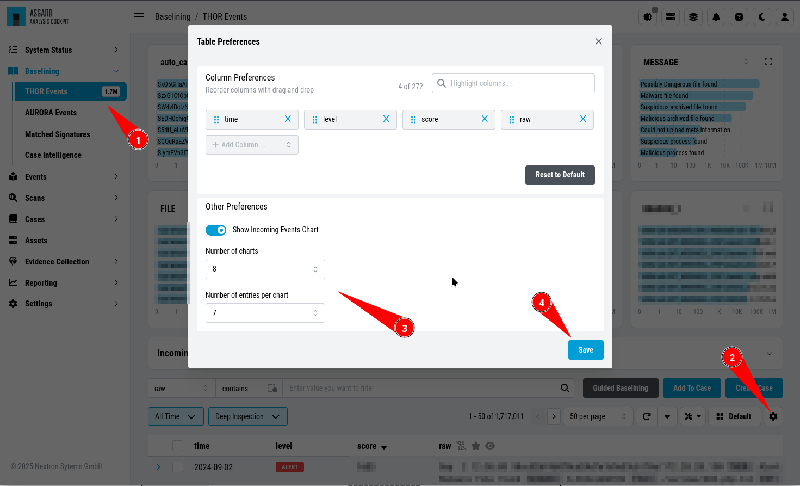
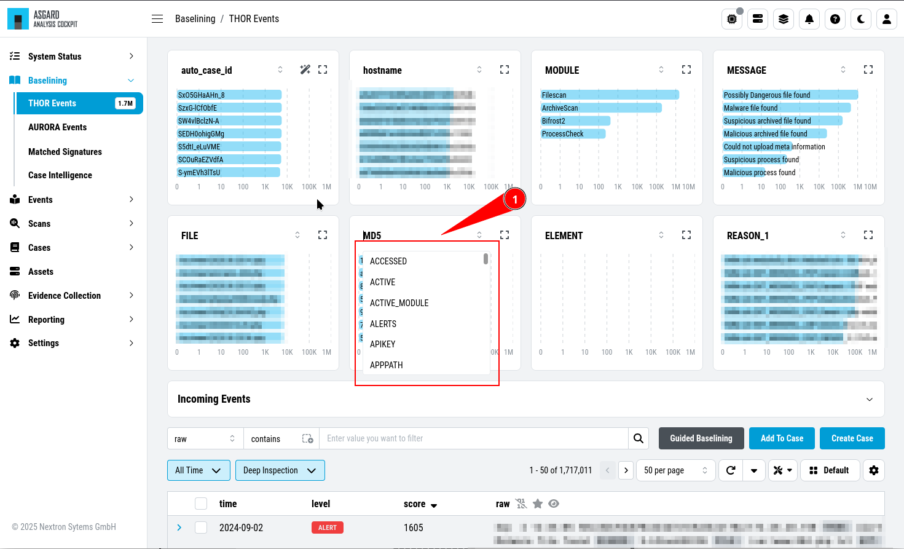

.. Index:: Baselining View

Customize Your View
-------------------

| ``>Baselining\THOR Events``
| ``>Events\THOR Events``

.. hint:: 
   All views are personalized and changes will only affect your user.
   Please see :ref:`basic-concepts/baselining:dashboards`
   if you want to share your Baselining view with other users, or if you
   want to have multiple views for different scenarios.

The default ``Baselining`` view comes with multiple bar charts and a table
with the most relevant columns in order to help you find meaningful groups
of logs. You can add additional bar charts by clicking on the ``Table Preferences``.
You can also set the visible columns in the table on the bottom in the same view.

   Table Preferences

You can also modify which bar charts are visible. To do this, click the name of
the chart and choose the category you want to see. To get more details about
a bar chart, you can click on square symbol in the heading of the bar chart.

   Bar Chart Selector

.. figure:: ../images/cockpit_bar_chart_details.png
   :alt: Bar Chart Details

   Bar Chart Details
