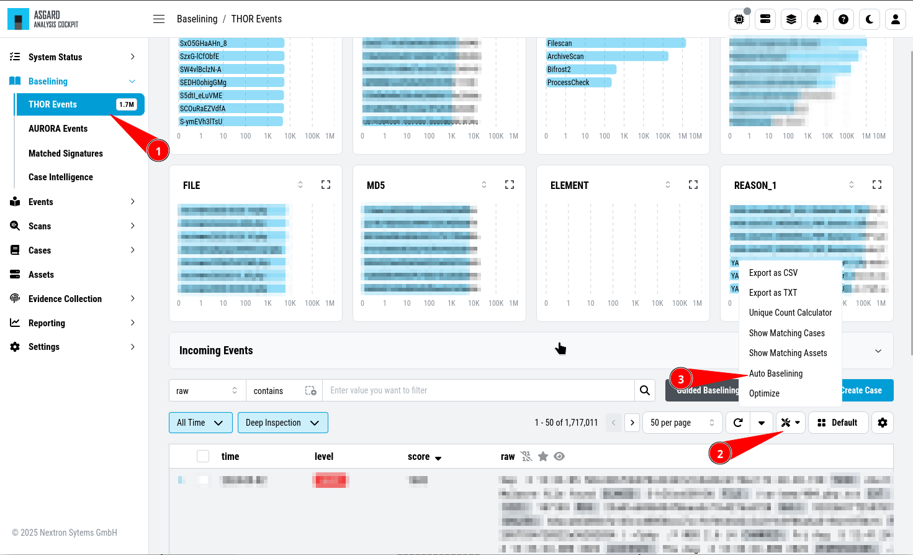
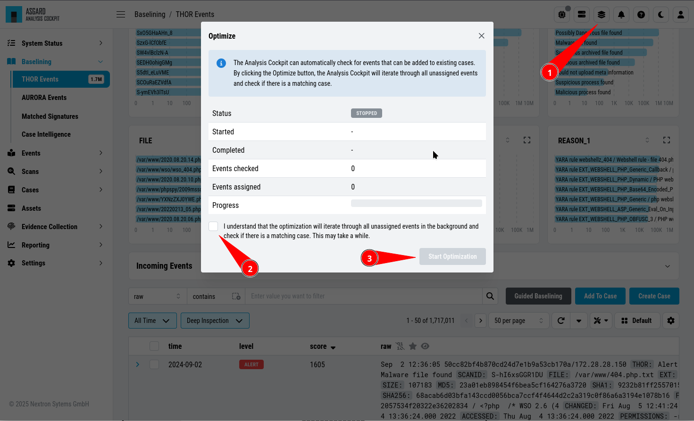
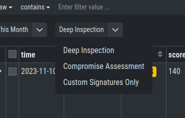

Baselining
----------

All events that have **not** been assigned to a particular case are
displayed in the ``Baselining`` section of the Analysis Cockpit.

Again, the Baselining Section is split into the different sources
of our events. Additionally, you can see the ``Suggested Cases``, which
will suggest cases based on predefined :ref:`basic-concepts/cases:case templates`.

- THOR Events
- Aurora Events
- Log Watcher Events (deprecated)
- Suggested Cases

.. figure:: ../images/cockpit_baselining_overview.png
   :alt: Baselining Section

   Baselining Section

Logs that represent the same type of anomaly or incident can be grouped
together using the various filters and then be stored in a Case for
further analysis. Grouping can be done manually by filtering and clicking
``Create Case``, selecting individual Events and clicking ``Create Case``,
or automatically by simply clicking the ``Advanced Tools`` button and
``Auto Baselining``. With ``Auto Baselining``, the Cockpit automatically calculates groups of
"similar" log lines.

Once stored in a case, the logs will disappear from the Baselining section.

   Auto Baselining

.. To-DO add Info regarding Guided Baselining

The Analysis Cockpit can automatically check for events that can be added to
existing cases. By clicking the ``Optimize`` button, the Analysis Cockpit will
iterate through all unassigned events and check if there is a matching case.

   Optimize Function

.. note::
   The optimization will iterate through all unassigned events and assign them
   to cases if a match were found. This may take a while.

In an ideal organization, the Baselining section should always be empty
at the end of a day, as these logs represent suspicious elements that
have not yet been looked at.

Baselining Views
~~~~~~~~~~~~~~~~

In the ``Baselining`` section there are two main views, the ``Compromise Assessment Mode``
and the ``Deep Inspection Mode``. Additionally, you can find the ``Custom Signatures
Only Mode``, which will only show events found by custom signatures. This can
be helpful if you scanned your environment with customer signatures, for example
during or after an incident.

By default, the Analysis Cockpit Baselining Mode is set to ``Compromise Assessment``.

   Select your view

Compromise Assessment Mode
~~~~~~~~~~~~~~~~~~~~~~~~~~

The ``Compromise Assessment Mode`` is a new filter/representation of events
created and reviewed by our security experts. 

It includes our most successful detections. In this context "success" means,
that the detection uncovered malicious activity in the wild and at the same
time had a low anomaly and false positive rate. Additionally we also consider
a detection to be successful that caused little or no false positives or anomalies. 

The new view will combine and apply different techniques and filters to all
the unclassified events in the ``Baselining`` section, providing a reduced
set of logs which proved to be relevant from an analyst perspective.

This new "Compromise Assessment Mode" dramatically reduces your baselining effort.
In our tests we noticed a decrease of events in the Baselining section of more
than 90%. We believe that especially entities that follow our "Continuous Compromise Assessment"
approach should switch into this new mode. We've also challenged the new mode
with the post exploitation tools and techniques found in the context of HAFNIUM / Exchange exploitations
in March 2021 and covered almost every aspect of the attacks in the new view.

.. note:: 
   In case of an Incident Response, the ``Deep Inspection Mode`` is always
   recommended, since nothing is filtered here.

Deep Inspection Mode
~~~~~~~~~~~~~~~~~~~~

This view is basically how it used to be (the old default view).
It shows all Alerts and Warnings unless they are already part of an existing case.

Custom Signatures Only Mode
~~~~~~~~~~~~~~~~~~~~~~~~~~~

The ``Custom Signatures Only`` view will only show you events, which:

- Are not part of a case
- Where found by a custom signature

This view can be helpful if you only want to see events found by one of your custom
signatures during a THOR scan. This can be helpful if you want to see only those events
and nothing else.
