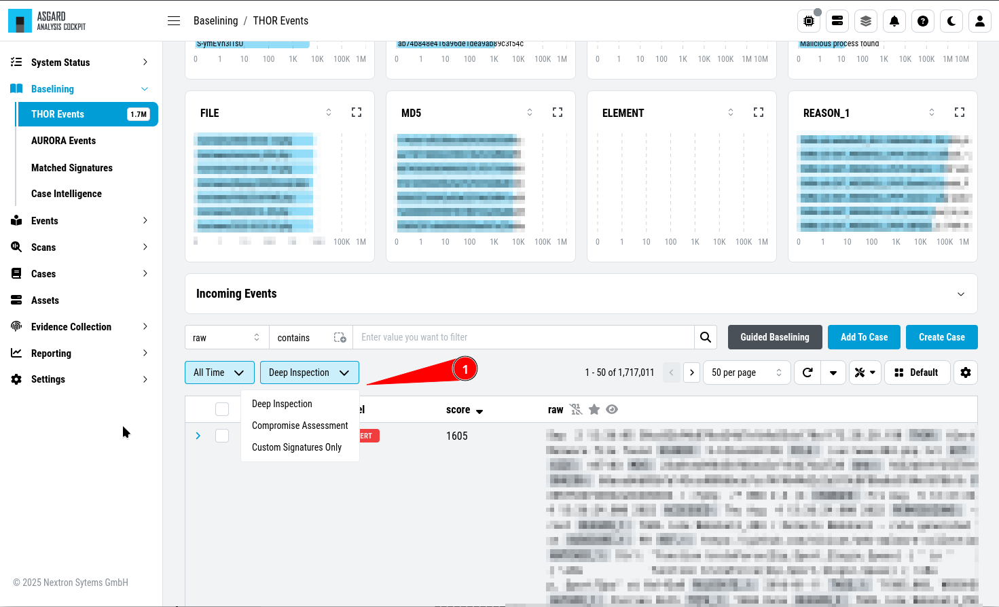

.. Index:: Baselining

Baselining
----------

| ``>Baselining\THOR Events``
| ``>Baselining\Aurora Events``
| ``>Baselining\Case Intelligence``

All events that have **not** been assigned to a particular case are
displayed in the ``Baselining`` section of the Analysis Cockpit.

The Baselining Section is split into the different sources
of our events. Additionally, you can see the :ref:`baselining/case-intelligence:case intelligence`
menu, which will suggest cases (if enabled) based on Nextron's Intelligence Feed.

.. figure:: ../images/cockpit_baselining_overview.png
   :alt: Baselining Section

   Baselining Section

Logs that represent the same type of anomaly or incident can be grouped
together using filters and conditions, and then be documented in a Case for
further analysis. Grouping can be done manually by filtering and clicking
``Create Case``, selecting individual Events and clicking ``Create Case``,
or automatically by simply clicking the ``Advanced Tools`` button and
``Auto Baselining``.

Once stored in a case, the logs will disappear from the Baselining section.

Ideally you want to keep your baselining section as empty or organized as possible.
The logs in your Baselining View represent potentially suspicious elements that
have not yet been looked at. This is your best point to triage through all the
THOR events.

Baselining Modes
~~~~~~~~~~~~~~~~

| ``>Baselining\THOR Events``
| ``>Settings\Advanced\Baselining``

The ``Baselining`` section contains three predefined modes, the ``Compromise Assessment``
mode, the ``Deep Inspection`` mode, and the ``Custom Signatures Only`` mode. By default,
the Analysis Cockpit Baselining Mode is set to ``Compromise Assessment``.

   Select your Baselining Mode

The three modes are used for different scenarios, which depend on how
you are using your Analysis Cockpit. The **Compromise Assessment** mode
filters out "background noise" and only shows you the most relevant
events - this is a good mode of operation for daily usage. The
**Deep Inspection** mode shows you all events which might be relevant -
this mode is often used in Incident Response scenarios. The **Custom
Signatures Only** mode shows you only events that were found by your custom
signatures. This mode is helpful if you want to see only those
events and nothing else.

Compromise Assessment Mode
^^^^^^^^^^^^^^^^^^^^^^^^^^

The ``Compromise Assessment Mode`` is a filter/representation of events
created and reviewed by our security experts. It is designed to help
security teams identify evidence of a breach across their infrastructure
in a **systematic** and **scalable** way.

This view will contain our most relevant and successful detections. The idea
behind this is to reduce "background noise" to help analysts focus on the
important events.

The view combines and applies different techniques and filters to all the unclassified
events in the ``Baselining`` section, providing a reduced set of logs, which proved
to be the most relevant from an analyst perspective.

The "Compromise Assessment Mode" dramatically reduces your baselining effort.
In our tests we noticed a decrease of events in the Baselining section of more
than 90%. We especially believe that entities, which follow our "Continuous Compromise
Assessment" approach, should use the **Compromise Assessment Mode**.

.. note:: 
   In case of an Incident Response, the ``Deep Inspection Mode`` is always
   recommended, since nothing is filtered here.

Deep Inspection Mode
^^^^^^^^^^^^^^^^^^^^

This view shows all **Alerts** and **Warnings**, unless they are already part
of an existing case.

Custom Signatures Only Mode
^^^^^^^^^^^^^^^^^^^^^^^^^^^

The ``Custom Signatures Only`` view will only show you events, which:

- Are not part of a case
- Where found by a custom signature

This view can be helpful if you only want to see events found by one of your custom
signatures during a THOR scan. This can be helpful if you want to see only those events
and nothing else.

Dashboards
~~~~~~~~~~

Depending on what you are currently looking for in the Baselining (or Events)
view, you can modify the view by using dashboards. The default dashboard is
your personal dashboard. This dashboard is updated whenever you change your view,
add columns or change the displayed graphs. You can create additional Dashboards
by clicking the ``Select Dashboard`` button.

   Select Dashboard

You can create multiple Dashboards and also share them with other users.
Dashboards are used for the ``Baselining`` and ``Events`` view, meaning
one view works for both.

Auto Baselining
~~~~~~~~~~~~~~~

With ``Auto Baselining``, the Cockpit automatically calculates groups of
"similar" log lines and creates cases for those logs. You have to specify
an minimum amount of events per case before a case is being created.

.. figure:: ../images/cockpit_auto_baselining.png
   :alt: Auto Baselining

   Auto Baselining

Optimize
~~~~~~~~

The Analysis Cockpit can automatically check for events that can be added to
existing cases. By clicking the ``Optimize`` button, the Analysis Cockpit will
iterate through all unassigned events and check if there is a matching case.

.. figure:: ../images/cockpit_optimize.png
   :alt: Optimize Function

   Optimize Function

.. warning::
   Once the optimize process started, it cannot be stopped

To see the status of the optimize run, press the same button again:

   Optimize Progress

You can also set :ref:`maintenance/optimize:auto optimize` to run
the **Optimize** function automatically every day.