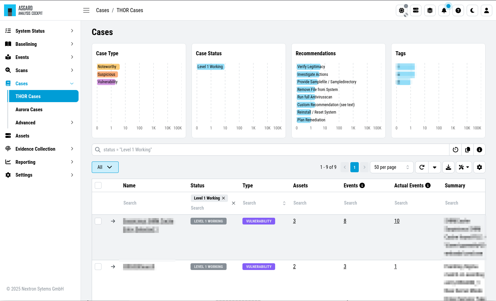
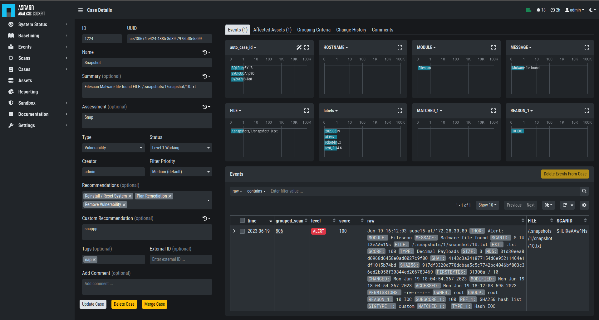
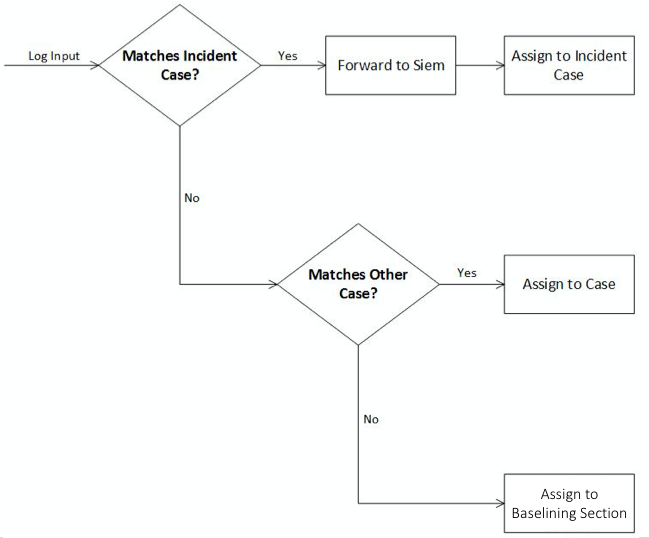

.. Index:: Cases and Log Processing

Cases and Log Processing
------------------------

The Cases section gives a good overview regarding the existing cases and
also provides various filtering options. Column visibility can be
configured by clicking on the Columns button of this section.

The Cases Section is split into the different sources of your Cases:

- THOR Cases
- Aurora Cases
- Log Watcher Cases (deprecated)

Additionally, you can find more information regarding:

- Grouping Criteria
- Case Changes
- Security Center

   Cases Section

When a case is created, the state will be "Open" and the type will be
set to "Noteworthy" by default.

The following states can be set (by default):

* Open
* Level 1 Finished
* Level 1 Working
* Level 2 Working
* Closed

It is possible to configure custom states.

The following types can be set:

* Incident
* Suspicious
* Vulnerability
* Noteworthy
* Unknown
* Legitimate Anomaly
* False Positive

See chapter :ref:`glossary/index:glossary` for a detailed description
of these terms.

Within a case, it is possible to add various information, write a
summary, provide canned recommendations or add assessment information.

   Case Details

The log lines contained in the case can of course be analyzed in detail
and changes to the case are tracked automatically.

The cockpit will automatically calculate rules (auto\_case\_id), that
make sure, future incoming logs that are similar to the log lines in
this particular case are automatically assigned to this case and **will
not show up** in the ``Baselining`` section.

.. important::
   ``Automatically assign newly incoming events to this case`` needs to
   be selected during case creation to automatically assign new events
   to an existing case.

In order to understand this better, let's assume you have decided a
group of logs are legitimate anomalies. Then all future logs that are
similar to these anomalies will automatically be added to this case and
not show up in the Baselining section.

In case you have decided a group of log lines represent a security
incident, the same thing will happen. Future log lines that represent a
security incident will show up only in the case and not in the
Baselining section.

Most organizations want to be alerted in case of a security
incident. The Cockpit can be configured to forward all logs that are
automatically assigned to an incident case to the organizations' SIEM
System via syslog. Organizations that prefer to handle THOR Events
entirely within the Analysis Cockpit and not forward anything to a SIEM
system may choose to configure a notification that shows up in the
Cockpit's Notification Section.

The following picture shows the recommended log processing.

   Log Processing

As one can see, an incoming log line only shows up in the ``Baselining``
section when it matches no existing case.

This behavior is highly configurable and can be changed in the
``Settings`` section of the Analysis Cockpit. One can even decide not to
forward anything to a SIEM System or may decide to also forward
suspicious elements in addition.

In other Words:

Cases represent the means of setting and maintaining the log baseline
within the Cockpit. When you scan your infrastructure once, assign all
logs to cases and then scan it for the second time, the ``Baselining``
section should be empty if nothing has changed. All incoming logs should
be similar to the ones in the first scan and therefore be assigned to
the respective cases and not show up in the ``Baselining`` section.

Working with cases is explained in detail in the sections below.

Case Templates
~~~~~~~~~~~~~~

Case Templates can be used to suggest new cases in the ``Suggested Cases``
section. If there are no Suggested Cases in the view, no events match
the Case Templates in your Analysis Cockpit.

.. figure:: ../images/cockpit_case_templates.png
   :alt: Case Templates Overview

   Case Templates Overview

To import new Case Templates, you need to create a ``.yaml`` file with
the conditions first. This can be done by navigating to the ``Cases``
view and exporting your search results as Case Templates. You will
be able to download a ``.yaml`` file from here, which can be used to
import as a Case Template.

.. figure:: ../images/cockpit_export_case_template.png
   :alt: Export Case Template

   Exporting Search Results as Case Templates

.. code-block:: yaml
   :linenos:
   :caption: Exported Case Template

   uuid: 94565b82-45fc-47f8-82eb-e9c5352c37c2
   name: Thor started on a system with the wrong processor architecture
   summary: ""
   type: 5
   scanner: THOR
   creator: admin
   condition: "\"MODULE: Startup\" AND \"MESSAGE: 32 bit THOR was executed on 64 bit
     system. For improved results, use the 64 bit version of THOR.\"\r\n"

After you downloaded the Case Templates, you can import them in the ``Case
Templates`` view.

.. figure:: ../images/cockpit_import_case_templates.png
   :alt: Import Case Template

   Import Case Template

You can now inspect the Case Template. You can find it by either looking
for the name or filter by who created it. You can see that the conditions
match the contents of your exported Case Template (``.yaml`` file).

.. figure:: ../images/cockpit_inspect_imported_case_template.png
   :alt: Inspect Imported Case Template

   Inspect Imported Case Template
