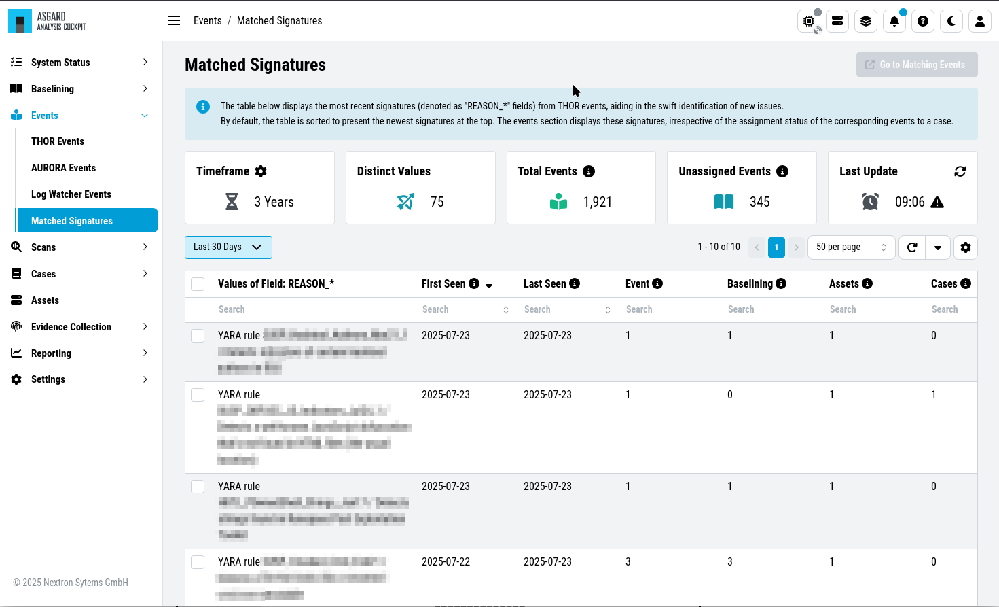

.. Index:: Events

Events
------

| ``>Events\THOR Events``
| ``>Events\Aurora Events``

Those sections contain all events which have been stored in your
Analysis Cockpit. You can use this for threat hunting by leveraging
the powerful filtering options. The Events Section is split into
the different sources of your Events:

- THOR Events
- Aurora Events

.. figure:: ../images/cockpit_events_overview.png
   :alt: Events Section 

   Events Section

Matched Signatures
~~~~~~~~~~~~~~~~~~

``>Events\Mached Signatures``

This section shows all signatures that have been matched by the events
in your Analysis Cockpit. The section provides swift identification of
new issues or potentially False Positives.

   Matched Signatures Section