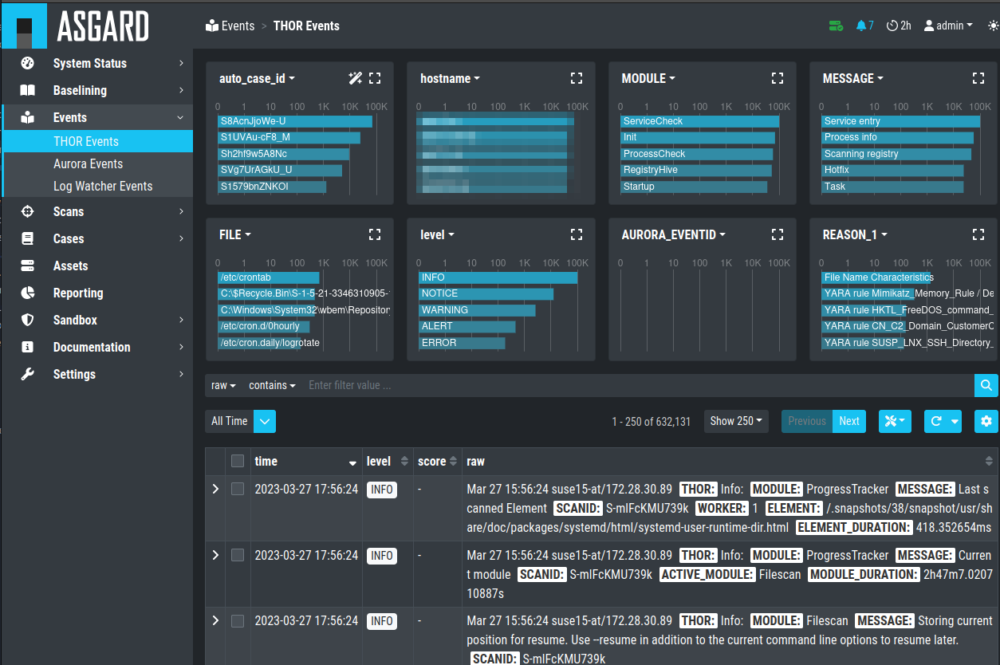

.. Index:: Events

Events
------

All events that have been stored in your Analysis Cockpit – regardless
if they are assigned to a particular case or not – are displayed
in the section ``Events``. This section can be seen as your threat hunting
pool. The section provides powerful filtering options. The Events
Section is split into the different sources of your Events:

- THOR Events
- Aurora Events
- Log Watcher Events (deprecated)

   Events Section
