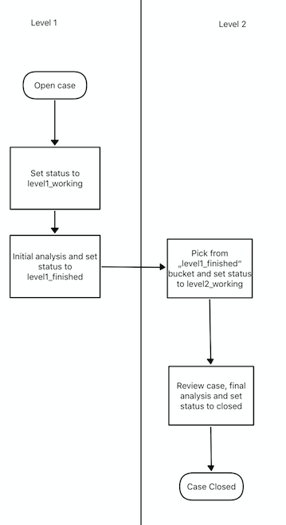
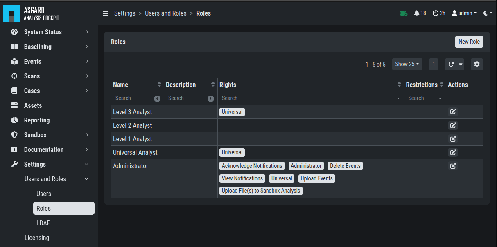
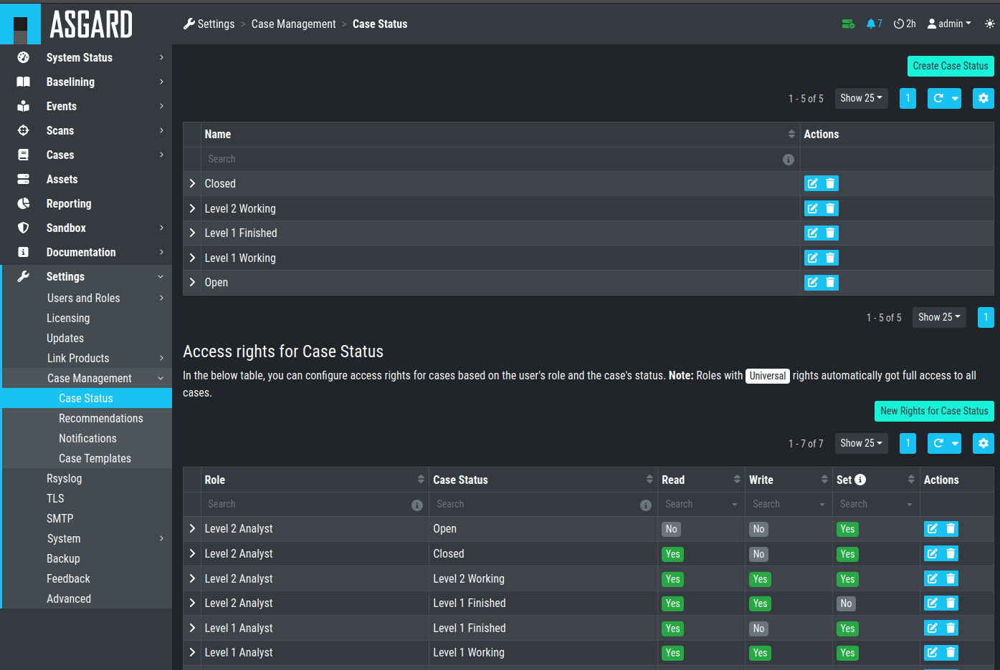

.. Index:: Permissions

Understanding Users, Roles, Rights and Case Status
--------------------------------------------------

The rights and roles model within the cockpit is aimed to support large
multinational organizations with different independent users working
with the case management at the same time. An organization responsible
for analyzing THOR logs might be split up in groups of analysts.

Within the cockpit, all users have the right to access the logs and
create cases. Within the ``Case Management`` section, access rights are
granted depending on the particular state the case is in.

In order to setup your rights management you must first decide about the
states you want your cases to have, then assign rights for a particular
state to a role and after that you add users to that particular role.

In order to understand this better, let's look at an example.

Let's assume we have an organization where a Level 1 analyst group
located in Frankfurt is responsible for creating cases and providing an
initial assessment for cases, while a Level 2 analyst group located in
Hamburg is responsible for reviewing, final decision and closing of
cases. In order to support an efficient workflow, you would at least
need the following states for your cases:

* Open (nobody is yet working on this case)
* Level 1 Working (Level 1 is working on this case)
* Level 1 Finished (Level 1 has finished and nobody is now working on this case)
* Level 2 Working (Level 2 is working on this case)
* Closed (Case closed)

A workflow could look like this:

   Workflow open Cases

For your convenience, we already did the setup for this example and ship
all Analysis Cockpit with this workable template by default. You are
free to use, modify or delete the corresponding rights, statuses and
roles.

However, in order to explain the concepts and the setup of roles and
statuses better we assume for a while, we had an empty cockpit with no
roles and statuses pre-configured.

In order to set up our pre-configured example, we navigate to the
``Settings`` section and create the following roles:

   Settings – adding additional roles

Every role can have different rights. We will explain this in detail in
the next section. Firstly, we create Level 1 Analyst and Level 2 Analyst
without rights at all.

After that we define the following statuses:

   Settings – Case Status

.. TO-DO change screenshots

In the lower table you can manage the access rights for every role and
every Case Status. We can give the suitable rights to our generated
roles by clicking the ``New Rights for Case Status`` button on the right.

.. figure:: ../images/image34.png
   :alt: Edit Rights - Read, Write, Set

   Edit Rights – Read, Write, Set

For Level 1 Analyst we add the right to read and write all "Open" cases
and change the case status to this status (set).

Additionally, we grant Level 1 Analyst the rights to read, write and set
all cases for "Level 1 Working".

Finally, we grant the right to read and set cases for the status ``Level1 Finished``. 
This allows Level 1 Analysts to set a particular case to
"Level 1 Finished" and restricts them from modifying this case once they
have passed it to this status.

For Level 2 we now add the rights to read and write cases for 
"Level 1 Finished" and the rights to read, write and set cases for 
"Level 2 Working". This allows Level 2 analysts to pick cases from the 
"Level 1 Finished" status and start working on them.

As we do not want Level 2 Analysts to reopen cases, that have already
been closed we only grant them rights to read and set for the status
"Closed".

Additionally, we give Level 2 Analyst the right to set the case status
to "Open".

After that, the ``Access rights for Case Status`` section looks like this:

.. figure:: ../images/image35.png
   :alt: Settings - Access rights for Case Status

   Settings – Access rights for Case Status

Of course, this is only an example. You may of course decide to give
Level 2 full access to all cases, and it may also be a good means of
training to grant Level 1 Analysts the right to see the "Level 2 Working"
and "Closed" cases. You may also want Level 2 Analysts to reopen 
"Closed" cases or may restrict this right to an additional role. This just
illustrates, that the system is highly configurable with an almost
infinite number of statuses, roles and rights.

Finally, you simply add users and add them to their particular role.
