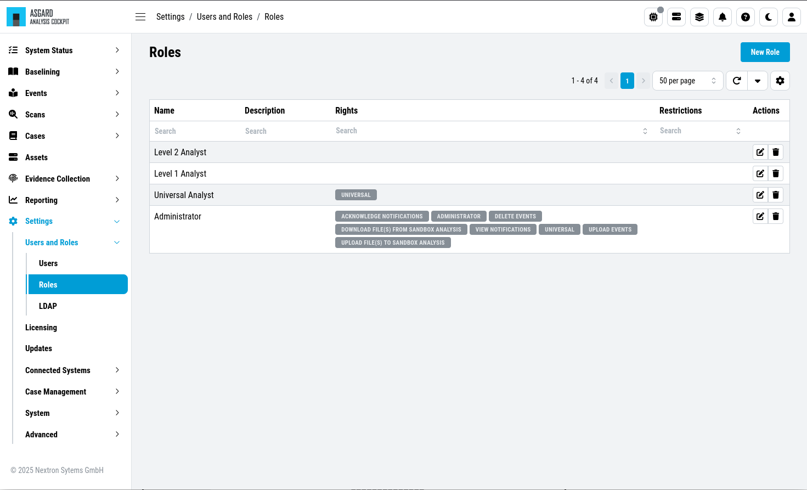
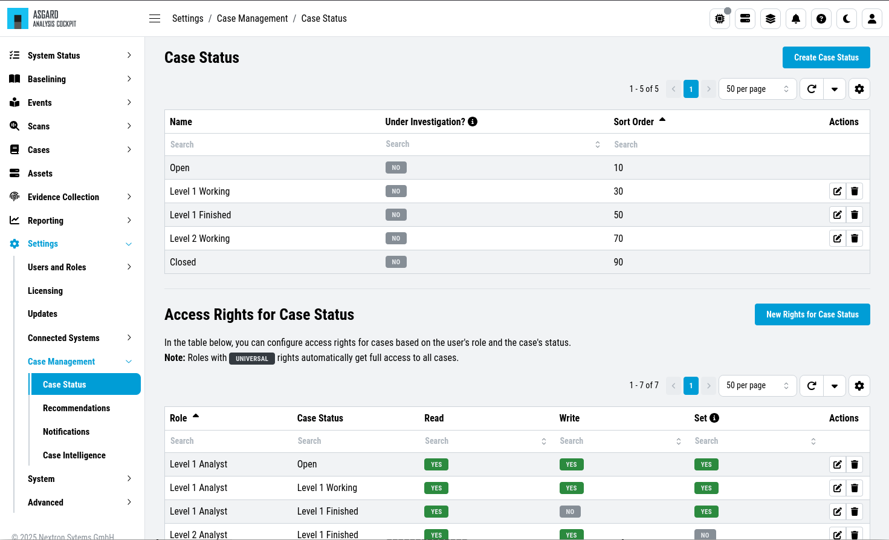
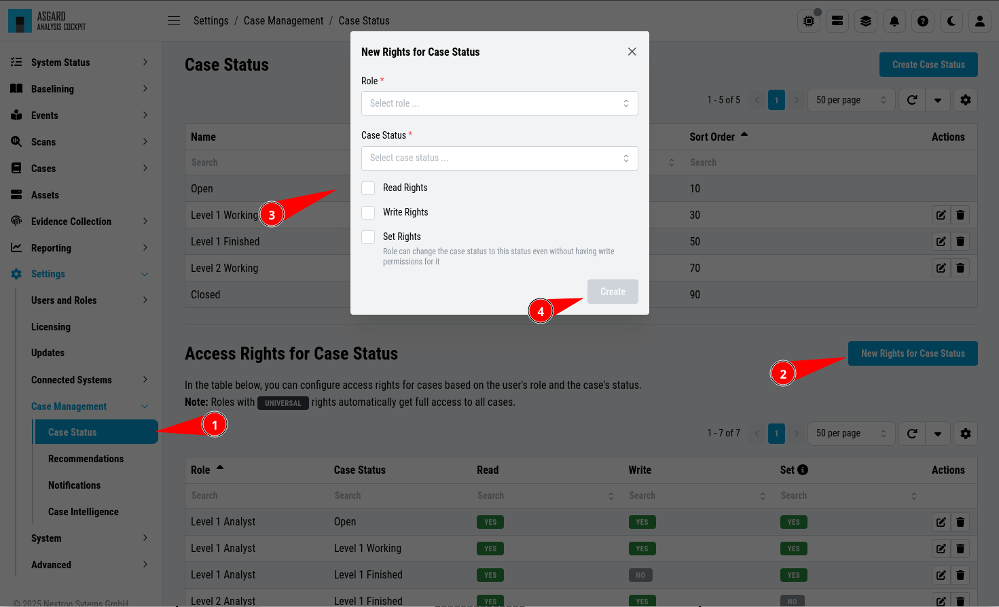

.. Index:: Permissions

Understanding Users, Roles, Rights and Case Status
--------------------------------------------------

| ``>Settings\Users and Roles\Roles``
| ``>Settings\Case Management\ Case Status``

The rights and roles model within the cockpit is aimed to support large
multinational organizations with different independent users working
with the case management at the same time. An organization responsible
for analyzing THOR logs might be split up in groups of analysts.

Within the cockpit, all users have the right to access the logs and
create cases. Within the ``Case Management`` section, access rights are
granted depending on the particular state the case is in.

In order to setup your rights management you must first decide about the
states you want your cases to have, then assign rights for a particular
state to a role and after that you add users to that particular role.

In order to understand this better, let's look at an example.

Let's assume we have an organization where a Level 1 analyst group
located in Frankfurt is responsible for creating cases and providing an
initial assessment for cases, while a Level 2 analyst group located in
Hamburg is responsible for reviewing, final decision and closing of
cases. In order to support an efficient workflow, you would at least
need the following states for your cases:

* Open (nobody is yet working on this case)
* Level 1 Working (Level 1 is working on this case)
* Level 1 Finished (Level 1 has finished and nobody is now working on this case)
* Level 2 Working (Level 2 is working on this case)
* Closed (Case closed)

A workflow could look like this:

.. figure:: ../images/cockpit_workflow_open_cases.png
   :alt: Workflow open Cases 

   Workflow open Cases

For your convenience, we already did the setup for this example and ship
all Analysis Cockpit with this workable template by default. You are
free to use, modify or delete the corresponding rights, statuses and
roles.

   Roles

Every Role can have different rights, corresponding to one specific status.
The predefined statuses come with a **Sort Order** (you might need to display
this column). This is the order those statuses are shown when you are
creating/updating a case.

   Case Status

In the lower table you can manage the access rights for every **Role** and
every **Case Status**. We can give the suitable rights to our generated
roles by clicking the ``New Rights for Case Status`` button on the right.

   Edit Rights – Read, Write, Set

The three permissions can be explained as follows:

- Read
  
  - The selected **Role** can read from the defined **Case Status**
  - If this permission is set, any Case with this Status can be seen

- Write
  
  - The selected **Role** can write/modify the defined **Case Status**
  - If this permission is set, any Case with this Status can be modified

- Set
  
  - The selected **Role** can set a case to the defined **Case Status**
  - Role can change the case status to this status even without having write permissions for it

To visualize the role and case status relationship, we created the table below:

.. list-table::
    :header-rows: 1
    :widths: 25 25 25 25

    * - User
      - Role
      - Case Status
      - Permissions
    * - User A
      - Level 1 Analyst
      - Open
      - Read, Write, Set

User A, who is a member of the Role ``Level 1 Analyst``, can see (read) and modify (write)
any case with the status ``Open``. They can also set **any** case, which they can **read**,
to the status ``Open``.