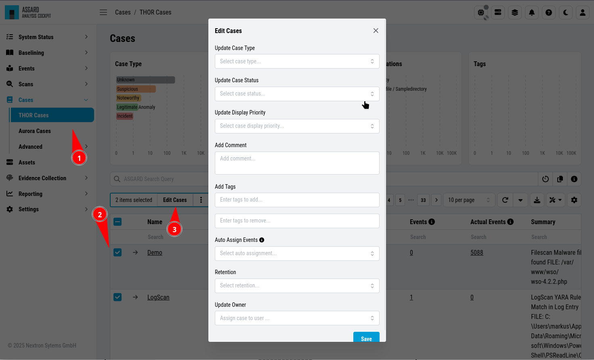

.. Index:: Additional Case Functionalities

Generate and Review auto\_case\_ids
-----------------------------------

``>Cases\THOR Cases``

These auto\_case\_ids can be reviewed in the ``Grouping Criteria`` section
of the case.

.. figure:: ../images/cockpit_auto_case_grouping_criteria.png
   :alt: Reviewing Grouping Criteria

   Reviewing Grouping Criteria

In our example, three auto\_case\_ids were added that match all 1,000
log lines. In the future all incoming logs, that match one of the three
“Detailed Reasons” will be added to this case directly and will not show
up in the Log Management section.

Limitations
^^^^^^^^^^^

There are limitations to the visibility of grouping criteria. Grouping
Criteria are only calculated for Alerts and Warnings. For all other
types of logs (Notices, Info, Error) auto\_case\_ids are not calculated,
so every log line gets its own highly specific filter that matches future
occurrences of exactly the same log line but will not do any kind of
generic matching. These highly specific filters are not displayed in the
case for simplicities sake.

In rare cases the Analysis Cockpit will find it difficult to calculate
auto\_case\_ids even for Alerts and Warnings. These logs will get tagged
with ``optimized\_template=false``. In this case, the behavior is like for
Notices, Info and Error messages. Grouping Criteria will not show up as
it will be one highly specific filter per log line.

More Information about Cases
----------------------------

The ``Affected Assets`` tab of a case shows assets that have contributed at least
one log line to this case. In this example 5 assets are affected.
All of them have the same operating system "windows".

.. figure:: ../images/cockpit_case_affected_assets.png
   :alt: Case - Assets Tab

   Case – Assets Tab

In the ``Comments`` tab you can add comments and attachments
to this case. Attachments can be used to pass additional information to
members of the analysis team (e.g. memory dump for further analysis).

.. figure:: ../images/cockpit_case_add_comment.png
   :alt: Case - Comments

   Case – Comments

The ``Changes`` tab shows information about changes to this case.

In other words: This is your case audit log.

.. figure:: ../images/cockpit_case_change_history.png
   :alt: Case - Changes tab

   Case – Changes tab

Bulk Edit / Bulk Delete
-----------------------

The Analysis Cockpit features a convenient way to make certain changes
to groups of cases. Just select the case in the left column and click
the ``Edit Cases`` or ``Delete Cases`` button.

   Bulk Edit

