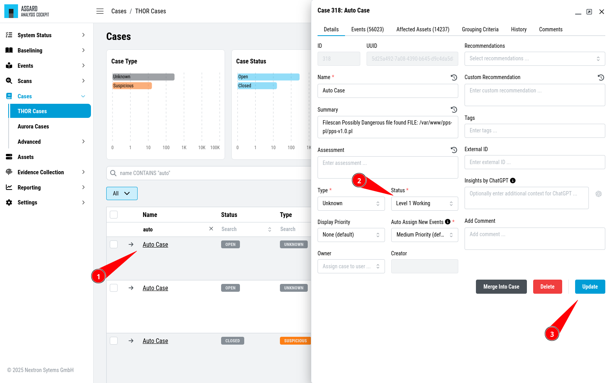

.. Index:: Case Workflow

Open a Case for Editing
-----------------------

``>Cases\THOR Cases``

The picture below shows the Case Management view with cases that have
been created with the ``Auto Case`` feature. You can see those cases
by filtering the ``Name`` column to only contain the ``Auto Case``
value and the ``Status`` column to only contain the ``Open`` value.

.. figure:: ../images/cockpit_overview_auto_cases.png
   :alt: Opening a Case for editing

   Opening a Case for editing

In our example a Level 1 Analyst would now pick one of these open cases
and set the Status to "Level 1 Working". To do this, they would open
the case by clicking on the magnifier button and modify the status
to ``Level 1 Working`` and then click ``Update``.

   Change Status

Now the logs within the case can be analyzed and results can be
documented in the assessment field. Recommendations can be set from the
canned recommendations list. Columns can be faded in and out and
comments can be added.

Case Dispatching
----------------

Let's assume, our Level 1 Analyst concludes, that this is a "Legitimate Anomaly". 
They will now set the status to "Level 1 Finished" and update
the case. After setting the case to "Level 1 Finished" the case becomes
visible to the Level 2 Analyst.

Closing a Case
--------------

``>Cases\THOR Cases``

Let's assume, that a Level 2 Analyst now picks one of the cases in
status "Level 1 Finished" and starts working on this case.

In this respect we assume, that something suspicious has been found,
that needs further analysis by the system administration team. In most
organizations this will be controlled through the organization's action
request or ticketing system. So, we assume, that we will close the case
in the Analysis Cockpit as it is progressed in another system. The
status is changed to ``closed`` and the case gets updated.

.. figure:: ../images/cockpit_closed_auto_case.png
   :alt: Closing a Case

   Closing a Case

.. note::
  The Analysis Cockpit provides interfacing to action-request and
  external ticketing systems using the API.

Grouping Criteria
-----------------

``>Cases\THOR Cases``

The Grouping Criteria of cases are the fields that are used to assign
events to cases. There are three types of grouping criteria:

- Auto Case IDs
- Conditions
- Regex

One Case can have multiple grouping criteria. Auto Case IDs are the most
performant way to group events into cases. Conditions are used to group
events into cases based on the values of the fields in the event - Conditions
are slower and should only be used if Auto Case IDs are too broad. Regex
should be your last resort and used only if the other two options are not
possible, as this is the most performance intensive way to group events into
cases.

   Grouping Criteria