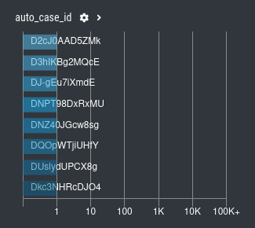

.. Index:: No new Events in Case

No new Events in Case
---------------------

**Q: I have created a case but it seems that no new incoming
events are assigned to that existing case. How can I check what's wrong?**

The first thing that you should check are the ``auto_case_ids`` of the
events in that case (``Cases`` > ``Open Case`` > ``Events`` > ``auto_case_id`` Panel).

If they are distributed as in the following screenshot, it seems that
auto-casing doesn't work on this case.

This case doesn't have groupable contents and uses only so-called
"Dynamic Auto Case IDs", which are used whenever the Analysis cockpit
was unable to find a suitable filter template to create usable filters
for this type of events.

Also check the grouping criteria of that case:

``Cases`` > ``Open Case`` > Tab ``Grouping Criteria``

What are the conditions defined to assign new events to that case?
