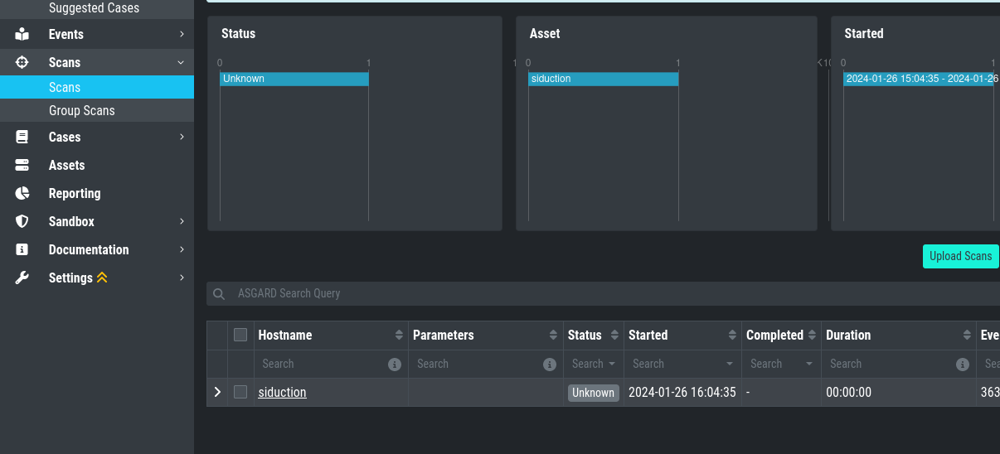

.. Index:: List of Known Issues

AAC#003: [WAR] could not create case
------------------------------------

.. list-table::
    :header-rows: 1
    :widths: 50, 50

    * - Introduced Version
      - Fixed Version
    * - 4.0.10
      - 4.0.11

There is currently a bug in the Analysis Cockpit when
creating cases, if the following conditions are given:

- Baseline view with a limited time frame (e.g. 30 days)
- Trying to create a ``Condition Case``

When you try to create a case with the above criteria given,
you will receive the following error:

.. code-block:: none

    [WAR] could not create case ERROR: can not create case with more than one source (query / condition / regex) set

AAC#003: Workaround
~~~~~~~~~~~~~~~~~~~

While we are working on the fix, you can do the following
to avoid the above error:

- Change the time frame to ``All time`` in your baseline view

AAC#002: Scan stuck at Status "Unknown"
---------------------------------------

.. list-table::
    :header-rows: 1
    :widths: 50, 50

    * - Introduced Version
      - Fixed Version
    * - 4.0.10
      - 4.0.11

There is currently a bug in the Analysis Cockpit
which prevents some Scans from being imported correctly.

This is caused by very big events (a single event bigger
than 64 Kb), which will cause the parser to error. The
Analysis Cockpit can never finish importing this Scan.

AAC#002: Fix
~~~~~~~~~~~~

We are currently testing the fix, which will skip
larger events and finish importing the scan logs.

You will also have the possibility to set the maximum
size of a single log line in the advanced options,
once the fix is released.

You will additionally see failed Log imports in the
Dashboard of your Analysis Cockpit.

AAC#002: Check
~~~~~~~~~~~~~~

You can check if one of your scan logs is effected
if the following conditions are met:

You will see a scan which is in the Status ``Unknown``

When you connect to your Analysis Cockpit via SSH
and enter a root session, you can execute the following
command to see if the error occured on one or more
log files:

.. code-block:: console

    root@analysis:# grep -R "ERROR: bufio.Scanner: token too long" /var/log/asgard-analysis-cockpit
    Jan 26 16:18:49 analysis analysiscockpit4[29459]: 2024-01-26T15:18:49Z [ERR] could not read events from file PATH: /var/lib/asgard-analysis-cockpit/events/upload_siduction_thor_2024-01-06.txt ERROR: bufio.Scanner: token too long

You should see from the above output which log had
problems, which should also be reflected in the filename:

.. code-block:: console

    root@analysis:# ls /var/lib/asgard-analysis-cockpit/events
    upload_siduction_thor_2024-01-06.txt.problem

The file has the ``.problem`` suffix, which indicates
a problem during the import.

Once you installed the update you can re-import the
failed scan logs. You can either upload them manually
again, or rename the files from the output above (remove
the ``.problem`` suffix).

AAC#001: Could not get table data: Data too large
-------------------------------------------------

This issue is related to ElasticSearch, which stores
your Analysis Cockpit's events. Elasticsearch calculates
the required RAM for operations before executing them.

The below error might occur on complex searches or aggregations
(e.g. for the graphs in the baselining view). To fix this issue,
you have to increase the RAM of your Analysis Cockpit and reconfigure
ElasticSearch to actually use more RAM.

AAC#001: Fix
~~~~~~~~~~~~

To actually fix the problem, you have to allocate more RAM
to your Analysis Cockpit. You should be able to do this
via your hypervisor.

To increase heap space for ElasticSearch, edit the following
configuration file on your Analysis Cockpit:

.. code-block:: console

    nextron@cockpit:~$ sudoedit /etc/elasticsearch/jvm.options.d/10-cockpit.options

You should see the following default values:

.. code-block:: none

    -Xms2g
    -Xmx2g

- Xms represents the initial size of total heap space
- Xmx represents the maximum size of total heap space

The ``2g`` part of the values indicates the heap space in gigabytes.
We advise to use 50% of your system's memory for ElasticSearch. On a
system with a maximum of 8 GB of RAM, this would be ``4g``:

.. code-block:: console

    -Xms4g
    -Xmx4g

After you saved your changes, restart the elasticsearch service (this
could take a few seconds!):

.. code-block:: console

    nextron@cockpit:~$ sudo systemctl restart elasticsearch.service

Make sure the service is in ``active (running)`` state after you
restarted it:

.. code-block:: console

    nextron@cockpit:~$ sudo systemctl status elasticsearch.service
