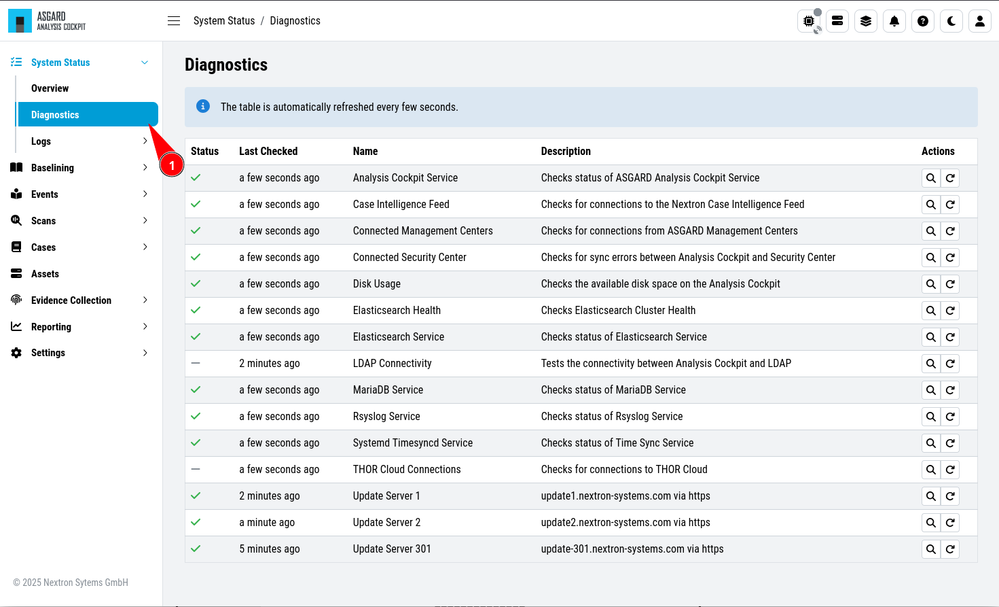

.. Index:: Diagnostics
   
Diagnostics
-----------

| ``>System Status\Diagnostics``
| ``>System Status\Logs\Diagnostic Pack``

You can find a Diagnostics Overview in your Analysis Cockpit.
To see the current status of your system, click on the "Diagnostics"
icon in the top right corner, or navigate to ``System Status`` >
``Diagnostics``. The Diagnostics Overview provides a summary of the
current status of your system, including the status of the system
components, the status of the system services, and the status of
connectivity to other services or update servers.

   Diagnostics Overview

You can rerun tests or inspect the status of individual tests by
by using the Actions Buttons to the right.

In case of ongoing issues, you can also download the diagnostics
pack for further analysis by our support team. To do so, click
``Generate and Download Diagnostic Pack``. Depending on your system
and usage, this file can be quite large.

   Diagnostic Pack

Our support team can provide you dedicated access to our file share, since
the file will be most likely too big for email attachments.