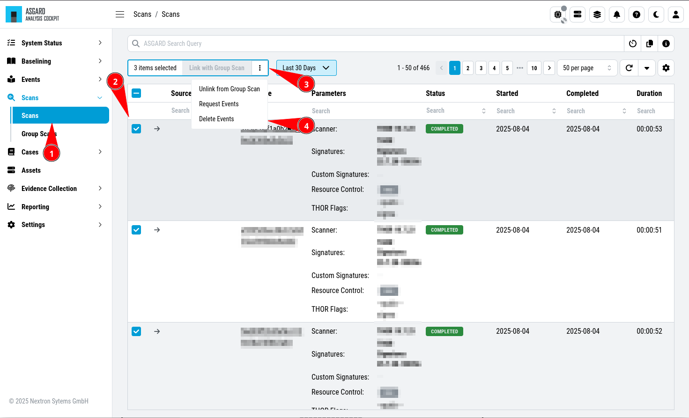

.. Index:: Regain Disk Space

Regain Disk Space
-----------------

If your disk is already at or close to 100% and AC no longer works properly, see section
:ref:`pitfalls/pitfalls:recover from a full disk`.

If your disk usage is growing too fast and free disk space is running out, you have several options:

1. Increase the size of your disk
2. Delete files that are not needed for operation
3. Delete files that are used by AC but are unneeded / dated
4. Set the :ref:`maintenance/retention:data retention` Policy to automatically delete old data

Safe-to-Delete Files
^^^^^^^^^^^^^^^^^^^^

The following files are safe to delete. They are not needed for AC
to operate.

- ``/var/log/asgard-analysis-cockpit/*.gz``
- ``/var/lib/asgard-analysis-cockpit/events/*.ok``

They are only kept on the system if needed for further processing.
E.g. saving/sending the log files to another system or keeping the
THOR scans (found in ``events``) for backup reasons. If you do
not need or plan to use those, they can be deleted. If you are unsure
make a copy to another system before deleting them.

More details can be found in section
:ref:`pitfalls/pitfalls:recover from a full disk`.

Potentially Unneeded / Dated Files
^^^^^^^^^^^^^^^^^^^^^^^^^^^^^^^^^^^

This method is only advised as a last resort if increasing your disk space is not an option.

If your AC is running for a long time, there might be data ingested that you
no longer need and therefore can be deleted to regain disk space. This includes:

- Scans
- Reports

Deleting Unneeded Scans
~~~~~~~~~~~~~~~~~~~~~~~

``>Scans\Scans``

.. warning::
    
    Deleting old scans deletes information which the Analysis Cockpit uses.

    Example: You have an incident case, which contains events from a certain
    scan. Those events are associated with an endpoint, since the events originate
    from that endpoint. When you delete this scan, no association between endpoint
    and incident case remains, thus the endpoint has one less ``Incident Case`` in
    the Assets View.

Therefore only delete scans you no longer need. This can be done by selecting
the scans and clicking ``Delete Events``.

   Possible Filter for Selecting Scans for Deletion

Another possibility is searching for assets which are no longer
part of your infrastructure and deleting their scans.

Deleting Unneeded Reports
~~~~~~~~~~~~~~~~~~~~~~~~~

Old unneeded reports can be deleted via command line and are
found at ``/var/lib/asgard-analysis-cockpit/reports``.

.. note::
   The reports are still listed in the UI after removal,
   but a download attempt will fail.
