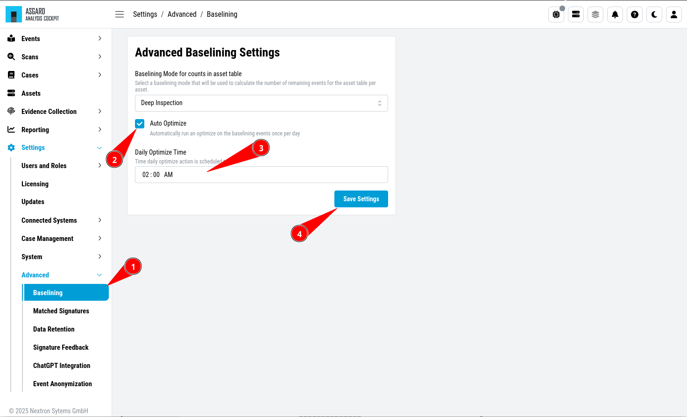

.. Index:: Auto Optimize

Auto Optimize
-------------

``>Settings\Advanced\Baselining``

You can schedule a daily **Auto Optimize**. To do so,
enable the ``Auto Optimize`` Setting and set a time when
the **Optimize** function should run.

   Auto Optimize