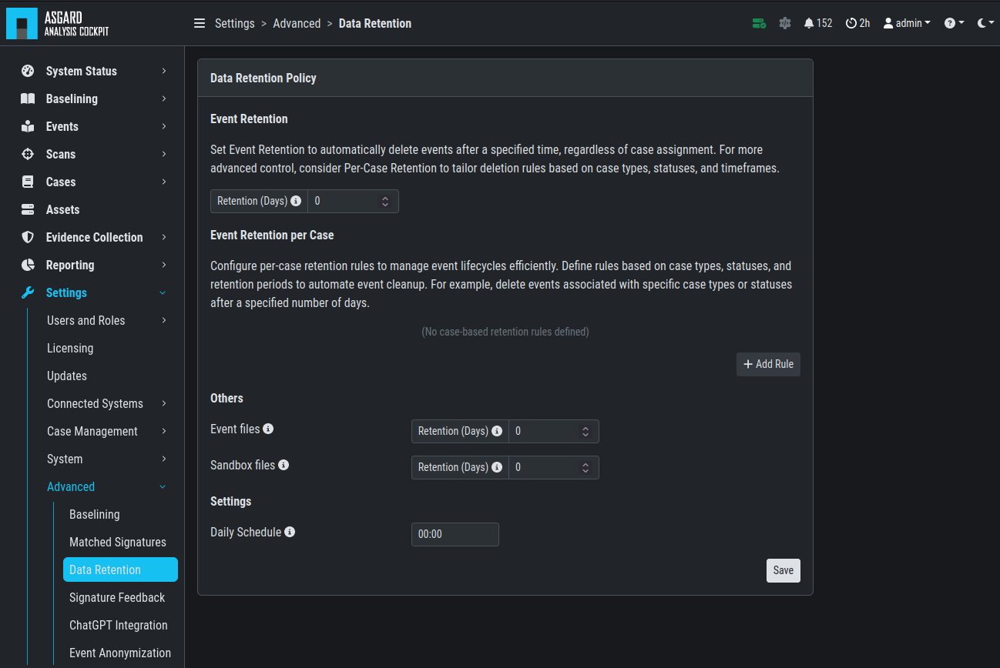

.. Index:: Data Retention
   
Data Retention
--------------

You can configure the Data Retention Policy for your Analysis Cockpit.
This will delete old events from the database, based on the retention
policy rules you have defined. This is useful to keep the database size
manageable and to keep the performance of the Analysis Cockpit at a
reasonable level. Additionally, raw data on disk and sandbox files can
also be deleted with the Data Retention Policy, which can help you to
manage your disk space usage.

The Data Retention Policy is configured in ``Settings`` > ``Advanced`` >
``Data Retention``.

   Data Retention

.. hint::
   The default setting is to keep all events indefinitely. If you want to
   delete old events automatically, you need to configure a Data Retention
   Policy.

There are multiple options within the Data Retention Policy:

- **Event Retention per Case Type / Status** - this setting will allow you to
  set a different retention period rule for each case type and status. This is
  useful if you have different retention requirements for different case types
  and statuses. You can create multiple rules for different case types and case
  statuses. This policy will only apply to cases which have the "default" retention
  period set (see next option).

  .. figure:: ../images/cockpit_data-retention-per-case-type-status.png
      :alt: Data Retention - Case Type / Status

      Data Retention - Case Type / Status
- **Event Retention per Case** - this setting will allow you to set a
  different retention period rule for each case. This is useful if you have
  different retention requirements for different cases. This value takes
  presedence over the **Event Retention per Case Type / Status**. You can
  choose from the following options:

  - **Default** - uses retention period from the General Event Retention setting.
  - **Indefinite** - keeps all events indefinitely.
  - **Custom** - allows you to specify a custom retention period in days.

   .. figure:: ../images/cockpit_data-retention-per-case.png
         :alt: Data Retention - Case
   
         Data Retention - Case

- **General Event Retention** - this setting will delete events older than the
  specified number of days. For example, if you set this to 30 days, all
  events older than 30 days will be deleted from your Analysis Cockpit.
  Raw data on disk will not be deleted. The default setting is to keep all
  events indefinitely. We recommend to only use this setting if necessary,
  as it will delete all events older than the specified number of days.
  The reason for this is that this setting is taking presedence over the
  other settings. Please use this option with caution.

  .. figure:: ../images/cockpit_data-retention-general.png
      :alt: Data Retention - General

      Data Retention - General

- **Others** - this deletes raw data on disk and sandbox files older than
  the specified number of days. Default value: 0 for both.

  .. figure:: ../images/cockpit_data-retention-other.png
      :alt: Data Retention - Others

      Data Retention - Others