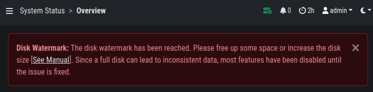

.. Index:: Pitfalls

Certificate Validation Failed
-----------------------------

If you receive the following error, SSL/TLS interception interrupted the
installation process.

.. code-block:: console
   
   nextron@cockpit:~$ sudo nextronInstaller -cockpit 
   [sudo] password for nextron:
   Ign:1 https://update3.nextron-systems.com analysis InRelease
   Err:2 https://update3.nextron-systems.com analysis Release
   Certificate verification failed: The certificate is NOT trusted. The certificate issuer is unknown. Could not handshake: Error in the certificate verification. [IP: 192.168.3.21 8080]

Since we do not support setups in which the connections to our update
servers are intercepted (see chapter :ref:`requirements/network:ssl/tls interception`), the
only way to resolve this problem is to deactivate SSL/TLS interception
for our update servers.

Log File Import of Previous Years
---------------------------------

The log file format of (old) THOR scan logs is the original SYSLOG
format, which contains no year value in the timestamp of the message
header.

You can modify the timestamp of old THOR logs by using the following
script:

https://github.com/NextronSystems/nextron-helper-scripts/blob/master/asgard-analysis-cockpit/thor-timestamp-coverter.py

Disk Watermark
--------------

Elasticsearch has a disk watermark that it uses to determine if it
should go into read-only mode. If the disk is too full, Elasticsearch
will stop accepting new data. This watermark is set to 95% by default
and will prevent data loss by stopping the system from writing to the
disk.

The disk watermark of the Analysis Cockpit however is set to 90%. This means
on a 1TB drive you need at least 100GB of free space or the Analysis Cockpit
will put itself into read-only mode. We set this value lower than the default
of Elasticsearch to give you more time to react before Elasticsearch goes into
read-only mode, in which case you would need to reset the read-only mode manually
on Elasticsearch.

The below message shows up in the Analysis Cockpit if the disk watermark is
reached:

   Disk Watermark

If you see this message, the Analysis Cockpit went into a read-only mode
and you need to free up some disk space or increase the disk space by
allocating more storage to the virtual machine.

To free up some disk space, you can follow the instructions in the next
chapter (:ref:`maintenance/disk-space:regain disk space`).

If your disk usage somehow got above 95%, Elasticsearch will go into read-only mode
nontheless. If this happened, you need to reset the Elasticsearch state after you
freed up some disk space. You can achieve this by running the following command:

.. code-block:: console

   nextron@cockpit:~$ curl -X PUT -s -u elastic:$(cat /etc/asgard-analysis-cockpit/elastic.password) \
   -H 'Content-Type: application/json' \
   -d '{"index.blocks.read_only_allow_delete": null}' \
   http://localhost:9200/_all/_settings

You should get the following output if the command was successful:

.. code-block:: none

   {"acknowledged":true}

.. note:: 
   Please note that the password changes after the Analysis Cockpit was
   restarted, this is why we ``cat`` the password directly from the file.

Recover from a Full Disk
------------------------

If your disk is full or near full, ASGARD Analysis Cockpit will
not work properly. In order to resume its operation you need to
make free space on the disk.

We suggest to save the files to another system beforehand, if you
want to keep the information for future usage. ASGARD will not need
the following files to function and they can be removed safely:
    
- ``/var/lib/asgard-analysis-cockpit/log/*.gz``
- ``/var/lib/asgard-analysis-cockpit/events/*.ok``

Especially the assignment log can grow big in production environments.
If deleting the logs is not enough, deleting the already read-in events (ending on ``.ok``)
is the next best location to regain disk space. If there are too many files for a 
simple ``rm *.ok``, you can use find to delete them:

.. code-block:: console

   nextron@cockpit:~$ sudo su -
   [sudo] password for nextron:
   root@cockpit:~# find /var/lib/asgard-analysis-cockpit/events -name "*.ok" -print0 | xargs -0 -I'{}' rm '{}'

If Elasticsearch does not automatically work again after cleaning up some disk space, restart
it under ``Settings`` > ``System`` > ``Services`` or with ``sudo systemctl restart elasticsearch.service``.
If this is not working either, you may need to disable Elasticsearch's read-only mode. See 
:ref:`pitfalls/pitfalls:disk watermark` for a how-to.

Deleting the files given above should be enough to resume operation. If the disk on your
ASGARD Analysis Cockpit is full because of growing data over time, the disk space should be
increased - see :ref:`maintenance/extending-lvm:extending disk space`. If that is not an option
you can delete old scans or set a Retention Policy as described in section
:ref:`maintenance/disk-space:regain disk space`.

Debug Failed File Imports
-------------------------

Check for reported problems using this command:

.. code-block:: console
   
   nextron@cockpit:~$ sudo su -
   [sudo] password for root:
   nextron@cockpit:~$ find /var/lib/asgard-analysis-cockpit/events -name "\*.problem"

Make sure that you're able to see the imported log data and review the
selected time range in the time range picker in whatever view you're
reviewing the data. Be aware that the log data gets indexed with the
creation timestamp of the log lines not the time of their import.

This means that if you're importing log data that is old, the default
date range set in the date range picker may be too narrowly defined so
that you're just unable to see the imported data.

Fixing a Broken Proxy Configuration
-----------------------------------

Sometimes during installation, proxy settings get mixed up or a typo in
the proxy URL leads to a broken Internet connection.

It is not trivial to fix this situation, since the proxy settings
collected during installation are changed in so many different locations
on a Linux system for all the different services and command line tools.

Broken before Analysis Cockpit Installation
^^^^^^^^^^^^^^^^^^^^^^^^^^^^^^^^^^^^^^^^^^^

If you have set a wrong proxy before the package installation using the
**sudo nextronInstaller -cockpit** command and the installer failed to
fetch the required packages from our update servers, perform the
following steps.

Fix the proxy string in the file ``/etc/apt/apt.conf.d/00proxy``

.. code:: console
   
   nextron@cockpit:~$ sudoedit /etc/apt/apt.conf.d/00proxy

Then rerun the installer.

Broken after the Analysis Cockpit Installation
^^^^^^^^^^^^^^^^^^^^^^^^^^^^^^^^^^^^^^^^^^^^^^

If your infrastructure has changed and you have to change the proxy
server sometime later, edit the proxy settings in the Web GUI.

``Settings`` > ``System`` > ``Proxy``
