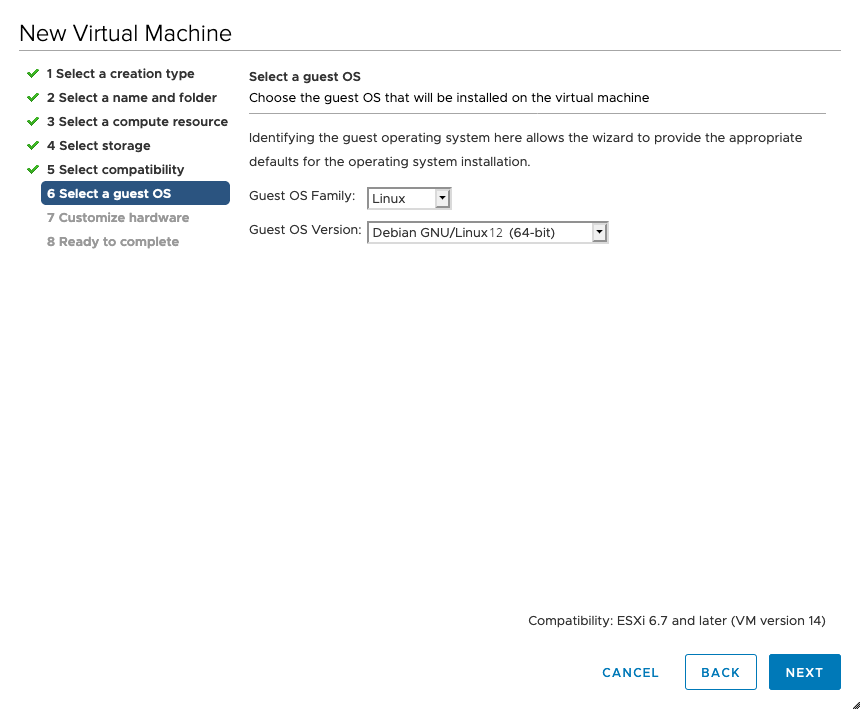

.. Index:: ESXi

Create a New ESX VM and Mount the ISO
=====================================

Create a new VM with your virtualization software. In this case, we will
use VMWare ESX managed through a VMWare VCenter.

The new VM must be configured with a Linux base system and Debian
GNU/Linux 10 (64 bits) as target version. It is recommended to upload
the Nextron Universal Installer ISO to an accessible datastore and mount
the same to your newly created VM.

.. figure:: ../images/esxi_new_vm.png
   :alt: Create a new virtual Machine I

.. figure:: ../images/esxi_new_vm_name.png
   :alt: Create a new virtual Machine II

.. figure:: ../images/esxi_new_vm_hardware.png
   :alt: Create a new virtual Machine IV 

   Create a new virtual Machine

Please make sure to select a suitable v-switch or physical interface
that reflects the IP address scheme you are planning to use for the new
Analysis Cockpit. Only use one Hard Disk for the installation.
