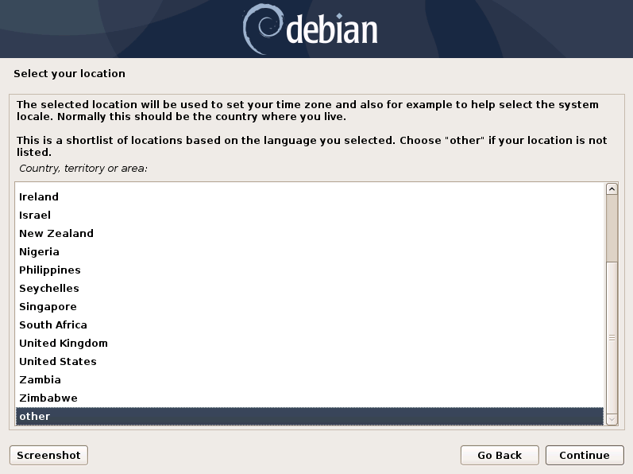
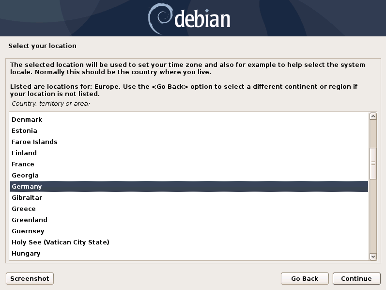
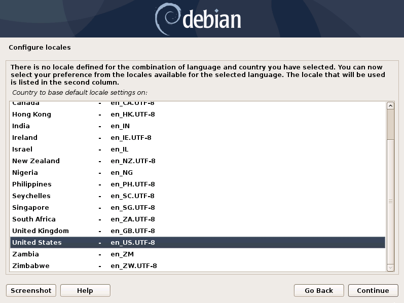

.. Index:: Installer

Navigate through the Installer
==============================

Start the installation confirming the only available option in the boot
loader screen.

The installer then loads the additional components from the ISO image
and lets you select a location and language.

.. figure:: ../images/asgard_iso_installer.png
   :alt: Starting the installation

   Starting the installation

.. figure:: ../images/asgard_iso_installer_language.png
   :alt: Choosing language, location and locales I

   Choosing language, location and locales

.. note:: 
    If DHCP is available, network parameters will be configured
    automatically. Without DHCP, ASGARD proceeds with the manual
    network configuration dialogue.
