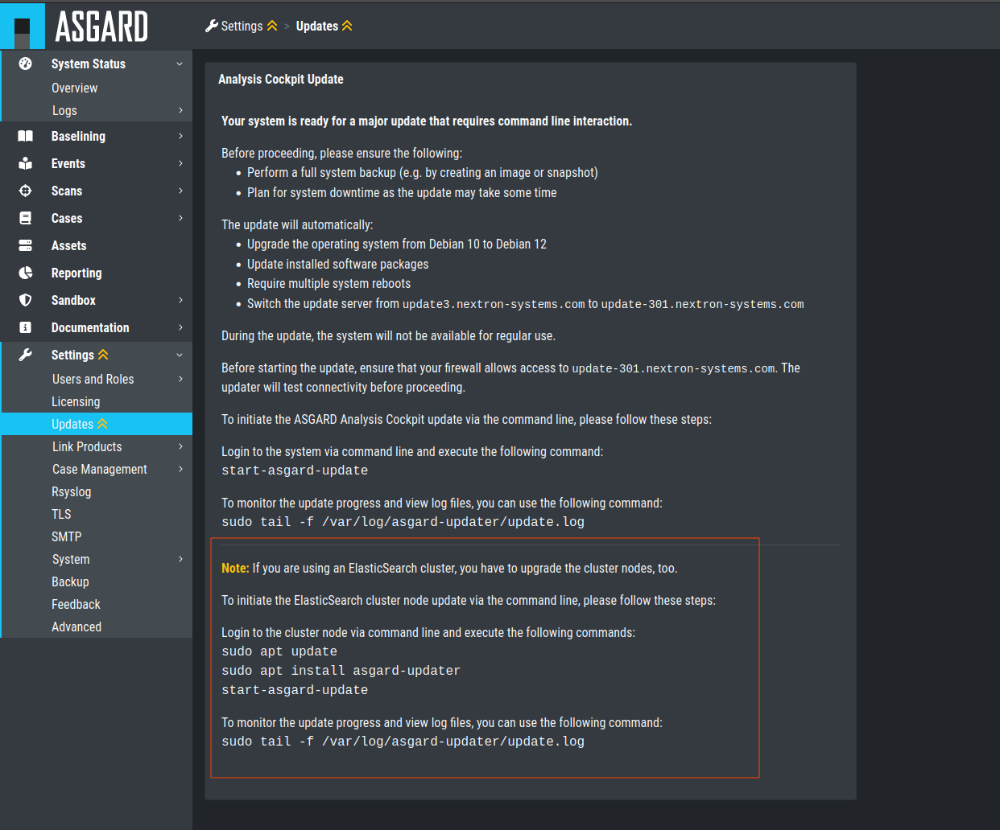
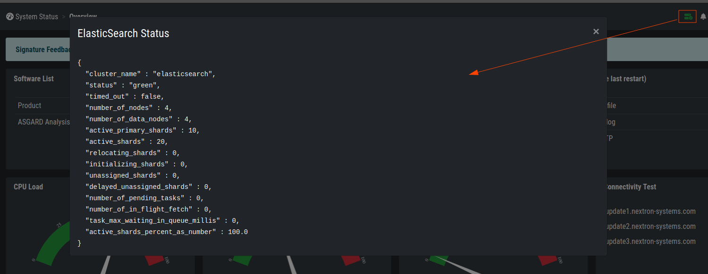

.. Index:: Cluster Upgrade

Cluster Upgrade
---------------

This chapter guides you through the upgrade process of
your Analysis Cockpit version 3.10.1 to version 4.x.

It is important to follow the steps carefully. We advise you
to create a snapshot of all your Elasticsearch cluster nodes
and the Analysis Cockpit itself before starting your upgrade.

.. danger::
   Please do not update your Analysis Cockpit before you update
   your Elasticsearch Cluster Nodes. This can potentially break
   your enviornment.

Preparation
^^^^^^^^^^^

To prepare for your upgrade, we compiled a list of tasks you
should follow:

.. list-table:: 
    :header-rows: 1
    :widths: 50 50

    * - Task
      - Description
    * - Snapshot of your Analysis Cockpit
      - For disaster recovery
    * - Snapshot of your Elasticsearch Cluster Nodes
      - For disaster recovery
    * - Analysis Cockpit running version 3.10.1
      - Prerequisite for the Major Upgrade
    * - Newest ``asgard-updater`` is installed
      - This performs the update and has to be in the newest version 
    * - Cluster status is "green"
      - We don't want to upgrade a non functional cluster
    * - Connection to our new update servers
      - New update server infrastructure
    * - Stop your Analysis Cockpit - ``optional``
      - To ensure no scans are being synchronized from your Management Center

For details regarding some of the above tasks, see the next section
in this manual.

With the new version of your Analysis Cockpit, we also
made changes to our update servers. Please make sure
that all your components can reach the following servers:

.. list-table:: 
    :header-rows: 1

    * - Server
      - Port
      - Description
    * - update3.nextron-systems.com
      - tcp/443
      - Old update server
    * - update-301.nextron-systems.com
      - tcp/443
      - New update Server

The old update server is needed to fetch the updater and
other prerequisites. The new update server is needed to upgrade
your servers to Debian 12 and also to install any new packages,
which are needed for your Analysis Cockpit v4.

You can find the corresponding IP-Addresses to the above
FQDNs here: https://www.nextron-systems.com/hosts/.

Analysis Cockpit running version 3.10.1
~~~~~~~~~~~~~~~~~~~~~~~~~~~~~~~~~~~~~~~

To check if your Analysis Cockpit is running on the correct version.
You can navigate to ``Settings`` and ``Updates``. The page should
look like this:

   Update Section

Newest ``asgard-updater`` is installed
~~~~~~~~~~~~~~~~~~~~~~~~~~~~~~~~~~~~~~

This step should be performed on your Analysis Cockpit and all
your cluster nodes.

To check if a newer version of the ``asgard-updater`` is
available, we have to run the following commands. If you
get the highlighted output, you have already the newest
version installed (the version from the output might be
newer in your case):

.. code-block:: console
    :emphasize-lines: 6

    nextron@analysis:~$ sudo apt update
    nextron@analysis:~$ sudo apt install asgard-updater
    Reading package lists... Done
    Building dependency tree       
    Reading state information... Done
    asgard-updater is already the newest version (1.0.17).
    0 upgraded, 0 newly installed, 0 to remove and 18 not upgraded.

You can now run the ``asgard-updater`` with the following command:

.. code-block:: console

    nextron@analysis:~$ start-asgard-update

Cluster status is "green"
~~~~~~~~~~~~~~~~~~~~~~~~~

You can see the status of your Elasticsearch Cluster with one
of the following two methods:

Via the Web UI of your Analysis Cockpit:

   Elasticsearch Cluster Status

Or via SSH. To do this, connect to your Analysis Cockpit via SSH
and run the following command:

.. code-block:: console
    :emphasize-lines: 4

    nextron@analysis:~$ curl -s http://127.0.0.1:9200/_cluster/health | jq
    {
      "cluster_name": "elasticsearch",
      "status": "green",
      "timed_out": false,
      "number_of_nodes": 4,
      "number_of_data_nodes": 4,
      "active_primary_shards": 8,
      "active_shards": 16,
      "relocating_shards": 0,
      "initializing_shards": 0,
      "unassigned_shards": 0,
      "delayed_unassigned_shards": 0,
      "number_of_pending_tasks": 0,
      "number_of_in_flight_fetch": 0,
      "task_max_waiting_in_queue_millis": 0,
      "active_shards_percent_as_number": 100
    }

If you are unsure what your cluster nodes are, you can run the
following command. Please note, the cluster marked as ``dim``
is your master node, or in our case the Analysis Cockpit.

.. code-block:: console
    :emphasize-lines: 4

    nextron@analysis:~$ curl -s http://127.0.0.1:9200/_cat/nodes
    172.28.30.53  23 61  0 0.03 0.10 0.04 di  - elastic-test-03
    172.28.30.52  20 61  0 0.01 0.03 0.00 di  - elastic-test-02
    172.28.30.225 68 97 20 1.17 1.48 1.60 dim * analysis
    172.28.30.51  23 86  0 0.08 0.02 0.01 di  - elastic-test-01

For more information, run the following command:

.. code-block:: console

    nextron@analysis:~$ curl -s 'http://127.0.0.1:9200/_cat/nodes?format=json&filter_path=ip,name' | jq
    [
      {
        "ip": "172.28.123.53",
        "name": "elastic-test-03"
      },
      {
        "ip": "172.28.123.52",
        "name": "elastic-test-02"
      },
      {
        "ip": "172.28.123.225",
        "name": "analysis"
      },
      {
        "ip": "172.28.123.51",
        "name": "elastic-test-01"
      }
    ]

Stop your Analysis Cockpit - ``optional``
~~~~~~~~~~~~~~~~~~~~~~~~~~~~~~~~~~~~~~~~~

You can optionally stop your Analysis Cockpit service
to ensure no new scan logs are being synchronized from
your Management Center. This will reduce the risk of
losing new scan logs during the upgrade process.

To stop and disable the Analysis Cockpit service on
your server, connect via SSH and run the following
commands. Please keep in mind that stopping the service
might take a while.

.. code-block:: console

  nextron@analysis:~$ sudo systemctl disable asgard-analysis-cockpit.service
  Removed /etc/systemd/system/multi-user.target.wants/asgard-analysis-cockpit.service.
  nextron@analysis:~$ sudo systemctl stop asgard-analysis-cockpit.service

Performing the upgrade
^^^^^^^^^^^^^^^^^^^^^^

In this section we will perform the actual upgrade
of the Analysis Cockpit and your cluster nodes. Please
following the instructions carefully, and follow the
sequence of updates according to this manual. Please
do not continue if you don't have a backup/snapshot
ready to restore your cluster in case of a disaster.

Cluster Node Upgrade
~~~~~~~~~~~~~~~~~~~~

.. hint:: 
    It is recommended that you update all your nodes at the
    same time. Do not update your Analysis Cockpit until
    all your notes are finished with the update.

If all the above tasks from the checklist are completed, you
can start to upgrade your cluster nodes. Connect to your
cluster nodes via SSH and run the following commands:

.. code-block:: console

    nextron@node-01:~$ sudo apt update
    nextron@node-01:~$ sudo apt install asgard-updater
    nextron@node-01:~$ start-asgard-update

This will install the asgard-updater, which will take care of
the update task. The tool will upgrade your Elasticsearch version
to the latest minor version available. After this, it will upgrade
the OS from Debian 10 to Debian 12. Your system will restart many
times during the update. If you have the feeling the upgrade is stuck
at one point, you can run the following command and see the latest logs:

.. code-block:: console

    nextron@node-01:~$ sudo tail -f /var/log/asgard-updater/update.log

The update is finished if you are seeing the following lines:

.. code-block:: console

    nextron@node-01:~$ sudo tail -f /var/log/asgard-updater/update.log
    2023-11-10T09:29:04.835115+01:00 elastic-test-01 asgard-updater[536]: Elasticsearch service status: active
    2023-11-10T09:29:04.835194+01:00 elastic-test-01 asgard-updater[536]: Upgrade finished. Deactivating service...
    2023-11-10T09:29:04.844839+01:00 elastic-test-01 asgard-updater[536]: Removed "/etc/systemd/system/multi-user.target.wants/asgard-updater.service".

Please continue with the next step to finish the upgrade.

Analysis Cockpit Upgrade
~~~~~~~~~~~~~~~~~~~~~~~~

You Elasticsearch Cluster will now be in a degraded ("red") state,
since your Analysis Cockpit is still running on an older version
of Elasticsearch. This is expected as long as you did not finish
your Analysis Cockpit upgrade. You should see the cluster changing
to a normal ("green") state throughout the upgrade of your Analysis
Cockpit.

To finish your upgrade, connect to your Analysis Cockpit via SSH.
We will run the following command on the command line to initiate the upgrade:

.. code-block:: console

    nextron@node-01:~$ sudo apt update
    nextron@node-01:~$ sudo apt install asgard-updater
    nextron@node-01:~$ start-asgard-update

The server running your Analysis Cockpit will now restart
multiple times. It is important to not interrupt the upgrade
process and let the server do all the tasks. You can however
see if any errors occurred during the upgrade or just observe
at what stage the upgrade is.

Run the following command to see the status of your upgrade:

.. code-block:: console

    nextron@analysis:~$ sudo tail -f /var/log/asgard-updater/update.log

There is a chance that you see the following log lines repeatedly
in the output:

.. code-block:: console

    nextron@analysis:~$ sudo tail -f /var/log/asgard-updater/update.log
    Nov 14 12:30:17 analysis asgard-updater[2403]: 2023-11-14T12:30:17+01:00 STARTING /usr/share/asgard-updater/bin/step05.sh
    Nov 14 12:30:17 analysis asgard-updater[2403]: Checking for Elasticsearch Cluster Nodes...
    Nov 14 12:30:17 analysis asgard-updater[2403]: Elasticsearch service status: active
    Nov 14 12:30:17 analysis asgard-updater[2403]: Elasticsearch cluster is not healthy (status: red).
    Nov 14 12:30:17 analysis asgard-updater[2403]: Elasticsearch cluster setup is enabled but no nodes are connected.
    Nov 14 12:30:17 analysis asgard-updater[2403]: 2023-11-14T12:30:17+01:00 FINISHED /usr/share/asgard-updater/bin/step05.sh RC=54

If this is the case, your cluster nodes might not be fully online
yet. The updater tries this check every minute to make sure
the cluster is fully online and healthy, before continuing with
the next steps. Even if it looks like the updater is stuck, you
have to give it some time and wait for it to continue by itself.

The update is finished if you are seeing the following lines:

.. code-block:: console

    nextron@node-01:~$ sudo tail -f /var/log/asgard-updater/update.log
    2023-11-10T09:29:04.835115+01:00 analysis asgard-updater[536]: Elasticsearch service status: active
    2023-11-10T09:29:04.835194+01:00 analysis asgard-updater[536]: Upgrade finished. Deactivating service...
    2023-11-10T09:29:04.844839+01:00 analysis asgard-updater[536]: Removed "/etc/systemd/system/multi-user.target.wants/asgard-updater.service".

Your cluster status should change back to a "green" status once
all the updates of your Analysis Cockpit are installed. You
can see the status in your Analysis Cockpit in the top right corner:

   Elasticsearch Cluster Status

Your upgrade is now finished, and you can use your Analysis Cockpit
with the newest version.