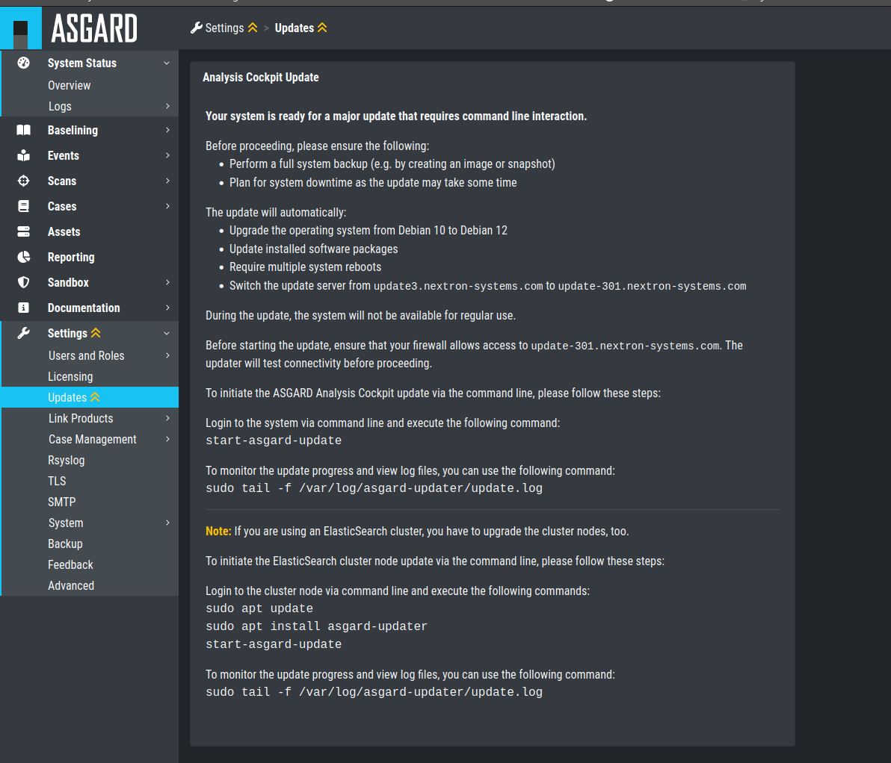

.. Index:: Cluster Upgrade

Cluster Upgrade
---------------

This chapter guides you through the upgrade process of
your Analysis Cockpit version 3.8.10 to version 4.x.

It is important to follow the steps carefully. We advise you
to create a snapshot of all your Elasticsearch cluster nodes
and the Analysis Cockpit itself before starting your upgrade.

Preparation
^^^^^^^^^^^

To prepare for your upgrade, we compiled a list of tasks you
should follow. You can find the list below:

.. list-table:: 
    :header-rows: 1

    * - Task
      - Description
    * - Snapshot of your Analysis Cockpit
      - For disaster recovery
    * - Snapshot of your Elasticsearch Cluster Nodes
      - For disaster recovery
    * - Analysis Cockpit running version 3.8.10
      - Prerequisite for the Major Upgrade
    * - Newest ``asgard-updater`` is installed
      - This performs the update and should be in the newest version 
    * - Cluster status is "green"
      - We don't want to upgrade a non functional cluster
    * - Connection to our update servers
      - We need to fetch updates

For details regarding some of the above tasks, see the next section
in this manual.

With the new version of your Analysis Cockpit, we also
made changes to our update servers. Please make sure
that all your components can reach the following servers:

.. list-table:: 
    :header-rows: 1

    * - Server
      - Port
      - Description
    * - update3.nextron-systems.com
      - tcp/443
      - Old update server
    * - update-301.nextron-systems.com
      - tcp/443
      - New update Server

The old update server is needed to fetch the updater and
other updates. The new update server is needed to upgrade
your servers to Debian 12 and also to install any new packages,
which are needed for your Analysis Cockpit v4.

You can find the corresponding IP-Addresses to the above
FQDNs here: https://www.nextron-systems.com/hosts/.

Analysis Cockpit running version 3.8.10
~~~~~~~~~~~~~~~~~~~~~~~~~~~~~~~~~~~~~~~

To check if your Analysis Cockpit is running on the correct version
you can navigate to ``Settings`` and ``Updates``. The page should
looks like this:

   Update Section

Newest ``asgard-updater`` is installed
~~~~~~~~~~~~~~~~~~~~~~~~~~~~~~~~~~~~~~

This step should be performed on your Analysis Cockpit and all
your cluster nodes.

To check if a newer version of the ``asgard-updater`` is
available, we have to run the following commands. If you
get the highlighted output, you have already the newest
version installed (the version might differ from the output
here):

.. code-block:: console
    :emphasize-lines: 6

    nextron@analysis:~$ sudo apt update
    nextron@analysis:~$ sudo apt install asgard-updater
    Reading package lists... Done
    Building dependency tree       
    Reading state information... Done
    asgard-updater is already the newest version (1.0.16).
    0 upgraded, 0 newly installed, 0 to remove and 18 not upgraded.

You can now run the ``asgard-updater`` with the following command:

.. code-block:: console

    nextron@analysis:~$ start-asgard-update

Cluster status is "green"
~~~~~~~~~~~~~~~~~~~~~~~~~

Connect to your Analysis Cockpit via SSH. Run the following command:

.. code-block:: console
    :emphasize-lines: 4

    nextron@analysis:~$ curl -s http://127.0.0.1:9200/_cluster/health | jq
    {
      "cluster_name": "elasticsearch",
      "status": "green",
      "timed_out": false,
      "number_of_nodes": 4,
      "number_of_data_nodes": 4,
      "active_primary_shards": 8,
      "active_shards": 16,
      "relocating_shards": 0,
      "initializing_shards": 0,
      "unassigned_shards": 0,
      "delayed_unassigned_shards": 0,
      "number_of_pending_tasks": 0,
      "number_of_in_flight_fetch": 0,
      "task_max_waiting_in_queue_millis": 0,
      "active_shards_percent_as_number": 100
    }

If you are unsure what your cluster nodes are, you can run the
following command. Please note, the cluster marked as ``dim``
is your master node, or in our case the Analysis Cockpit.

.. code-block:: console
    :emphasize-lines: 4

    nextron@analysis:~$ curl -s http://127.0.0.1:9200/_cat/nodes
    172.28.30.53  23 61  0 0.03 0.10 0.04 di  - elastic-test-03
    172.28.30.52  20 61  0 0.01 0.03 0.00 di  - elastic-test-02
    172.28.30.225 68 97 20 1.17 1.48 1.60 dim * analysis
    172.28.30.51  23 86  0 0.08 0.02 0.01 di  - elastic-test-01

For more information, run the following command:

.. code-block:: console

    nextron@analysis:~$ curl -s 'http://127.0.0.1:9200/_cat/nodes?format=json&filter_path=ip,name' | jq
    [
      {
        "ip": "172.28.123.53",
        "name": "elastic-test-03"
      },
      {
        "ip": "172.28.123.52",
        "name": "elastic-test-02"
      },
      {
        "ip": "172.28.123.225",
        "name": "analysis"
      },
      {
        "ip": "172.28.123.51",
        "name": "elastic-test-01"
      }
    ]

Performing the upgrade
^^^^^^^^^^^^^^^^^^^^^^

In this section we will perform the actual upgrade
of the Analysis Cockpit and your cluster nodes.

Cluster Node Upgrade
~~~~~~~~~~~~~~~~~~~~

.. hint:: 
    It is recommended that you update one node at a time,
    in particular when a reboot is required. It is not
    necessary to remove the node from the cluster for the update.

If all the above tasks are completed, you can start to upgrade
your cluster nodes. Connect to your cluster nodes via SSH and
run the following commands:

.. code-block:: console

    nextron@node-01:~$ sudo apt update
    nextron@node-01:~$ sudo apt install asgard-updater
    nextron@node-01:~$ start-asgard-update

This will install the asgard-updater, which will do all of
the work, and start the actual update process. Your system
will restart many times during the update. If you have the
feeling the upgrade is stuck at one point, you can run the
following command and see the latest logs:

.. code-block:: console

    nextron@node-01:~$ sudo tail -f /var/log/asgard-updater/update.log

The update is finished if you are seeing the following lines:

.. code-block:: console

    nextron@node-01:~$ sudo tail -f /var/log/asgard-updater/update.log
    2023-11-10T09:29:04.835115+01:00 elastic-test-01 asgard-updater[536]: Elasticsearch service status: active
    2023-11-10T09:29:04.835194+01:00 elastic-test-01 asgard-updater[536]: Upgrade finished. Deactivating service...
    2023-11-10T09:29:04.844839+01:00 elastic-test-01 asgard-updater[536]: Removed "/etc/systemd/system/multi-user.target.wants/asgard-updater.service".

After all your cluster nodes are upgraded, you will see that
the cluster status changed to "red". This is normal and to be
expected, since your nodes are now running a newer version of
Elasticsearch and are not connected to your Analysis Cockpit.

Please continue with the next step to finish the upgrade.

Analysis Cockpit Upgrade
~~~~~~~~~~~~~~~~~~~~~~~~

To finish your upgrade, connect to your Analysis Cockpit via
SSH. We will run the following command on the command line
to initiate the upgrade:

.. code-block:: console

    nextron@node-01:~$ start-asgard-update

The server running your Analysis Cockpit will now restart
multiple times. It is important to not interrupt the upgrade
process and let the server do all the tasks. You can however
see if any errors occurred during the upgrade or just observe
at what stage the upgrade is.

Run the following command to see the status of your upgrade:

.. code-block:: console

    nextron@analysis:~$ sudo tail -f /var/log/asgard-updater/update.log

The update is finished if you are seeing the following lines:

.. code-block:: console

    nextron@node-01:~$ sudo tail -f /var/log/asgard-updater/update.log
    2023-11-10T09:29:04.835115+01:00 elastic-test-01 asgard-updater[536]: Elasticsearch service status: active
    2023-11-10T09:29:04.835194+01:00 elastic-test-01 asgard-updater[536]: Upgrade finished. Deactivating service...
    2023-11-10T09:29:04.844839+01:00 elastic-test-01 asgard-updater[536]: Removed "/etc/systemd/system/multi-user.target.wants/asgard-updater.service".

Your upgrade is now finished, and you can use your Analysis Cockpit
with the newest version.