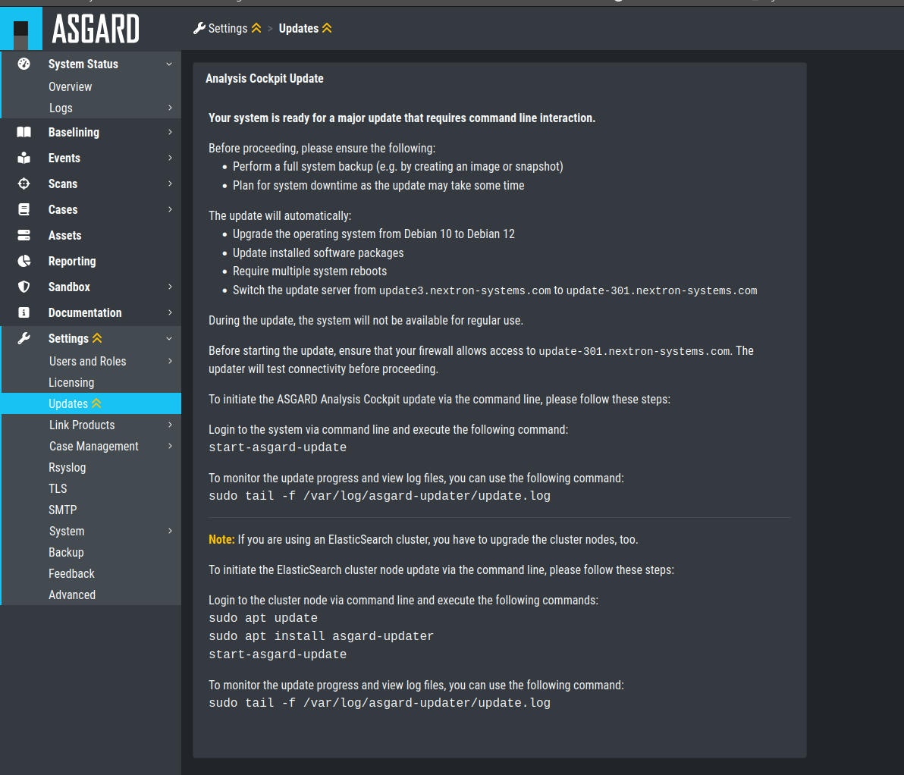

.. Index:: Standalone Upgrade

Standalone Upgrade
------------------

This chapter guides you through the upgrade process of
your Analysis Cockpit version 3.8.10 to version 4.x.

It is important to follow the steps carefully. We advise you
to create a snapshot of the Analysis Cockpit itself before
starting your upgrade.

Preparation
^^^^^^^^^^^

To prepare for your upgrade, we compiled a list of tasks you
should follow. You can find the list below:

.. list-table:: 
    :header-rows: 1

    * - Task
      - Description
    * - Snapshot of your Analysis Cockpit
      - For disaster recovery
    * - Analysis Cockpit running version 3.8.10
      - Prerequisite for the Major Upgrade
    * - Connection to our update servers
      - We need to fetch updates

For details regarding some of the above tasks, see the next section
in this manual.

With the new version of your Analysis Cockpit, we also
made changes to our update servers. Please make sure
that all your components can reach the following servers:

.. list-table:: 
    :header-rows: 1

    * - Server
      - Port
      - Description
    * - update3.nextron-systems.com
      - tcp/443
      - Old update server
    * - update-301.nextron-systems.com
      - tcp/443
      - New update Server

The old update server is needed to fetch the updater and
other updates. The new update server is needed to upgrade
your servers to Debian 12 and also to install any new packages,
which are needed for your Analysis Cockpit v4.

You can find the corresponding IP-Addresses to the above
FQDNs here: https://www.nextron-systems.com/hosts/.

Analysis Cockpit running version 3.8.10
~~~~~~~~~~~~~~~~~~~~~~~~~~~~~~~~~~~~~~~

To check if your Analysis Cockpit is running on the correct version
you can navigate to ``Settings`` and ``Updates``. The page should
looks like this:

   Update Section

Performing the upgrade
^^^^^^^^^^^^^^^^^^^^^^

In this section we will perform the actual upgrade
of the Analysis Cockpit.

Analysis Cockpit Upgrade
~~~~~~~~~~~~~~~~~~~~~~~~

To start your upgrade, connect to your Analysis Cockpit via
SSH. We will run utilize ``asgard-updater`` to perform the
upgrade. First we need to check if a newer version of the
``asgard-updater`` is available. If you get the highlighted
output, you have already the newest version installed (the
version might differ from the output here):

.. code-block:: console
    :emphasize-lines: 6

    nextron@analysis:~$ sudo apt update
    nextron@analysis:~$ sudo apt install asgard-updater
    Reading package lists... Done
    Building dependency tree       
    Reading state information... Done
    asgard-updater is already the newest version (1.0.16).
    0 upgraded, 0 newly installed, 0 to remove and 18 not upgraded.

You can now run the ``asgard-updater`` with the following command:

.. code-block:: console

    nextron@analysis:~$ start-asgard-update

The server running your Analysis Cockpit will now restart
multiple times. It is important to not interrupt the upgrade
process and let the server do all the tasks. You can, however, 
see if any errors occurred during the upgrade or just observe
at what stage the upgrade is.

Run the following command to see the status of your upgrade:

.. code-block:: console

    nextron@analysis:~$ sudo tail -f /var/log/asgard-updater/update.log

The update is finished if you are seeing the following lines:

.. code-block:: console

    nextron@node-01:~$ sudo tail -f /var/log/asgard-updater/update.log
    2023-11-10T09:29:04.835115+01:00 analysis asgard-updater[536]: Elasticsearch service status: active
    2023-11-10T09:29:04.835194+01:00 analysis asgard-updater[536]: Upgrade finished. Deactivating service...
    2023-11-10T09:29:04.844839+01:00 analysis asgard-updater[536]: Removed "/etc/systemd/system/multi-user.target.wants/asgard-updater.service".

Your upgrade is now finished, and you can use your Analysis Cockpit
with the newest version.