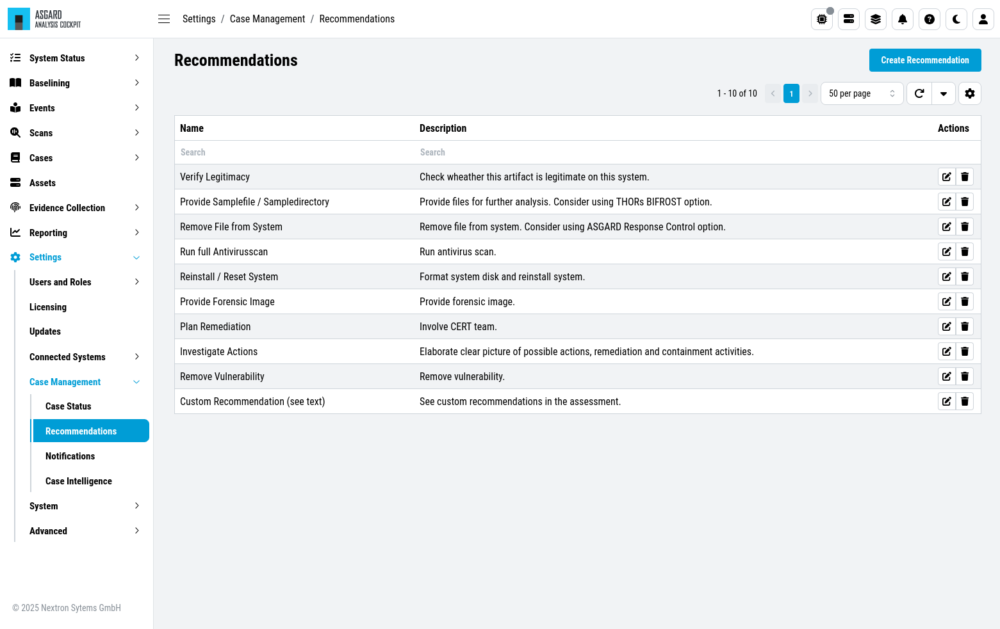
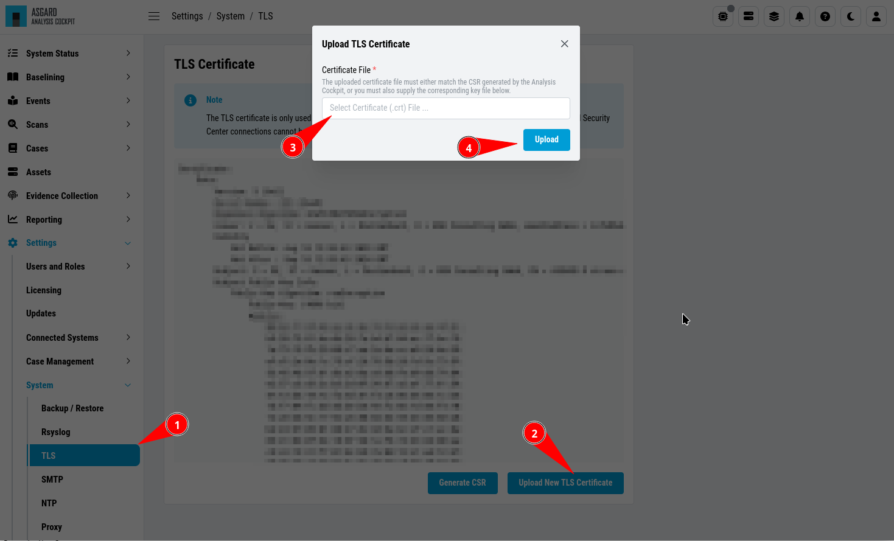
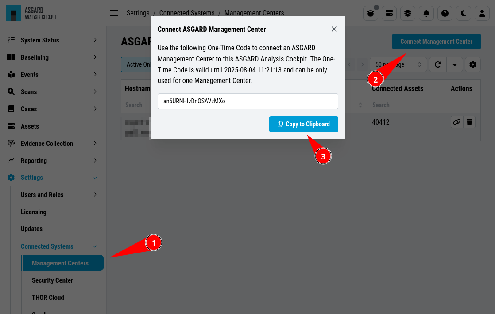
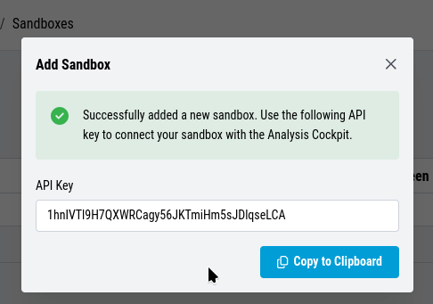

Administration
==============

This chapter assumes, that you have read chapter :ref:`usage/basic-concepts:basic concepts`.

In order to configure the Analysis Cockpit for the first use, the
following steps need to be done:

* License installation
* System update
* Set users and set user rights
* Define canned responses
* Decide about syslog forwarding
* Integrate your log source

These steps are described in detail in the following sections.

License Installation
--------------------

Before you can use the cockpit, you must install a license. Navigate to
the Licensing section, click the ``Upload License`` Button, select your
license file and click the ``Upload`` Button.

.. figure:: ../images/cockpit_license.png
   :alt: Licensing 

   Licensing

System Update
-------------

All updates can be done from the Web GUI. Simply navigate to the Updates
section, review the release notes and click the update button. You can
also check for new updates by clicking the ``Check for Updates`` Button.

.. figure:: ../images/cockpit_update.png
   :alt: Updating the System

   Updating the System

Set Users and User Rights
-------------------------

The chapter :ref:`usage/basic-concepts:Understanding Users, Roles, Rights and Case Status`
already described how to set up a 2-level analyst model for working with cases.
The roles defined in that section are non-administrative roles, meaning
they are only allowed to access cases based on the respective status of
a ticket.

Additionally, roles can have the following rights:

* Administrator
* Universal
* View Notifications
* Acknowledge Notifications
* Upload Events
* Delete Events
* Upload File(s) for Sandbox Analysis
* Download File(s) for Sandbox Analysis

Roles can be granted these privileges by choosing them in the ``New Role``
dialogue.

.. figure:: ../images/cockpit_new_role.png
   :alt: New Role

   New Role

Configure Canned Recommendations
--------------------------------

Canned recommendations are predefined actions that can be used within a
case. The recommendations are fully configurable and are aimed to
facilitate choice making regarding the action that should be applied for
a specific case. There is no need to set this up, but we suggest doing
some planning and provide recommendations that are suitable for your
organization. Some recommendations such as ``Verify Legitimacy``, ``Provide
Sample File / Sample Directory``, ``Run full Antivirus Scan`` are already
generated by default. You are free to use, modify or delete them.
Recommendations can also be added by any user from within a case.

   Case Management- Recommendations

Syslog Forwarding
-----------------

The Rsyslog Tab in the Settings section allows forwarding of all
incoming THOR events along with all audit logs and all other cockpit
related logs.

Please note, that forwarding THOR Logs through syslog might lead to a
certain loss of information as THOR events might exceed syslog length
restrictions.

.. figure:: ../images/cockpit_rsyslog_forwarding.png
   :alt: Add Rsyslog Forwarding II 

   Add Rsyslog Forwarding II

TLS Certificate Installation
----------------------------

Instead of using the pre-installed self-signed TLS Certificate,
users can upload their own TLS Certificate for ASGARD. 

In order to achieve the best possible compatibility with the
most common browsers, we recommend using the system's FQDN
in both fields ``Common Name`` AND ``Hostnames``.

.. figure:: ../images/cockpit_new_csr.png
   :alt: Generate a Certificate Signing Request (CSR)

   Generate a Certificate Signing Request (CSR)

.. hint::
   Please note that generating a CSR on the command line is not supported.   

The generated CSR can be used to generate a TLS Certificate.
Subsequently, this TLS Certificate can be uploaded in the ``Settings`` > ``TLS`` section.

   Upload a TLS Certificate

Configure LDAP
--------------

The LDAP tab in the ``Users and Roles`` section lets you configure an LDAP server
and define mappings for LDAP groups to roles within the Analysis
Cockpit.

The figures below illustrate options of a possible LDAP configuration.

.. figure:: ../images/cockpit_ldap.png
   :alt: Configure LDAP 

   Configure LDAP

Configure Notifications
-----------------------

As described in :ref:`usage/basic-concepts:cases and log processing`, the
Analysis Cockpit is able to forward logs to a SIEM system in case
this particular log line was added automatically to a case with the type "Incident".

The ``Notifications`` tab allows you to define custom notifications for
event assignments (Event Assignment Notifications). It is recommended to
at least configure an Event Assignment Notification for events that get
added to existing Incident cases.

Additionally, notifications can be defined for changes to cases (Case
Change Notifications), so Level 2 analysts can get notified if a case
gets added to their in-queue (e.g., Finished Level 1).

The notification itself can be a syslog message or an email. In order to
use email for notifications you have to setup an email account in the
``Mail Account`` Tab. Additionally webhook support has been added to
facilitate interfacing to services like Slack.

   Case Management- Notifications

.. note::
   The Analysis Cockpit will collect all triggering events and send only
   one email every 15 minutes. Syslog and Webhooks are triggered in real
   time for every single event.

Additionally, you can see the notifications in the top right corner (bell
icon) and inspect them. You will see all ``Unread`` notifications, which can
be ``Acknowledged`` by selecting one or more notification and clicking
``Acknowledge``. Only ``Unread`` notifications will show up in the top right
status bar of the Cockpit.

.. figure:: ../images/cockpit_notifications2.png
   :alt: UI Notifications

   UI Notifications

Configure Event Assignment Notifications
^^^^^^^^^^^^^^^^^^^^^^^^^^^^^^^^^^^^^^^^

To configure log notifications, click the 
``Add Event Assignment Notification`` button in the Notifications Tab of the 
``Settings`` section.
This leads you to a form that allows you to set a name for your
notification, the notification type (syslog, email, webhook or
notification within the Analysis Cockpit) and the condition that will
trigger your notification.

.. figure:: ../images/cockpit_event_assignment_notification.png
   :alt: Event Assignment Notification

   Event Assignment Notification

Configure Case Change Notifications
^^^^^^^^^^^^^^^^^^^^^^^^^^^^^^^^^^^

To configure Case Change Notifications, click the 
``Add Case Change Notification`` button in the Notifications Tab of the 
``Settings`` section.
This leads you to a form that allows setting a name for your
notification, the notification type (syslog, email, webhook or
notification within the Analysis Cockpit) and the condition that will
trigger your notification.

.. figure:: ../images/cockpit_case_assignment_notification.png
   :alt: Case Change Notification 

   Case Change Notification

Log File Import
---------------

Basic Concepts
^^^^^^^^^^^^^^

In general, all logs show up in the Events section. Additionally, all
Alerts and Warnings that are not matching a particular case will show up
in the ``Baselining`` section. Notices and informational events will NOT
show up in the Baselining Section as they match the predefined default
cases for these events.

All logs are tagged with a specific scan id – regardless of how the log
was integrated. This enables filtering down to all logs contained in a
specific scan.

If ASGARD Management Center is connected and the events was generated as
part of a group scan the event is also tagged with this particular group
scan id. This allows for filtering down to all logs a particular group
scan.

Assets are identified through the asset ID that was issued by ASGARD
Management Center during the setup of the ASGARD Agent. If this ID is
not available to the Analysis Cockpit (e.g. log has been uploaded
manually or sent through syslog) the hostname (NOT the FQDN) will be
used instead.

Direct Integration with ASGARD Management Center
^^^^^^^^^^^^^^^^^^^^^^^^^^^^^^^^^^^^^^^^^^^^^^^^

If the Analysis Cockpit is linked to one or more ASGARD Management
Centers, all THOR logs get integrated automatically and will show up in
the Baselining and/or the Events section. Aurora Events will also
automatically show up.

To see how to connect an ASGARD Management Center with your Analysis
Cockpit, follow the instructions in the chapter :ref:`usage/administration:connect to asgard management center`.

You can retrieve old scans performed by ASGARD Management Center before
connecting it to Analysis Cockpit using the ``Request Events`` button in
the ``Scans`` section.

.. figure:: ../images/cockpit_scan_request_events.png
   :alt: Request Events from Scan

   Request Events from Scan

Syslog Input
^^^^^^^^^^^^

Another way to import log data is by using SYSLOG messages.

The ANALYSIS COCKPIT listens on port 514/udp and 514/tcp for incoming
log data and all logs will show up in the Baselining and/or the Events
section.

Incoming syslog messages get assigned to single scan using the "ScanID"
value that's unique in each scan.

File Import Through Web-Based GUI
^^^^^^^^^^^^^^^^^^^^^^^^^^^^^^^^^

Alternatively, logs can be uploaded through the web-based interface by
selecting the particular log file (must be the .txt format, html import
is not supported) and clicking the ``Upload Scans`` button within the
Scans section.

.. note::
   You can upload one or more THOR scans in one or more text files.
   The Analysis Cockpit will automatically generate scans in the database,
   based on the scanned assets and the SCAN_IDs in the events. Only .txt,
   .log, .txt.gz and .log.gz files are supported.

.. figure:: ../images/cockpit_upload_scan_logs.png
   :alt: Upload logs using the web-based interface 

   Upload logs using the web-based interface

After a successful upload, the scans should appear in the list below.

.. important::
   If you can not see events in the ``Events`` or ``Baselining`` views,
   please make sure that you've selected the correct time frame as filter.
   Often times manually uploaded scans happened days or weeks before the
   upload. The log data gets indexed with the timestamp of their creation
   and not the import, and can therefore be hidden in the default view.

After the upload, you're able to link the recently uploaded scans with
an existing or new group scan. You can also unlink scans from a group scan.

.. figure:: ../images/cockpit_link_unlink_scans.png
   :alt: Link/Unlink scans with an existing or new group scan

   Link/Unlink scans with an existing or new group scan

File Import Using the Command Line
^^^^^^^^^^^^^^^^^^^^^^^^^^^^^^^^^^

This option can be helpful in an environment where you scan without
ASGARD Management Center but want to automate analysis by dropping the
log data into that import directory.

Log files can be imported by placing the files in the following
directory:

``/var/lib/nextron/analysiscockpit3/events``

Make sure that user and group of these files is set to ``cockpit``.

You can change the owner and group manually by using:

.. code:: console
   
   nextron@asgard-ac:~$ sudo chown cockpit:cockpit <file>

Successfully imported files get a new extension named ``.ok``.

When the file is moved to that folder with the wrong permissions,
Analysis Cockpit tries to handle these situations in the appropriate way.
If the Analysis cockpit had read access but no rights to
write/delete/rotate/rename the file, the file gets blacklisted in memory
and will not be imported as long as the service doesn't get restarted. A
restart of the service would cause the service to re-index the log data
placed in that folder.

.. important::
   We highly recommend not to directly copy (scp, rsync) files
   into that folder, but use a staging folder in which you set the right
   permissions and then copy the files to the import folder.

Copying files directly to that folder has many problematic side effects,
e.g. files partly composed of binary zeros because the file transfer is
still in progress.

Connect to ASGARD Management Center
-----------------------------------

In order to receive log data from ASGARD Management Center systems, add
them in the corresponding section in the system settings.

``Settings`` > ``Link Products`` > ``Management Center``

   Link ASGARD Management Center

After you have connected the two components, all assets along with additional
information from ASGARD will show up in the ``Assets`` section of your Analysis
Cockpit.

   Asset View after a Successful Connection

Asset View
----------

In most cases working with the ``Baselining`` section and the ``Cases`` section
can be seen as the best practice approach for setting baselines and
dealing with alerts and warnings.

However, in some cases it makes sense to change perspective and rather
go for a host centric approach. The Analysis Cockpit will calculate
numbers of lines in different case types (Incident, Suspicious, Anomaly,
etc.) on a per host basis for a given time frame. Along with information
from ASGARD on last scan dates, labels, host availability etc. this
gives an entirely different perspective.

By using the "Asset View" you can e.g., easily answer questions like:

-  Which systems appear most often in “Incident” cases?
-  Which systems haven't reported a single event for more than a month?
-  Which Domain Controllers have not been scanned yet?
-  Which systems with IP addresses starting "192.168." appear in
   "Incident" cases?

In combination with the ``ASGARD Query`` and ``Labels``, which are identical
to your ASGARD, you can even narrow down the events by system group
(e.g., Domain Controllers, or certain locations).

.. figure:: ../images/cockpit_assset_query.png
   :alt: Filtering within the Assets View 

   Filtering within the Assets view

Sandbox Integration
-------------------

You can configure your Analysis Cockpit to upload files to a local sandbox.

Currently you can use `CAPEv2 <https://github.com/kevoreilly/CAPEv2>`_
(recommended) or `Cuckoo <https://cuckoosandbox.org/>`_.

.. note:: 
   This section only focus on the integration of your Analysis Cockpit
   with an existing sandbox. We will not cover how to set up the sandbox.

Analysis Cockpit Sandbox Configuration
^^^^^^^^^^^^^^^^^^^^^^^^^^^^^^^^^^^^^^

In the web view of your Analysis Cockpit, navigate to ``Sandbox`` > ``Sandboxes``.
Click ``Add Sandbox`` in the top right corner. Keep the ``Name`` short and add a
proper ``Description``.

.. figure:: ../images/cockpit_add_sandbox.png
   :alt: Adding a new Sandbox

   Adding a new Sandbox

Once you click ``Add`` the page will display an API token. Copy this token, we will need it later.

   Sandbox API Token

Connect to your Analysis Cockpit via SSH and follow the steps below.

Change the user to the root user:

.. code:: console

   nextron@cockpit:~$ sudo su -
   [sudo] password for nextron:
   root@cockpit:~# 

We change into the configuration directory of the sandbox:

.. code:: console
   
   root@cockpit:~# cd /etc/nextron/analysiscockpit3/sandbox/connector
   root@cockpit:/etc/nextron/analysiscockpit3/sandbox/connector#

Here you can find multiple files and folders. The ``.py`` and ``.ini``
files represent each the type of sandbox you want to integrate. In
this example, we will configure the CAPv2 sandbox with our Analysis Cockpit.

.. code:: console
   
   root@cockpit:/etc/nextron/analysiscockpit3/sandbox/connector# ls -lA
   total 36
   drwxr-xr-x 2 analysiscockpit3 analysiscockpit3 4096 Apr 21 15:27 analysiscockpit
   -rw-r--r-- 1 analysiscockpit3 analysiscockpit3  253 Mär  3 11:20 capev2.ini
   -rw-r--r-- 1 analysiscockpit3 analysiscockpit3 4934 Mär  3 11:20 capev2.py
   -rw-r--r-- 1 analysiscockpit3 analysiscockpit3  278 Mär 28  2021 cuckoo.ini
   -rw-r--r-- 1 analysiscockpit3 analysiscockpit3 9867 Nov 17  2020 cuckoo.py
   drwxr-xr-x 2 analysiscockpit3 analysiscockpit3 4096 Apr 14 15:29 sandboxapi

Here we have two files which are of relevance for us:

- capev2.ini

  - This holds the configuration for both the sandbox and your Analysis Cockpit

- capev2.py
      
  - This has the systemd configuration to create the actual service on the system (we don't change anything in here)

Change the ``capev2.ini`` with a text editor. The important lines are marked:

.. code-block:: console
   
   root@cockpit:/etc/nextron/analysiscockpit3/sandbox/connector# nano capev2.ini

.. code-block:: ini
   :linenos:
   :emphasize-lines: 6-10, 16-17

   [DEFAULT]
   debug = yes
   tmp_directory = /var/lib/nextron/analysiscockpit3/sandbox/connector/capev2

   [capev2]
   protocol = http
   host = 192.168.0.50
   port = 8000
   token = <your CAPEv2 API token here>
   verify = no
   all = yes
   html = yes

   [analysis-cockpit]
   host = localhost:443
   apikey = <your API Key here>
   verify = no

For lines 6-10, please fill the information accordingly. ``host`` is the IP/FQDN
of your sandbox. ``port`` is the listening port of the web interface of your sandbox.
``token`` is the API token generated in the user management of your sandbox.
``verify`` is for verification of the TLS certificate (if you don't use TLS or don't
want to verify the certificate, set this option to ``no``).

For lines 16-17 you have to set the ``apikey`` of your Analysis Cockpit (see "Add
Sandbox" step in the beginning of this section) and ``verify``, which can be set to
``no``; this will verify the TLS certificate.

Save your files after you made your changes.

Now you have to create a new directory and give the ``analysiscockpit3`` user permission:

.. code:: console
   
   root@cockpit:/etc/nextron/analysiscockpit3/sandbox/connector# mkdir capev2
   root@cockpit:/etc/nextron/analysiscockpit3/sandbox/connector# chown analysiscockpit3: capev2

Open the ``capev2.py`` file with a text editor:

.. code-block:: console

   root@cockpit:/etc/nextron/analysiscockpit3/sandbox/connector# nano capev2.py

You will see the instructions to create a service in the comment
block on the top. Copy the following content from the comment block: 

.. code-block:: ini
   :linenos:

   [Unit]
   Description=CAPEv2 Sandbox Connector
   After=network.target
   
   [Service]
   ExecStart=/usr/bin/python3 /etc/nextron/analysiscockpit3/sandbox/connector/capev2.py
   Restart=on-failure
   User=analysiscockpit3
   Group=analysiscockpit3
   SyslogIdentifier=capev2_connector
   
   [Install]
   WantedBy=multi-user.target

Now we run the following command and paste the content from the output earlier into it:

.. code-block:: console

   root@cockpit:/etc/nextron/analysiscockpit3/sandbox/connector# nano /lib/systemd/system/capev2-connector.service

The file should now look like this:

.. code-block:: console

   root@cockpit:/etc/nextron/analysiscockpit3/sandbox/connector# cat /lib/systemd/system/capev2-connector.service
   [Unit]
   Description=CAPEv2 Sandbox Connector
   After=network.target

   [Service]
   ExecStart=/usr/bin/python3 /etc/nextron/analysiscockpit3/sandbox/connector/capev2.py
   Restart=on-failure
   User=analysiscockpit3
   Group=analysiscockpit3
   SyslogIdentifier=capev2_connector

   [Install]
   WantedBy=multi-user.target

   root@cockpit:/etc/nextron/analysiscockpit3/sandbox/connector#

Now that the systemd service file is created, we need to activate it. Run the following command:

.. code-block:: console

   root@cockpit:/etc/nextron/analysiscockpit3/sandbox/connector# systemctl daemon-reload && systemctl enable capev2-connector && systemctl start capev2-connector
   Created symlink /etc/systemd/system/multi-user.target.wants/capev2-connector.service → /lib/systemd/system/capev2-connector.service.
   root@cockpit:/etc/nextron/analysiscockpit3/sandbox/connector# 

The connection to your sandbox should work now. You can see the ``capev2.log`` for debug output and troubleshooting:

.. code-block:: console

   root@cockpit:/etc/nextron/analysiscockpit3/sandbox/connector/capev2# tail capev2.log
   22-11-15 12:07:46 DEBUG: Starting new HTTPS connection (1): localhost:443
   22-11-15 12:07:46 DEBUG: https://localhost:443 "GET /api/sandboxes/a/reports/pending?limit=10&offset=0 HTTP/1.1" 200 13
   22-11-15 12:07:46 DEBUG: no pending references found
   22-11-15 12:08:46 DEBUG: Starting new HTTP connection (1): 192.168.0.50:8000
   22-11-15 12:08:46 DEBUG: http://192.168.0.50:8000 "GET /apiv2/cuckoo/status/ HTTP/1.1" 200 289
   22-11-15 12:08:46 DEBUG: Starting new HTTPS connection (1): localhost:443
   22-11-15 12:08:46 DEBUG: https://localhost:443 "GET /api/sandboxes/a/get-sha256s-without-report?limit=10 HTTP/1.1" 200 13
   22-11-15 12:08:46 DEBUG: Starting new HTTPS connection (1): localhost:443
   22-11-15 12:08:46 DEBUG: https://localhost:443 "GET /api/sandboxes/a/reports/pending?limit=10&offset=0 HTTP/1.1" 200 13
   22-11-15 12:08:46 DEBUG: no pending references found
   root@cockpit:/etc/nextron/analysiscockpit3/sandbox/connector# 

Analysis Cockpit Sandbox Usage
^^^^^^^^^^^^^^^^^^^^^^^^^^^^^^

Once your sandbox is set up and running, you can see the status of it in the sandbox view (Last Seen):

.. figure:: ../images/cockpit_sandbox_view.png
   :alt: Sandbox View in the Analysis Cockpit

If you wish to enable automatic scanning for uploaded files
(`Bifrost <https://asgard-manual.nextron-systems.com/en/latest/usage/administration.html#bifrost-quarantine>`_),
you can do so by pressing the play button to the right hand side.

In the ``Files`` view you can see previously analyzed files or upload files for analysis by yourself:

.. figure:: ../images/cockpit_sandbox_file_upload.png
   :alt: File View in the Analysis Cockpit

.. note:: 
   If you did not enable ``auto mode`` of your configured sandbox, you have
   to manually add the file for scanning in here. You can do this by pressing
   the ``Scan file with sandbox`` button to the right of your file.

After your file has been uploaded, you have to wait until your sandbox
is finished with analyzing the file. Change to the ``Reports`` view
to see the status of the files.

.. figure:: ../images/cockpit_sandbox_reports_view1.png
   :alt: Reports View in the Analysis Cockpit

Once the file was analyzed and the reports are ready, you will see that
the status of the file changed to ``SUCCESS`` and the buttons ``REPORT``,
``JSON`` and ``HTML`` can be clicked.

.. figure:: ../images/cockpit_sandbox_reports_view2.png
   :alt: Reports View in the Analysis Cockpit

You can now download the report.

API
---

The API documentation has been integrated into the web interface.

.. figure:: ../images/cockpit_api_documentation.png
   :alt: API Documentation

   API Documentation

