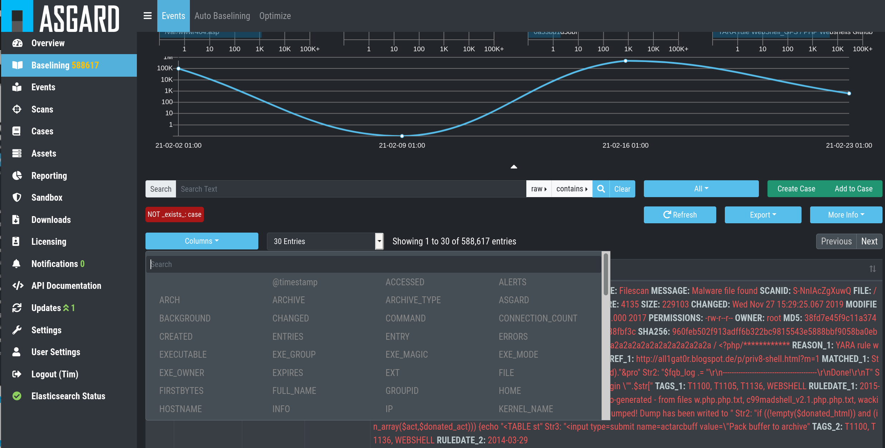
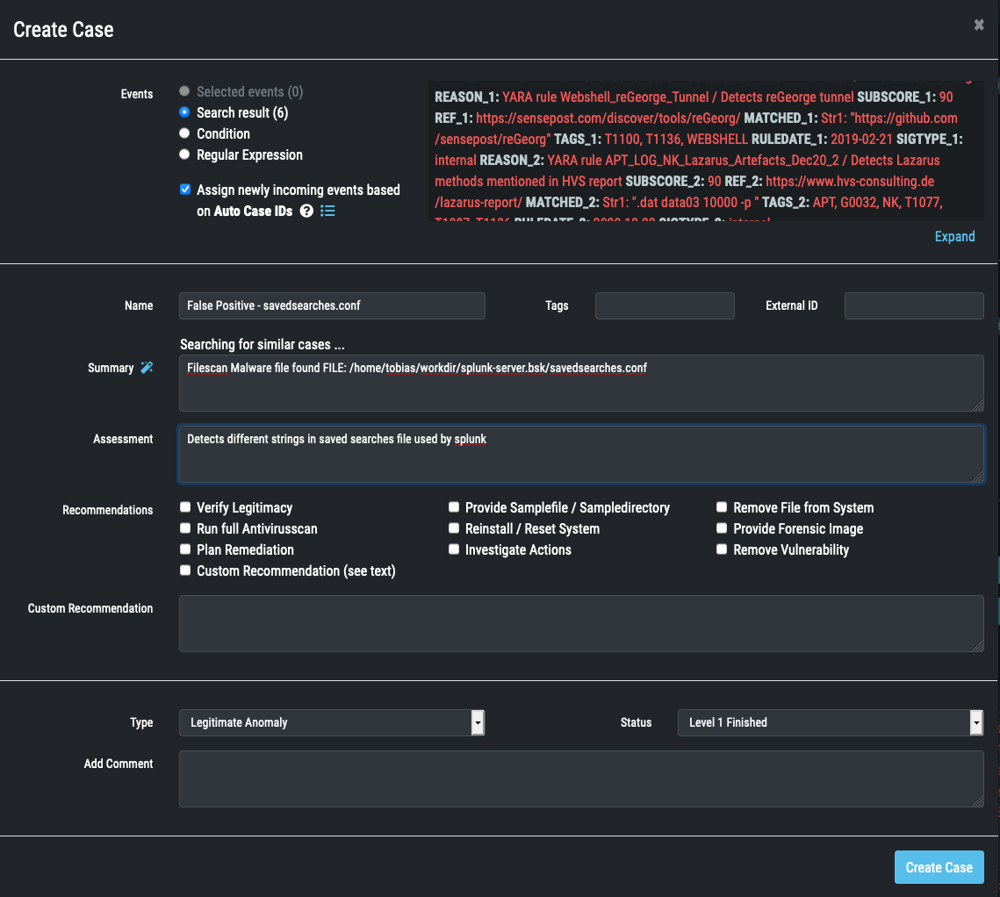
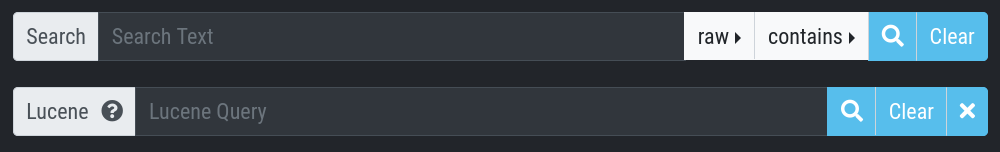
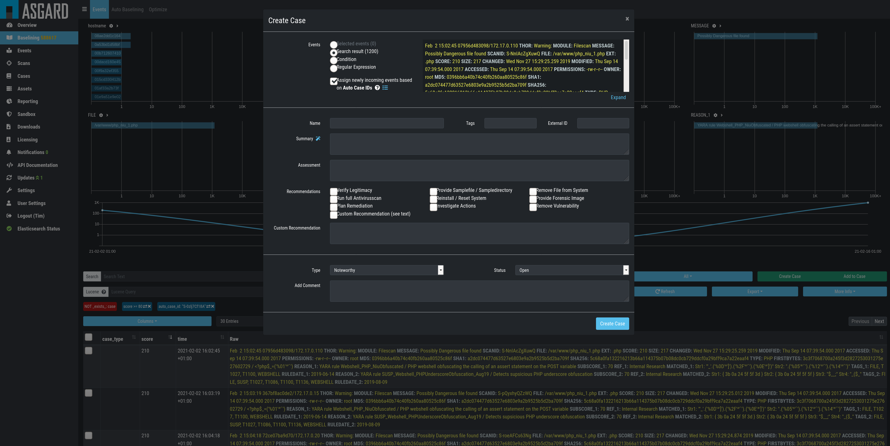
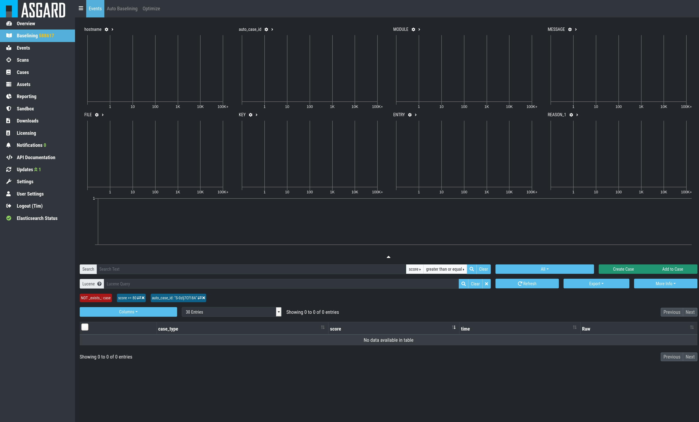
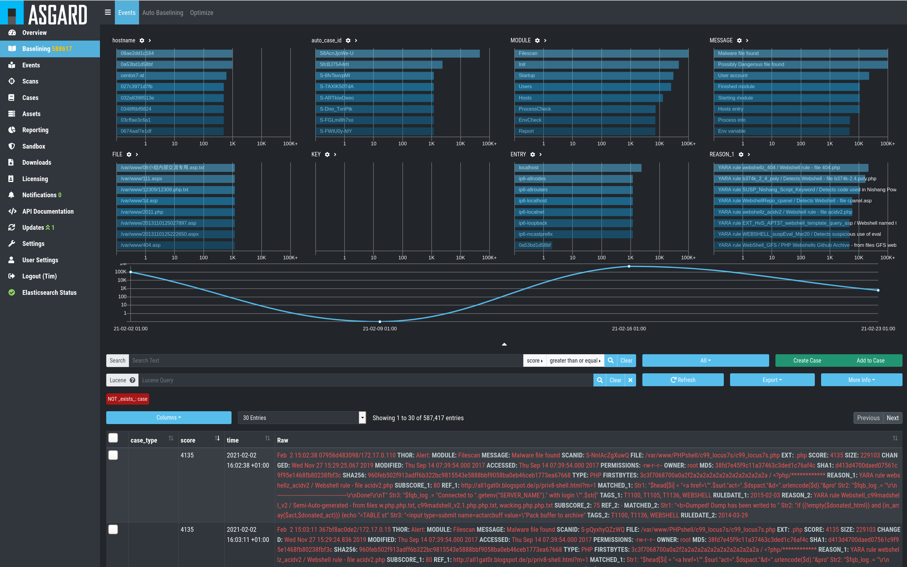
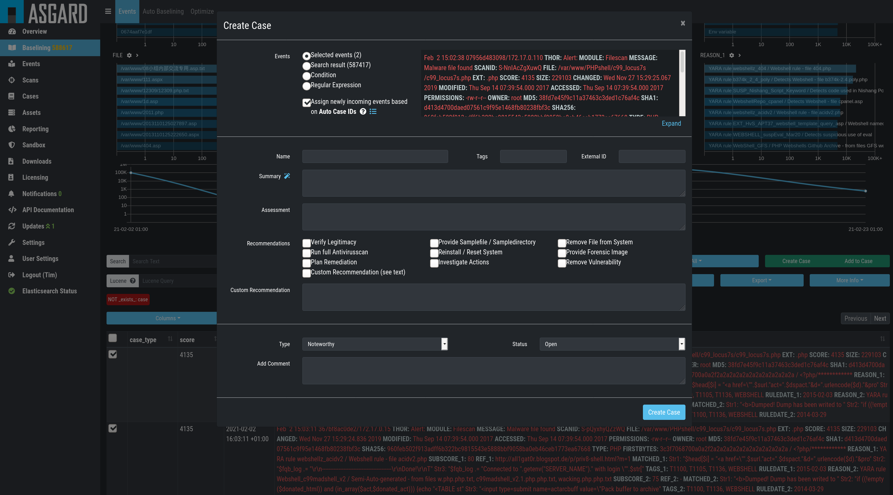
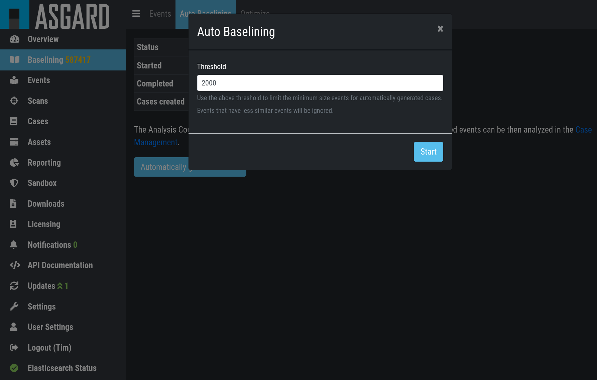
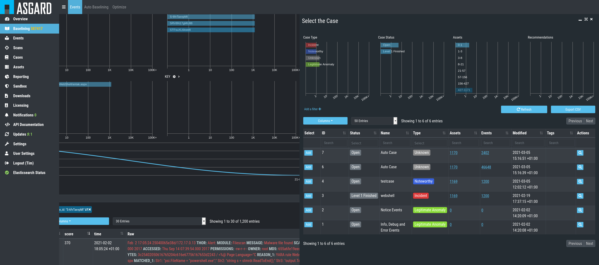
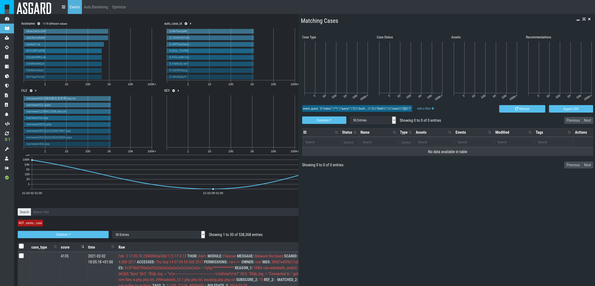

Baselining Best Practices
=========================

This section assumes, that you have read the :ref:`usage/basic-concepts:basic concepts`.

All incoming logs, that do not match an existing case, will show up in
the ``Baselining`` section.

While importing the logs, the cockpit will already try to find logs are
that similar and represent the same type of alert or warning. It will
group these logs and assign an auto\_case\_id. In the example below we
can see that the biggest group with the auto\_case\_id: "S8AcnJjoWe-U"
contains more than 10,000 events.

.. figure:: ../images/image50.png
   :alt: Baselining

   Baselining

Customize Your View
-------------------

By default, the Analysis Cockpit ``Baselining`` views ship with four bar
charts and a table with five columns in order to help you find
meaningful groups of logs. You can add four additional bar charts by
clicking on the triangle which is located under the bar charts. You can also
modify which bar charts are shown by clicking gear symbol next to the
category name and choosing the category you want to see. To get to know
to number of unique hostnames, files etc., you can click on the right arrow symbol
next to the category name.

Click the ``Columns`` button to manage which columns are shown.

.. figure:: ../images/image55.png
   :alt: Configure your personal view - select bar charts

   Configure your personal view – select bar charts

   Configure your personal view – select columns

Manual Case Creation
--------------------

Case Creation Basics
^^^^^^^^^^^^^^^^^^^^

Create a new case following these steps: 

#. Select if and how new incoming events should be assigned to this case
#. Set a case **name**, which serves as title - use keywords that make it easy for other analysts to find it based on a few terms (e.g. if a false positive was caused by matches in **savedsearch.conf**, use this filename in the title of your case)
#. Select a sample event for the **summary** field 
#. Add your **assessment**
#. Choose one or more **recommendations**
#. Select a **case type** (see the :ref:`Glossary <usage/glossary:Case Types>` for a detailed description of every case type)
#. Select a **case status** (usually used to mark it as 'work in progress' or to forward it to the next team)
#. Submit case by clicking the **Create** button

Select Log Messages for a Case
^^^^^^^^^^^^^^^^^^^^^^^^^^^^^^

In order to create a meaningful case, you typically start with selecting
logs or groups of logs that you want to be contained in the case. This
can be done in various ways:

* by adding a custom filter in the search bar
* by clicking on one of the bars in the bar chart
* by clicking on magnifier symbol in a field in a log line
* by using Lucene within the search bar

You can generate a filter bubble using an expression in the search
field, choosing a category, deciding whether the expression should be
contained, equal etc. and clicking the magnifier button. Clicking on one
of the bars in the bar chart or on magnifier symbol in a field in a
log line will generate a filter bubble, too.

| Example:
| The following search made use of the built-in custom filters and
  displays all logs that are not contained in any case AND where
  auto\_case\_id is equal to “S8AcnjjoWe-U”.

.. figure:: ../images/image59.png
   :alt: Custom Filter

   Custom Filter

Please note, that, filters can be negated by clicking on the two arrows symbol or delete it by clicking on the cross symbol.

Using the built-in custom filters is the most common and easiest way to
select groups of logs.

For those who prefer Lucene, an additional Lucene search bar can be
activated and can even be combined with the built-in custom search.

In order to activate the Lucene Query search just click the ``contains`` button and
choose ``Lucene Query``.

   Lucene Query

.. note:: 
   You can Alt/Shift click items in the top field view to add them as a ``NOT`` filter to your search. 

Case Creation from Search Results
^^^^^^^^^^^^^^^^^^^^^^^^^^^^^^^^^

This is the most relevant way to create a case. Create the filters, so
that you only see the logs you want to be contained in your case. Then
click the ``Create Case`` button, 
select ``Search results`` and add a name,
that makes sense to you.

If you want future incoming logs with the same auto\_case\_id like
log lines in this particular case to be automatically assigned to this
case, you have to tick the checkbox ``Assign newly incoming events based on Auto Case ID``.

.. figure:: ../images/image64.png
   :alt: Auto Case IDs

You may add a summary or let the system suggest one for you (click on the magic wand symbol).
The suggestion is calculated out of the first log lines within the
selected logs.

   Baselining – Create Case

You may or may not add assessment, case type, recommendations or a
comment. After closing you will find the log section empty, as it is
still using your filter, but the matching log lines have been removed
from this section and added to the case.

   Log Section empty

Simply remove the filter and the remaining log lines will show up.

   Remove the Filter

Case Creation from Selection
^^^^^^^^^^^^^^^^^^^^^^^^^^^^

In order to create a case from a specific selection of logs simply use
the checkboxes at the very left side of the table and click the ``Create Case`` button 
select ``Selected events`` and add a name, that makes sense
to you.

   Creating Cases from Selection

After closing you will find the selected logs have been removed from the
logs section.

Case Creation Using a Custom Condition
^^^^^^^^^^^^^^^^^^^^^^^^^^^^^^^^^^^^^^

To create a case with a condition, click the ``Create Case`` button and
select ``Condition``. Now you can build a condition by entering keywords
in the field.

Keywords in the same field are combined by **OR**, you can negate them by
clicking the ``NOT`` button or combine them with **AND** by clicking the
``Add AND Condition`` button. The filter bubbles you have generated before
will be used as default. You are free to use, modify or delete them.
Conditions only match on the ``raw`` field.

The ``Test Condition / Regular Expression`` button will calculate the
numbers of hits and return some matching and some non-matching events as
an example.

.. figure:: ../images/image70.png
   :alt: Creating Cases through Condition

   Creating Cases through Condition

Again, you may or may not add auto assignment for future incoming
log lines, summary, assessment, case type, recommendations or a comment.
After closing you will find the selected logs have been removed from the
logs section.

Case Creation Using a Regular Expressions
^^^^^^^^^^^^^^^^^^^^^^^^^^^^^^^^^^^^^^^^^

In order to create a case from a regular expression just click the
``Create Case`` button and select 
``Regular Expression``. This lets you
write and test your regular expression.

The ``Test Condition / Regular Expression`` button will calculate the
numbers of hits and return some matching and some non-matching events as
an example.

.. figure:: ../images/image71.png
   :alt: Creating Cases through Regular Expressions

   Creating Cases through Regular Expressions

Again, you may or may not add auto assignment for future incoming
log lines, summary, assessment, case type, recommendations or a comment.
After clicking the ``Create Case`` button, the matching lines will get
removed from the log management view.

Important: It is recommended to use regular expressions only rarely
and with caution. This feature can severely impact the performance of
the system.

Create Cases Automatically
--------------------------

With Auto Baselining, the Cockpit will automatically generate cases for
groups of logs that are similar, or in other words: Have the same
auto\_case\_id.

After clicking the button ``Automatically generate Cases`` button in the
``Auto Baselining`` tab you will be prompted for a threshold. This means:
Do only create a case when you find at least that many similar logs. In
our example below the Cockpit will now generate cases for all groups of
at least 2000 similar events.

   Automatically create cases

After pressing the ``Start`` button, the Cockpit will start calculating
and create cases. Depending on the data volume this may take a while and
you will be presented a page that shows that Auto Cases is still running
along with the current number of cases.

.. figure:: ../images/image73.png
   :alt: Auto Cases running

   Auto Cases running

It is safe to leave this page, once the status in ``Running``. It will
continue in the background.

.. figure:: ../images/image74.png
   :alt: Auto Cases finished

   Auto Cases finished

In our example, the Cockpit created two cases with at least 2000
log lines in each case.

.. important::
  The Analysis Cockpit generates auto\_case\_ids only for Alerts and
  Warnings. Don't use the Autocase feature for Notice and Info level
  events.

Add to Case
-----------

Sometimes you may want to add log lines to an already existing case
because they represent the same security context. To do this you can
just click the ``Add to Case`` button and select the suitable case. It is
also possible to add an additional comment to this case for the
addition.

   Add to Case

Customizing the Detailed View of Log Lines
------------------------------------------

The detailed view for log lines opens by clicking on a log line. Within
this view you can select some fields as favorite fields by clicking on
the star symbol. They will always be shown at the top of this view. ``MESSAGE``,
``MODULE``
and ``hostname`` are selected by default.

To search for all log lines with the same entry as this log line in a
particular field, you can click on the magnifier symbol behind the entry. If you
are looking for more information about this entry in this field, just
click on the eye symbol.

.. figure:: ../images/image78.png
   :alt: customizing the detailed view for log lines

   Customizing the detailed view for log lines

Additionally, you can find a ``VIRUSTOTAL`` button in every hash field and a
``VALHALLA`` button in every reason field. 
By clicking ``VIRUSTOTAL`` the hash
will be searched on Virustotal. By clicking ``VALHALLA`` you will get more
information about the matching rule from valhalla.nextron-systems.com.

More Information on Assets and Cases
------------------------------------

To get more information about matching assets and the matching cases you
can click the ``More Info`` button and select what you want to see. You
can also choose to get the unique count of a category.

.. figure:: ../images/image81.png
   :alt: More Info - Matching Assets

   More Info – Matching Assets

   More Info – Matching Cases

.. figure:: ../images/image83.png
   :alt: More Info - Calculate count of unique values

   More Info – Calculate count of unique values

