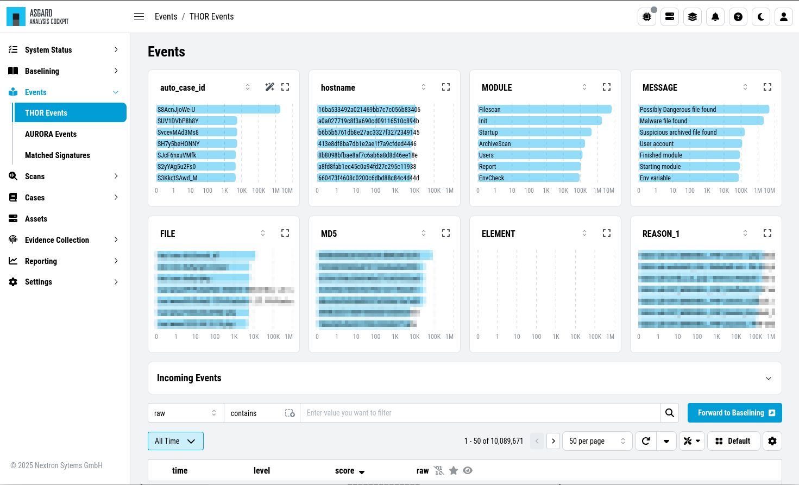
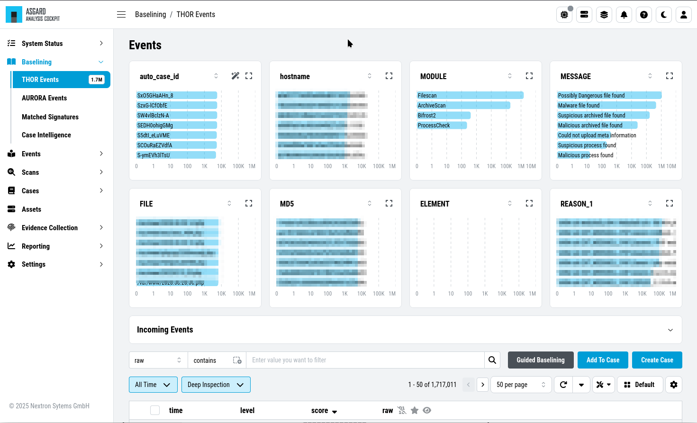
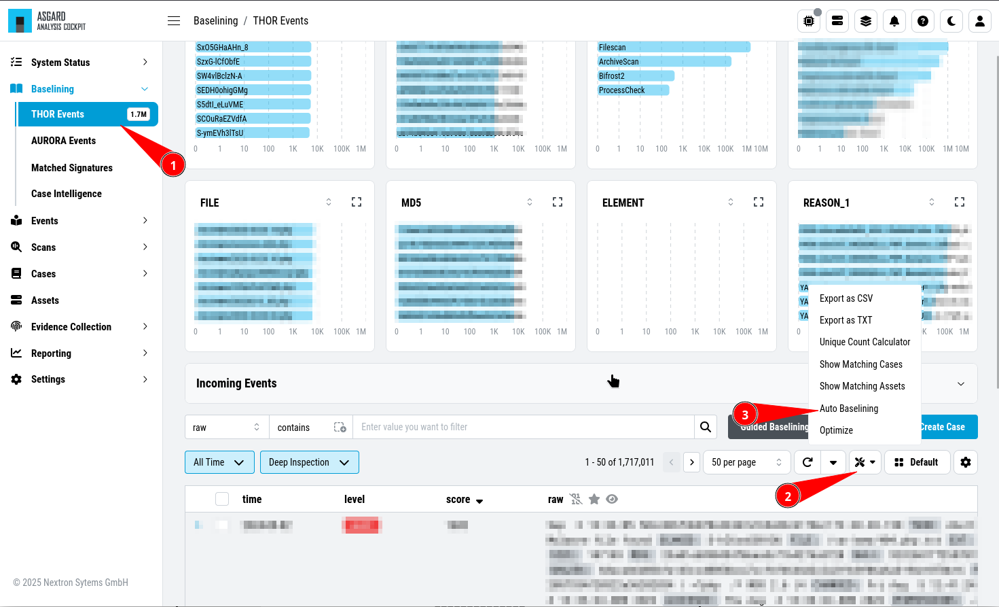
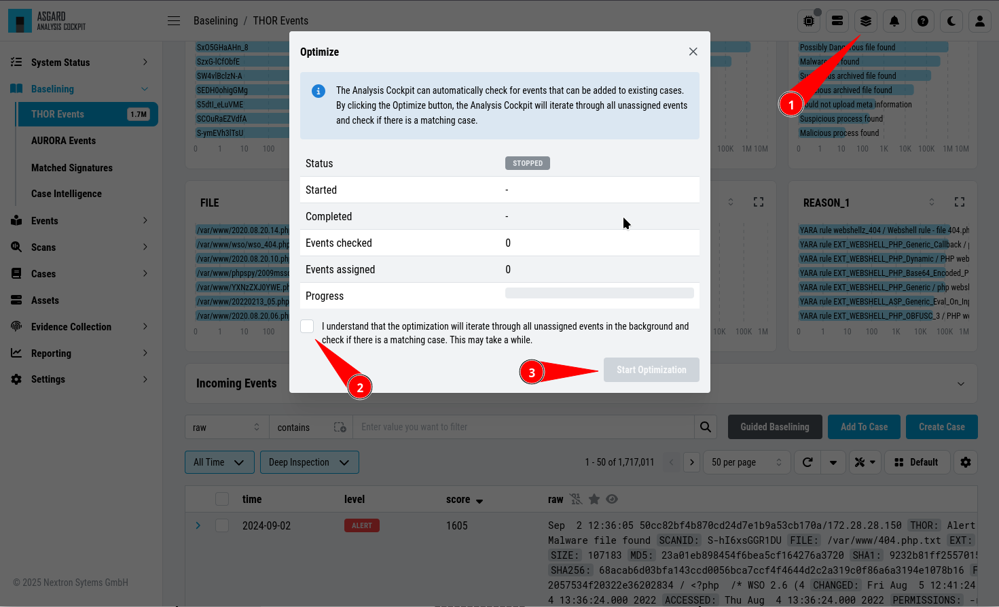
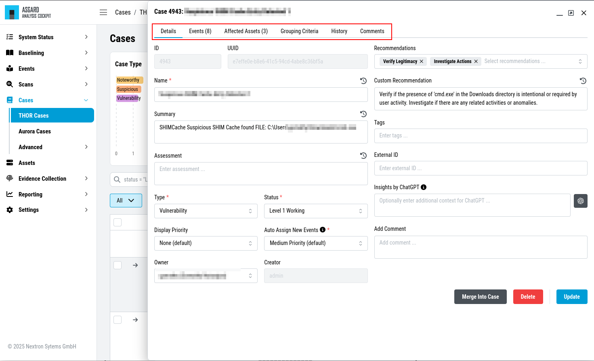

Basic Concepts
==============

Events
------

All events that have been stored in your Analysis Cockpit – regardless
if they are assigned to a particular case or not – are displayed
in the section ``Events``. This section can be seen as your threat hunting
pool. The section provides powerful filtering options. The Events
Section is split into the different sources of your Events:

- THOR Events
- Aurora Events
- Log Watcher Events (deprecated)

   Events Section

Baselining
----------

All events that have **not** been assigned to a particular case are
displayed in the ``Baselining`` section of the Analysis Cockpit.

Again, the Baselining Section is split into the different sources
of our events. Additionally, you can see the ``Suggested Cases``, which
will suggest cases based on predefined :ref:`usage/basic-concepts:case templates`.

- THOR Events
- Aurora Events
- Log Watcher Events (deprecated)
- Suggested Cases

   Baselining Section

Logs that represent the same type of anomaly or incident can be grouped
together using the various filters and then be stored in a Case for
further analysis. Grouping can be done manually by filtering and clicking
``Create Case``, selecting individual Events and clicking ``Create Case``,
or automatically by simply clicking the ``Advanced Tools`` button and
``Auto Baselining``. With ``Auto Baselining``, the Cockpit automatically calculates groups of
"similar" log lines.

Once stored in a case, the logs will disappear from the Baselining section.

   Auto Baselining

.. To-DO add Info regarding Guided Baselining

The Analysis Cockpit can automatically check for events that can be added to
existing cases. By clicking the ``Optimize`` button, the Analysis Cockpit will
iterate through all unassigned events and check if there is a matching case.

   Optimize Function

.. note::
   The optimization will iterate through all unassigned events and assign them
   to cases if a match were found. This may take a while.

In an ideal organization, the Baselining section should always be empty
at the end of a day, as these logs represent suspicious elements that
have not yet been looked at.

Baselining Views
~~~~~~~~~~~~~~~~

In the ``Baselining`` section there are two main views, the ``Compromise Assessment Mode``
and the ``Deep Inspection Mode``. Additionally, you can find the ``Custom Signatures
Only Mode``, which will show events found by custom signatures. This can
be helpful if you scanned your environment with customer signatures, for example
during or after and incident.

By default, the Analysis Cockpit Baselining Mode is set to ``Compromise Assessment``.

.. figure:: ../images/cockpit_baseline_view_mode.png
   :alt: Select your view

   Select your view

Compromise Assessment Mode
~~~~~~~~~~~~~~~~~~~~~~~~~~

The ``Compromise Assessment Mode`` is a new filter/representation of events
created and reviewed by our security experts. 

It includes our most successful detections. In this context "success" means,
that the detection uncovered malicious activity in the wild and at the same
time had a low anomaly and false positive rate. Additionally we also consider
a detection to be successful that caused little or no false positives or anomalies. 

The new view will combine and apply different techniques and filters to all
the unclassified events in the ``Baselining`` section, providing a reduced
set of logs which proved to be relevant from an analyst perspective.

This new "Compromise Assessment Mode" dramatically reduces your baselining effort.
In our tests we noticed a decrease of events in the Baselining section of more
than 90%. We believe that especially entities that follow our "Continuous Compromise Assessment"
approach should switch into this new mode. We've also challenged the new mode
with the post exploitation tools and techniques found in the context of HAFNIUM / Exchange exploitations
in March 2021 and covered almost every aspect of the attacks in the new view.

.. note:: 
   In case of an Incident Response, the ``Deep Inspection Mode`` is always
   recommended, since nothing is filtered here.

Deep Inspection Mode
~~~~~~~~~~~~~~~~~~~~

This view is basically how it used to be (the old default view).
It shows all Alerts and Warnings unless they are already part of an existing case.

Custom Signatures Only Mode
~~~~~~~~~~~~~~~~~~~~~~~~~~~

The ``Custom Signatures Only`` view will only show you events, which:

- Are not part of a case
- Where found by a custom signature

This view can be helpful if you only want to see events found by one of your custom
signatures during a THOR scan. This can be helpful if you want to see only those events
and nothing else.

Cases and Log Processing
------------------------

The Cases section gives a good overview regarding the existing cases and
also provides various filtering options. Column visibility can be
configured by clicking on the Columns button of this section.

The Cases Section is split into the different sources of your Cases:

- THOR Cases
- Aurora Cases
- Log Watcher Cases (deprecated)

Additionally, you can find more information regarding:

- Grouping Criteria
- Case Changes
- Security Center

.. figure:: ../images/cockpit_cases_overview.png
   :alt: Cases Section

   Cases Section

When a case is created, the state will be "Open" and the type will be
set to "Noteworthy" by default.

The following states can be set (by default):

* Open
* Level 1 Finished
* Level 1 Working
* Level 2 Working
* Closed

It is possible to configure custom states.

The following types can be set:

* Incident
* Suspicious
* Vulnerability
* Noteworthy
* Unknown
* Legitimate Anomaly
* False Positive

See chapter :ref:`usage/glossary:glossary` for a detailed description of these
terms.

Within a case, it is possible to add various information, write a
summary, provide canned recommendations or add assessment information.

   Case Details

The log lines contained in the case can of course be analyzed in detail
and changes to the case are tracked automatically.

The cockpit will automatically calculate rules (auto\_case\_id), that
make sure, future incoming logs that are similar to the log lines in
this particular case are automatically assigned to this case and **will
not show up** in the ``Baselining`` section.

.. important::
   ``Automatically assign newly incoming events to this case`` needs to
   be selected during case creation to automatically assign new events
   to an existing case.

In order to understand this better, let's assume you have decided a
group of logs are legitimate anomalies. Then all future logs that are
similar to these anomalies will automatically be added to this case and
not show up in the Baselining section.

In case you have decided a group of log lines represent a security
incident, the same thing will happen. Future log lines that represent a
security incident will show up only in the case and not in the
Baselining section.

Most organizations want to be alerted in case of a security
incident. The Cockpit can be configured to forward all logs that are
automatically assigned to an incident case to the organizations' SIEM
System via syslog. Organizations that prefer to handle THOR Events
entirely within the Analysis Cockpit and not forward anything to a SIEM
system may choose to configure a notification that shows up in the
Cockpit's Notification Section.

The following picture shows the recommended log processing.

.. figure:: ../images/cockpit_log_processing.png
   :alt: Log Processing 

   Log Processing

As one can see, an incoming log line only shows up in the ``Baselining``
section when it matches no existing case.

This behavior is highly configurable and can be changed in the
``Settings`` section of the Analysis Cockpit. One can even decide not to
forward anything to a SIEM System or may decide to also forward
suspicious elements in addition.

In other Words:

Cases represent the means of setting and maintaining the log baseline
within the Cockpit. When you scan your infrastructure once, assign all
logs to cases and then scan it for the second time, the ``Baselining``
section should be empty if nothing has changed. All incoming logs should
be similar to the ones in the first scan and therefore be assigned to
the respective cases and not show up in the ``Baselining`` section.

Working with cases is explained in detail in the sections below.

Case Templates
~~~~~~~~~~~~~~

Case Templates can be used to suggest new cases in the ``Suggested Cases``
section. If there are no Suggested Cases in the view, no events match
the Case Templates in your Analysis Cockpit.

.. figure:: ../images/cockpit_case_templates.png
   :alt: Case Templates Overview

   Case Templates Overview

To import new Case Templates, you need to create a ``.yaml`` file with
the conditions first. This can be done by navigating to the ``Cases``
view and exporting your search results as Case Templates. You will
be able to download a ``.yaml`` file from here, which can be used to
import as a Case Template.

.. figure:: ../images/cockpit_export_case_template.png
   :alt: Export Case Template

   Exporting Search Results as Case Templates

.. code-block:: yaml
   :linenos:
   :caption: Exported Case Template

   uuid: 94565b82-45fc-47f8-82eb-e9c5352c37c2
   name: Thor started on a system with the wrong processor architecture
   summary: ""
   type: 5
   scanner: THOR
   creator: admin
   condition: "\"MODULE: Startup\" AND \"MESSAGE: 32 bit THOR was executed on 64 bit
     system. For improved results, use the 64 bit version of THOR.\"\r\n"

After you downloaded the Case Templates, you can import them in the ``Case
Templates`` view.

.. figure:: ../images/cockpit_import_case_templates.png
   :alt: Import Case Template

   Import Case Template

You can now inspect the Case Template. You can find it by either looking
for the name or filter by who created it. You can see that the conditions
match the contents of your exported Case Template (``.yaml`` file).

.. figure:: ../images/cockpit_inspect_imported_case_template.png
   :alt: Inspect Imported Case Template

   Inspect Imported Case Template

Understanding Users, Roles, Rights and Case Status
--------------------------------------------------

The rights and roles model within the cockpit is aimed to support large
multinational organizations with different independent users working
with the case management at the same time. An organization responsible
for analyzing THOR logs might be split up in groups of analysts.

Within the cockpit, all users have the right to access the logs and
create cases. Within the ``Case Management`` section, access rights are
granted depending on the particular state the case is in.

In order to setup your rights management you must first decide about the
states you want your cases to have, then assign rights for a particular
state to a role and after that you add users to that particular role.

In order to understand this better, let's look at an example.

Let's assume we have an organization where a Level 1 analyst group
located in Frankfurt is responsible for creating cases and providing an
initial assessment for cases, while a Level 2 analyst group located in
Hamburg is responsible for reviewing, final decision and closing of
cases. In order to support an efficient workflow, you would at least
need the following states for your cases:

* Open (nobody is yet working on this case)
* Level 1 Working (Level 1 is working on this case)
* Level 1 Finished (Level 1 has finished and nobody is now working on this case)
* Level 2 Working (Level 2 is working on this case)
* Closed (Case closed)

A workflow could look like this:

.. figure:: ../images/cockpit_workflow_open_cases.png
   :alt: Workflow open Cases 

   Workflow open Cases

For your convenience, we already did the setup for this example and ship
all Analysis Cockpit with this workable template by default. You are
free to use, modify or delete the corresponding rights, statuses and
roles.

However, in order to explain the concepts and the setup of roles and
statuses better we assume for a while, we had an empty cockpit with no
roles and statuses pre-configured.

In order to set up our pre-configured example, we navigate to the
``Settings`` section and create the following roles:

.. figure:: ../images/cockpit_roles.png
   :alt: Settings - adding additional roles

   Settings – adding additional roles

Every role can have different rights. We will explain this in detail in
the next section. Firstly, we create Level 1 Analyst and Level 2 Analyst
without rights at all.

After that we define the following statuses:

.. figure:: ../images/cockpit_case_status.png
   :alt: Settings - Case Status

   Settings – Case Status

.. TO-DO change screenshots

In the lower table you can manage the access rights for every role and
every Case Status. We can give the suitable rights to our generated
roles by clicking the ``New Rights for Case Status`` button on the right.

.. figure:: ../images/image34.png
   :alt: Edit Rights - Read, Write, Set

   Edit Rights – Read, Write, Set

For Level 1 Analyst we add the right to read and write all "Open" cases
and change the case status to this status (set).

Additionally, we grant Level 1 Analyst the rights to read, write and set
all cases for "Level 1 Working".

Finally, we grant the right to read and set cases for the status ``Level1 Finished``. 
This allows Level 1 Analysts to set a particular case to
"Level 1 Finished" and restricts them from modifying this case once they
have passed it to this status.

For Level 2 we now add the rights to read and write cases for 
"Level 1 Finished" and the rights to read, write and set cases for 
"Level 2 Working". This allows Level 2 analysts to pick cases from the 
"Level 1 Finished" status and start working on them.

As we do not want Level 2 Analysts to reopen cases, that have already
been closed we only grant them rights to read and set for the status
"Closed".

Additionally, we give Level 2 Analyst the right to set the case status
to "Open".

After that, the ``Access rights for Case Status`` section looks like this:

.. figure:: ../images/image35.png
   :alt: Settings - Access rights for Case Status

   Settings – Access rights for Case Status

Of course, this is only an example. You may of course decide to give
Level 2 full access to all cases, and it may also be a good means of
training to grant Level 1 Analysts the right to see the "Level 2 Working"
and "Closed" cases. You may also want Level 2 Analysts to reopen 
"Closed" cases or may restrict this right to an additional role. This just
illustrates, that the system is highly configurable with an almost
infinite number of statuses, roles and rights.

Finally, you simply add users and add them to their particular role.
