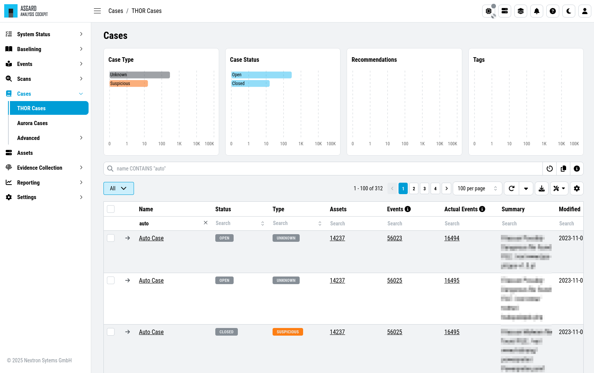
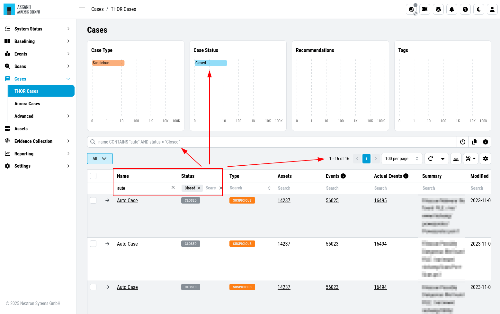
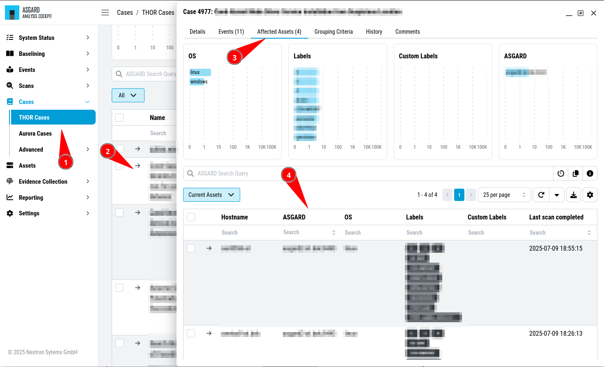
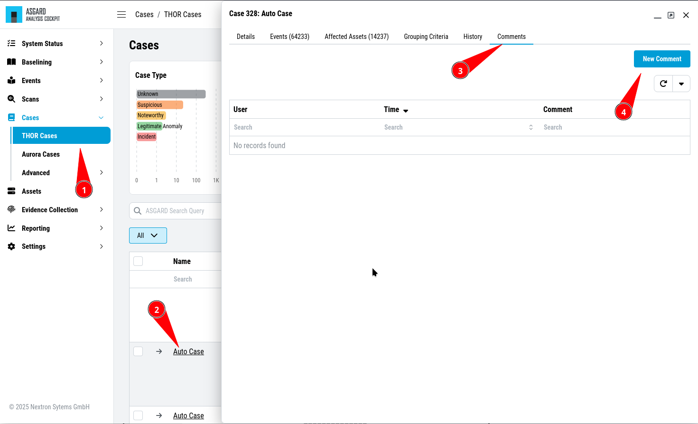

Case Management Best Practices
==============================

This section assumes, that a 2-Level model as described in
:ref:`usage/basic-concepts:Understanding Users, Roles, Rights and Case Status` is used.

The following actions will be explained:

-  Opening a case

-  Handing a case over to the next level

-  Closing a case

-  Reviewing the rules that add future logs to this case (Grouping
   Criteria)

Open a Case for Editing
-----------------------

The picture below shows the Case Management view with cases that have
been created with the ``Auto Case`` feature. You can see those cases
by filtering the ``Name`` column to only contain the ``Auto Case``
value and the ``Status`` column to only contain the ``Open`` value.

   Opening a Case for editing

In our example a Level 1 Analyst would now pick one of these open cases
and set the Status to "Level 1 Working". To do this, they would open
the case by clicking on the magnifier button and modify the status
to ``Level 1 Working`` and then click ``Update``.

.. figure:: ../images/cockpit_update_case_status_l1.png
   :alt: Change Status

   Change Status

Now the logs within the case can be analyzed and results can be
documented in the assessment field. Recommendations can be set from the
canned recommendations list. Columns can be faded in and out and
comments can be added.

Case Dispatching
----------------

Let's assume, our Level 1 Analyst concludes, that this is a "Legitimate Anomaly". 
They will now set the status to "Level 1 Finished" and update
the case. After setting the case to "Level 1 Finished" the case becomes
visible to the Level 2 Analyst.

Closing a Case
--------------

Let's assume, that a Level 2 Analyst now picks one of the cases in
status "Level 1 Finished" and starts working on this case.

In this respect we assume, that something suspicious has been found,
that needs further analysis by the system administration team. In most
organizations this will be controlled through the organization's action
request or ticketing system. So, we assume, that we will close the case
in the Analysis Cockpit as it is progressed in another system. Thus, the
status is changed to closed and the case gets updated.

   Closing a Case

.. note::
  The Analysis Cockpit provides interfacing to action-request and
  external ticketing systems using the API.

Generate and Review auto\_case\_ids
-----------------------------------

These auto\_case\_ids can be reviewed in the ``Grouping Criteria`` section
of the case.

   Reviewing Grouping Criteria

In our example, three auto\_case\_ids were added that match all 1,000
log lines. In the future all incoming logs, that match one of the three
“Detailed Reasons” will be added to this case directly and will not show
up in the Log Management section.

Limitations
^^^^^^^^^^^

There are limitations to the visibility of grouping criteria. Grouping
Criteria are only calculated for Alerts and Warnings. For all other
types of logs (Notices, Info, Error) auto\_case\_ids are not calculated,
so every log line gets its own highly specific filter that matches future
occurrences of exactly the same log line but will not do any kind of
generic matching. These highly specific filters are not displayed in the
case for simplicities sake.

In rare cases the Analysis Cockpit will find it difficult to calculate
auto\_case\_ids even for Alerts and Warnings. These logs will get tagged
with ``optimized\_template=false``. In this case, the behavior is like for
Notices, Info and Error messages. Grouping Criteria will not show up as
it will be one highly specific filter per log line.

More Information about Cases
----------------------------

The ``Affected Assets`` tab of a case shows assets that have contributed at least
one log line to this case. In this example 5 assets are affected.
All of them have the same operating system "windows".

   Case – Assets Tab

In the ``Comments`` tab you can add comments and attachments
to this case. Attachments can be used to pass additional information to
members of the analysis team (e.g. memory dump for further analysis).

   Case – Comments

The ``Changes`` tab shows information about changes to this case.

In other words: This is your case audit log.

   Case – Changes tab

Bulk Edit / Bulk Delete
-----------------------

The Analysis Cockpit features a convenient way to make certain changes
to groups of cases. Just select the case in the left column and click
the ``Edit Cases`` or ``Delete Cases`` button.

.. figure:: ../images/cockpit_bulk_edit_cases.png
   :alt: Bulk Edit

   Bulk Edit

