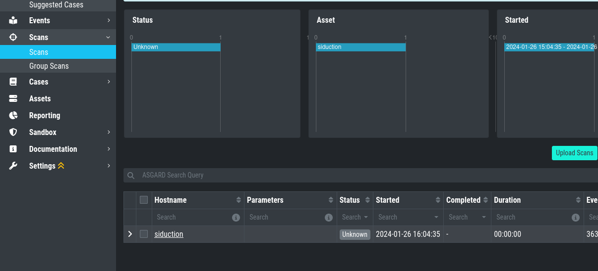

Known Issues
============

AAC#006: Scan stuck at Status "Unknown"
---------------------------------------

.. list-table::
    :header-rows: 1
    :widths: 50, 50

    * - Introduced Version
      - Fixed Version
    * - <= 3.10.1
      - 3.10.3

There is currently a bug in the Analysis Cockpit
which prevents some Scans from being imported correctly.

This is caused by very big events (a single event bigger
than 64 Kb), which will cause the parser to error. The
Analysis Cockpit can never finish importing this Scan.

AAC#006: Check
~~~~~~~~~~~~~~

You can check if one of your scan logs is effected
if the following conditions are met:

You will see a scan which has the Status ``Unknown``

When you connect to your Analysis Cockpit via SSH
and enter a root session, you can execute the following
command to see if the error occured on one or more
log files:

.. code-block:: console

    root@analysis:# grep -R "ERROR: bufio.Scanner: token too long" /var/lib/nextron/analysiscockpit3/log
    Jan 26 16:18:49 analysis analysiscockpit4[29459]: 2024-01-26T15:18:49Z [ERR] could not read events from file PATH: /var/lib/nextron/analysiscockpi3/events/upload_siduction_thor_2024-01-06.txt ERROR: bufio.Scanner: token too long

You should see from the above output which log had
problems, which should also be reflected in the filename:

.. code-block:: console

    root@analysis:# ls /var/lib/nextron/analysiscockpit3/events
    /upload_siduction_thor_2024-01-06.txt.problem

The file has the ``.problem`` suffix, which indicates
a problem during the import.

If you encounter this problem with one or more scan
files, update your system and re-import the scans.

You can either uplopad the manually, or rename them
by removing the ``.problem`` suffix in the end. They
should then get correctly imported.

AAC#005: Could not get table data: Data too large
-------------------------------------------------

This issue is related to ElasticSearch, which stores
your Analysis Cockpit's events. Elasticsearch calculates
the required RAM for operations before executing them.

The below error might occur on complex searches or aggregations
(e.g. for the graphs in the baselining view). To fix this issue,
you have to increase the RAM of your Analysis Cockpit and reconfigure
ElasticSearch to actually use more RAM.

AAC#005: Fix
~~~~~~~~~~~~

To actually fix the problem, you have to allocate more RAM
to your Analysis Cockpit. You should be able to do this
via your hypervisor.

To increase heap space for ElasticSearch, edit the following
configuration file on your Analysis Cockpit:

.. code-block:: console

    nextron@cockpit:~$ sudoedit /etc/elasticsearch/jvm.options.d/10-cockpit.options

You should see the following default values:

.. code-block:: none

    -Xms2g
    -Xmx2g

- Xms represents the initial size of total heap space
- Xmx represents the maximum size of total heap space

The ``2g`` part of the values indicates the heap space in gigabytes.
We advise to use 50% of your system's memory for ElasticSearch. On a
system with a maximum of 8 GB of RAM, this would be ``4g``:

.. code-block:: console

    -Xms4g
    -Xmx4g

After you saved your changes, restart the elasticsearch service (this
could take a few seconds!):

.. code-block:: console

    nextron@cockpit:~$ sudo systemctl restart elasticsearch.service

Make sure the service is in ``active (running)`` state after you
restarted it:

.. code-block:: console

    nextron@cockpit:~$ sudo systemctl status elasticsearch.service

AAC#004: Multiple Sandbox Issues
--------------------------------

.. list-table::
    :header-rows: 1
    :widths: 50, 50

    * - Introduced Version
      - Fixed Version
    * - <= 3.7.8
      - 3.8.2

There are currently three issues with the sandbox integration:

1. Wrong python script ``capev2.py``
2. Reports can't be downloaded
3. Files coming from the Bifrost Quarantine have no Name ``(missing)``

Those issues will be fixed with the next release.

AAC#004: Workarounds
~~~~~~~~~~~~~~~~~~~~

1. To fix the ``capev2.py`` file, contact support. We can provide you with the correct file
2. No workaround - upgrade needed
3. No workaround - upgrade needed

AAC#003: Case Management - onDelete is not defined
--------------------------------------------------

.. list-table::
    :header-rows: 1
    :widths: 50, 50

    * - Introduced Version
      - Fixed Version
    * - 3.7.4
      - 3.8.2

Version 3.7.4 of the Analysis Cockpit introduced a bug, which occurs when
trying to edit ``Access rights for Case Status`` in the **Case Management**
settings. The following error appears along with a visual bug on the right
side of your browser window which says "**Retry**":

.. error::
   Error: Something went wrong

   onDelete is not defined

There is currently no workaround for this bug, you need to upgrade to
version **3.8.2 or higher** to fix this.

AAC#002: Context Deadline Exceeded
----------------------------------

.. list-table::
    :header-rows: 1
    :widths: 50, 50

    * - Introduced Version
      - Fixed Version
    * - N/A
      - Ongoing

When debugging GRPC connectivity issues between your components (for example Management
Center to Analysis Cockpit), you might encounter an error similar to the following one:

.. code-block:: json
   :linenos:
   :emphasize-lines: 9

   {
    "LEVEL":"Warning",
    "MESSAGE":"could not dial grpc",
    "MODULE":"api",
    "REQUEST_IP":"172.16.30.20",
    "TIME":"2023-03-06T12:35:37Z",
    "USER":"admin",
    "error":"context deadline exceeded",
    "host":"cockpit3.domain.local:7443"
   }

AAC#002: Workaround
~~~~~~~~~~~~~~~~~~~

There is no workaround for this type of error. The error usually occurs because
one of the following things are preventing proper communication between your
components:

* Firewall is using TLS Inspection
* Proxy is using TLS Inspection
* DNS Issues

.. note::
  Your components expect specific certificates from each other when communicating.
  If a device is trying to inspect TLS traffic, the certificate will change and
  you receive the above error.

To help you figuring out what is causing the problem, you can try the following.
You can use openssl on your source system to see which certificate is presented
by the destination host (change the host and port values as needed)

.. code-block:: console
  :emphasize-lines: 3, 6

  nextron@asgard2:~$ openssl s_client -host cockpit3.domain.local -port 7443
  CONNECTED(00000005)                        
  depth=0 O = Nextron Systems GmbH, CN = cockpit3.domain.local
  verify error:num=20:unable to get local issuer certificate
  verify return:1
  depth=0 O = Nextron Systems GmbH, CN = cockpit3.domain.local
  verify error:num=21:unable to verify the first certificate
  verify return:1
  write W BLOCK
  ---               
  Certificate chain      
   0 s:O = Nextron Systems GmbH, CN = cockpit3.domain.local
     i:O = Nextron Systems GmbH, CN = Analysis Cockpit 3
  ---         
  Server certificate     
  -----BEGIN CERTIFICATE-----

The marked lines show you the certificate which is presented by the destination
host. If this certificate is different from the one you installed, then the problem
might be a device trying to do TLS Inspection.

We are currently working on improving the presented error message, to give
a better understanding what might be the issue at hand.

AAC#001: Nested LDAP Groups not working
---------------------------------------

.. list-table::
    :header-rows: 1
    :widths: 50, 50
    
    * - Introduced Version
      - Fixed Version
    * - 3.0.0
      - Open

Using nested groups in your LDAP/AD will result in no users because the query will fail.

AAC#001: Workaround
~~~~~~~~~~~~~~~~~~~

Change your LDAP GroupFilter to the following:

.. code-block:: none
    
    (&(objectCategory=group)(objectClass=group)(member:1.2.840.113556.1.4.1941:=%s))
