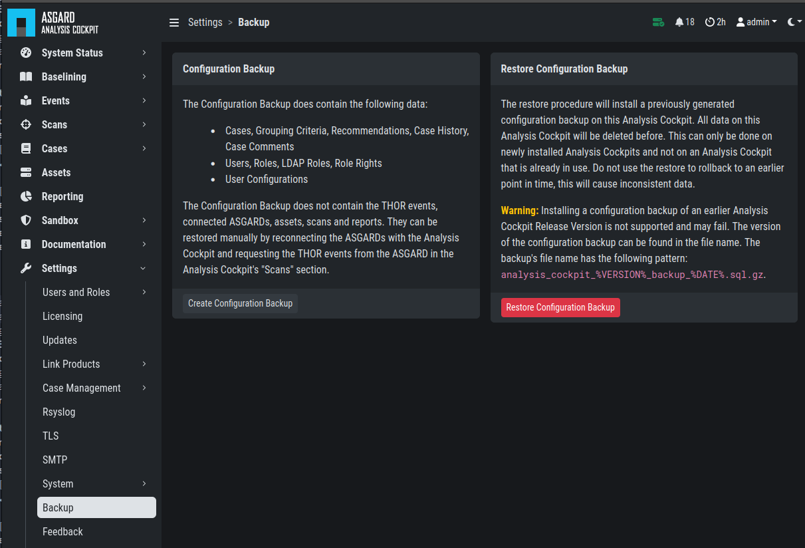
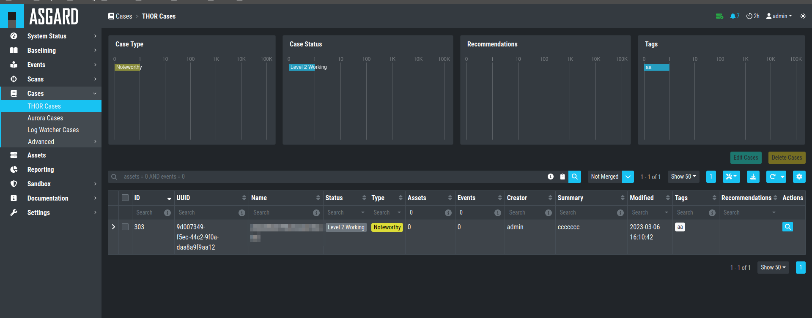

Maintenance
===========

Configuration Backup & Restore
------------------------------

The Analysis Cockpit comes with a backup and restore function
for its configuration. The Configuration Backup contains the
following data:

- Cases, Grouping Criteria, Recommendations, Case Changes, Case Comments
- Users, Roles, LDAP Roles, Role Rights
- User Configurations

To perform a backup, you can simply go to ``Settings`` > ``Backup``
and click ``Create Configuration Backup``. To restore from an old backup,
it is important to understand the implications of the restore. From the
Backup page of the Analysis Cockpit:

    The restore procedure will install a previously generated configuration
    backup on this Analysis Cockpit. All data on this Analysis Cockpit will
    be deleted before. This can only be done on newly installed Analysis Cockpits
    and not on an Analysis Cockpit that is already in use. Do not use the restore
    to rollback to an earlier point in time, this will cause inconsistent data.

    .. warning::
        Installing a configuration backup of an earlier Analysis Cockpit Release
        Version is not supported and may fail. The currently installed version is
        3.5.6. The version of the configuration backup can be found in the file name.
        The backup's file name has the following pattern: ``analysis_cockpit_%VERSION%_backup_%DATE%.sql.gz``

   Configuration Backup & Restore

Regain Disk Space
-----------------

If your disk is already at or close to 100% and AC no longer works properly, see section
:ref:`usage/typical-pitfalls:Recover from a Full Disk`.

If your disk usage is growing too fast and free disk space is running out, you have several options:

1. Increase the size of your disk
2. Delete files that are not needed for operation
3. Delete files that are used by AC but are unneeded / dated

Safe-to-Delete Files
^^^^^^^^^^^^^^^^^^^^

The following files are safe to delete. They are not needed for AC
to operate.

- ``/var/lib/nextron/analysiscockpit3/log/*.gz``
- ``/var/lib/nextron/analysiscockpit3/events/*.ok``

They are only kept on the system if needed for further processing.
E.g. saving/sending the log files to another system or keeping the
THOR scans (found in ``events``) for backup reasons. If you do
not need or plan to use those, they can be deleted. If you are unsure
make a copy to another system before deleting them.

More details can be found in section
:ref:`usage/typical-pitfalls:Recover from a Full Disk`.

Potentially Unneeded / Dated Files
^^^^^^^^^^^^^^^^^^^^^^^^^^^^^^^^^^^

This method is only advised as a last resort if increasing your disk space is not an option.

If your AC is running for a long time, there might be data ingested that you
no longer need and therefore can be deleted to regain disk space. This includes:

- Scans
- Reports

Deleting Unneeded Scans
~~~~~~~~~~~~~~~~~~~~~~~

.. warning::
    
    Deleting old scans deletes information ASGARD Analysis Cockpit uses.

    As an example: If you delete a scan with which an asset was marked
    in an incident case, this connection is no longer made and the asset
    will be shown with 0 incident cases.

Therefore only delete scans you no longer need. This can be done under
``Scans`` > ``Scans`` by selecting the scans with check marks and 
clicking ``Delete Events``.

You can filter events for deletion with the time range picker in the
completed column and e.g. selecting only scans with 0 incident and 
0 suspicious cases. (Add columns using the ``Columns`` button). 

   Possible Filter for Selecting Scans for Deletion

Another possibility is searching for assets which are no longer
part of your infrastructure and deleting their scans.

Deleting Unneeded Reports
~~~~~~~~~~~~~~~~~~~~~~~~~

Old unneeded reports can be deleted via command line and are
found at ``/var/lib/nextron/analysiscockpit3/reports``.

.. note::
   The reports are still listed in the UI after removal,
   but a download attempt will fail.
