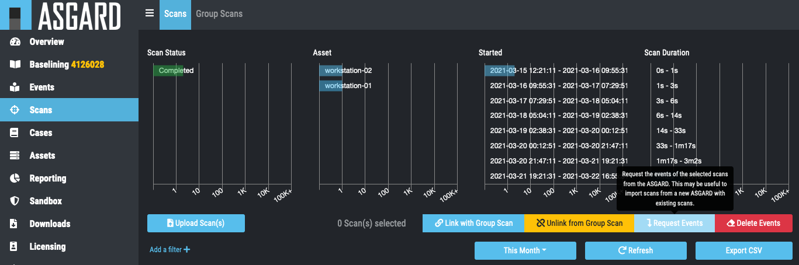

Migrate from Cockpit v2.8.x to Cockpit v3.x
-------------------------------------------

In order to migrate an old Cockpit Version 2.x to a newly installed
Cockpit 3.x proceed as follows

Make sure you have installed the latest updates.

On the command line of your Analysis Cockpit v2.x type:

.. code:: console
   
   nextron@cockpitv2:~$ sudo /etc/analysis-cockpit/ac2toac3 export -o export.ac2

This will create the output file export.ac2 that will contain the entire
Cockpit V2.x configuration including, users, rights, cases and case
content but it WILL NOT contain any logs.

Copy the file ``export.ac2`` to your newly installed Cockpit v3.x.

On the command line type of your Analysis Cockpit v3.x type:

.. code:: console
   
   nextron@cockpitv3:~$ sudo /etc/analysis-cockpit/ac2toac3 import -f export.ac2

This will import the entire Cockpit 2.x configuration into your Cockpit
V3.x.

Caution: This will overwrite your existing configuration.

Now your cockpit v3.x contains all v2.x configuration including all
users, roles and cases.

As the cases also contain all grouping criteria, group IDs and rules,
incoming logs will from now on be moved to the respective cases – just
like your cockpit V2.x would have done.

If you also require logs to be migrated from Cockpit v2.x to your new
Cockpit v3.x proceed as follows:

In ASGARD Management Center Version 2:

* Link your new Cockpit v3 to your ASGARD Management Center(s)

In Cockpit v3 navigate to ``Scans``.

* Select the Scans you want to import into Cockpit
* Click ``Request Events``

   Request Events from ASGARD Management Center 2.x

Events will show up in Analysis Cockpit shortly. Of course, this also
works for “Group Scans”.

ASGARD Management Center Version 1:

* On ASGARD navigate to /var/lib/bsk/asgard/log
* Copy and upload scan.log into Analysis Cockpit via web-based GUI (see
   below)

.. note::
   Scan.log rotates every month. Be sure to import older logs as needed.

To import old log data, see :ref:`usage/administration:Log File Import`.
