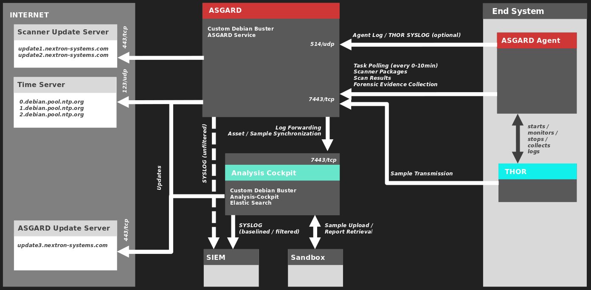

Requirements
============

Hardware Requirements
---------------------

There are a few things to consider, before you start with the
installation.

If you install on VMWare, the minimum requirements for the virtual
machine are as follows:

* System memory: 16 GB
* Hard disk: 200 GB
* CPU cores: 2

The disk size of 200 GB is fine in scenarios where you import only
Alerts and Warnings into the Cockpit, scan less than 1.000 systems on a
weekly basis and want to keep the logs for less than one year. If you
also import Notices and Info messages for these 1.000 servers, we
recommend a disk size of at least 500 GB.

For an Installation of up to 20.000 endpoints the following
specifications are recommended:

* System memory: 32 GB
* Hard disk: 2 TB SSD
* CPU cores: 4

Network Requirements
--------------------

The Analysis Cockpit and other systems which will have to communicate
with each other, need the following ports opened within the network.
For a detailed and up to date list of external connections to our update
and licensing servers, please visit https://www.nextron-systems.com/hosts/.

The Analysis Cockpit requires the following open ports (incoming).

From Management Workstation to Analysis Cockpit
^^^^^^^^^^^^^^^^^^^^^^^^^^^^^^^^^^^^^^^^^^^^^^^

.. list-table::
   :header-rows: 1
   :widths: 50, 50

   * - Description
     - Ports
   * - Administrative Web Interface
     - 443/tcp
   * - Command Line Access
     - 22/tcp

From Analyst Workstation to Analysis Cockpit
^^^^^^^^^^^^^^^^^^^^^^^^^^^^^^^^^^^^^^^^^^^^

.. list-table::
   :header-rows: 1
   :widths: 50, 50

   * - Description
     - Ports
   * - Administrative Web Interface
     - 443/tcp

From ASGARD Management Center to Analysis Cockpit
^^^^^^^^^^^^^^^^^^^^^^^^^^^^^^^^^^^^^^^^^^^^^^^^^

.. list-table::
   :header-rows: 1
   :widths: 50, 50

   * - Description
     - Ports
   * - Syslog Forwarding
     - 514/tcp, 514/udp
   * - Asset Synchronization
     - 7443/tcp

From Analysis Cockpit to SIEM (optional)
^^^^^^^^^^^^^^^^^^^^^^^^^^^^^^^^^^^^^^^^

.. list-table::
   :header-rows: 1
   :widths: 50, 50

   * - Description
     - Ports
   * - Syslog Forwarding
     - 514/tcp, 514/udp

From Analysis Cockpit to the Internet
^^^^^^^^^^^^^^^^^^^^^^^^^^^^^^^^^^^^^

The Analysis Cockpit is configured to retrieve updates from the
following URLs:

* Analysis Cockpit packages: https://update3.nextron-systems.com

A proxy system should be configured to allow access to these URLs
without TLS/SSL interception (Analysis Cockpit uses client-side SSL
certificates for authentication). It is possible to configure a proxy
server, username and password during the setup process of the Analysis
Cockpit platform. It only supports BASIC authentication, not NTLM
Authentication.

From Analysis Cockpit to Sandbox Systems (optional)
^^^^^^^^^^^^^^^^^^^^^^^^^^^^^^^^^^^^^^^^^^^^^^^^^^^

Depending on the Sandbox system and your individual configuration.

.. list-table::
   :header-rows: 1
   :widths: 50, 50

   * - Description
     - Ports
   * - Sandbox (typically)
     - 443/tcp, 8080/tcp

Time Synchronization
^^^^^^^^^^^^^^^^^^^^

Analysis Cockpit tries to reach the public Debian time servers by
default.

.. list-table::
   :header-rows: 1
   :widths: 50, 50

   * - Server
     - Port
   * - 0.debian.pool.ntp.org
     - 123/udp
   * - 1.debian.pool.ntp.org
     - 123/udp
   * - 2.debian.pool.ntp.org
     - 123/udp

The NTP server configuration can be changed in the settings.

DNS
^^^

Analysis Cockpit needs to be able to resolve internal and external IP addresses.

.. warning:: 
  Please make sure that you install your Analysis Cockpit with a
  ``domain name`` (see :ref:`usage/setup-guide:network configuration`).
  If you do not set the domain name and install the ASGARD package,
  you will have problems connecting your ASGARD(s) to the Analysis Cockpit.

  All components you install should have a proper domain name configured to avoid issues further during the configuration.

Internet Access during Installation
-----------------------------------

The Analysis Cockpit installer requires Internet access during the
setup. The installation process will fail if required packages cannot be
loaded from https://update3.nextron-systems.com

SSL/TLS Interception
^^^^^^^^^^^^^^^^^^^^

The installation and update processes do not accept an unknown but valid
SSL/TLS certificate presented by an intercepting entity and therefore
don't support SSL/TLS interception.

Since our products are usually used in possibly compromised
environments, the integrity of our software and update packages has
highest priority.

Verify the Downloaded ISO (Optional)
------------------------------------

You can do a quick hash check to verify that the download was not corrupted.
We recommend to verify the downloaded ISO's signature as this is the cryptographically sound method.

The hash and signature file are both part of the ZIP archive you download
from our `portal server <https://portal.nextron-systems.com>`__.

Via Hash
^^^^^^^^

Extract the ZIP and check the sha256 hash:

On Linux

   .. code-block:: bash

    $ sha256sum -c nextron-universal-installer.iso.sha256
    nextron-universal-installer.iso: OK

or in Windows command prompt

.. code-block:: bat

    C:\Users\user\Desktop\nextron-universal-installer>type nextron-universal-installer.iso.sha256
    efccb4df0a95aa8e562d42707cb5409b866bd5ae8071c4f05eec6a10778f354b  nextron-universal-installer.iso
    
    C:\Users\user\Desktop\nextron-universal-installer>certutil -hashfile nextron-universal-installer.iso SHA256
    SHA256 hash of nextron-universal-installer.iso:
    efccb4df0a95aa8e562d42707cb5409b866bd5ae8071c4f05eec6a10778f354b
    CertUtil: -hashfile command completed successfully.

or in Powershell

.. code-block:: powershell

    PS C:\Users\user\Desktop\nextron-universal-installer> type .\nextron-universal-installer.iso.sha256
    efccb4df0a95aa8e562d42707cb5409b866bd5ae8071c4f05eec6a10778f354b  nextron-universal-installer.iso
    PS C:\Users\user\Desktop\nextron-universal-installer> Get-FileHash .\nextron-universal-installer.iso
    
    Algorithm       Hash                                                                   Path
    ---------       ----                                                                   ----
    SHA256          EFCCB4DF0A95AA8E562D42707CB5409B866BD5AE8071C4F05EEC6A10778F354B       C:\Users\user\Desktop\asgard2-installer\nextron-universal-installer.iso

Via Signature (Recommended)
^^^^^^^^^^^^^^^^^^^^^^^^^^^

Extract the ZIP, `download the public signature <https://www.nextron-systems.com/certificates-and-keys>`__
and verify the signed ISO:

On Linux

.. code-block:: bash

    $ wget https://www.nextron-systems.com/certs/codesign.pem
    $ openssl dgst -sha256 -verify codesign.pem -signature nextron-universal-installer.iso.sig nextron-universal-installer.iso
    Verified OK

or in Powershell

.. code-block:: powershell

    C:\Users\user\Desktop\nextron-universal-installer> Invoke-WebRequest -Uri https://www.nextron-systems.com/certs/codesign.pem -OutFile codesign.pem
    C:\Users\user\Desktop\nextron-universal-installer>"C:\Program Files\OpenSSL-Win64\bin\openssl.exe" dgst -sha256 -verify codesign.pem -signature nextron-universal-installer.iso.sig nextron-universal-installer.iso
    Verified OK

.. note::

    If ``openssl`` is not present on your system you can easily install it using winget: ``winget install openssl``.

Other Optional Requirements
---------------------------

Usage of a Reverse Proxy
^^^^^^^^^^^^^^^^^^^^^^^^
If you are planing to make the Analysis Cockpit available through a
reverse proxy, see :ref:`usage/faqs:I am using a Reverse Proxy to access the Analysis Cockpit. What do I have to take care of?`.

Architecture
------------

The following image shows an architecture overview with all products and
their communication relationships.

	
   Full Architecture
