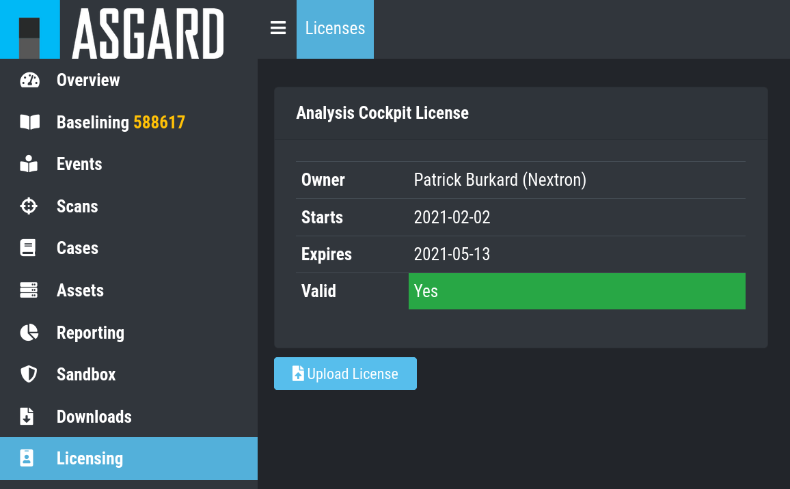
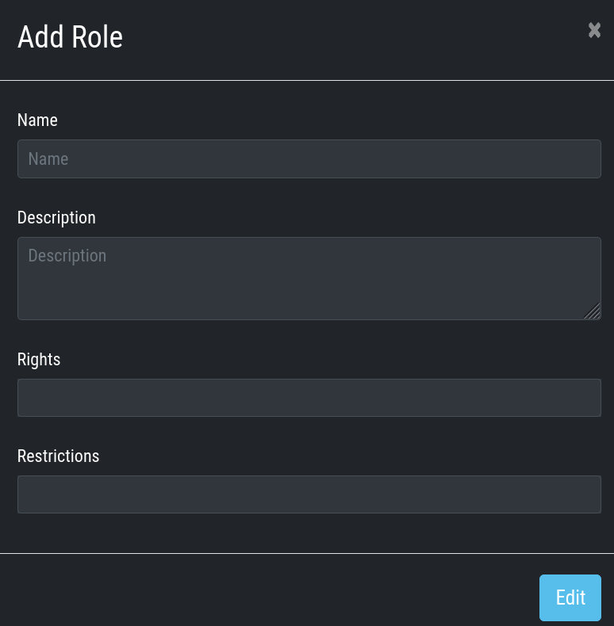
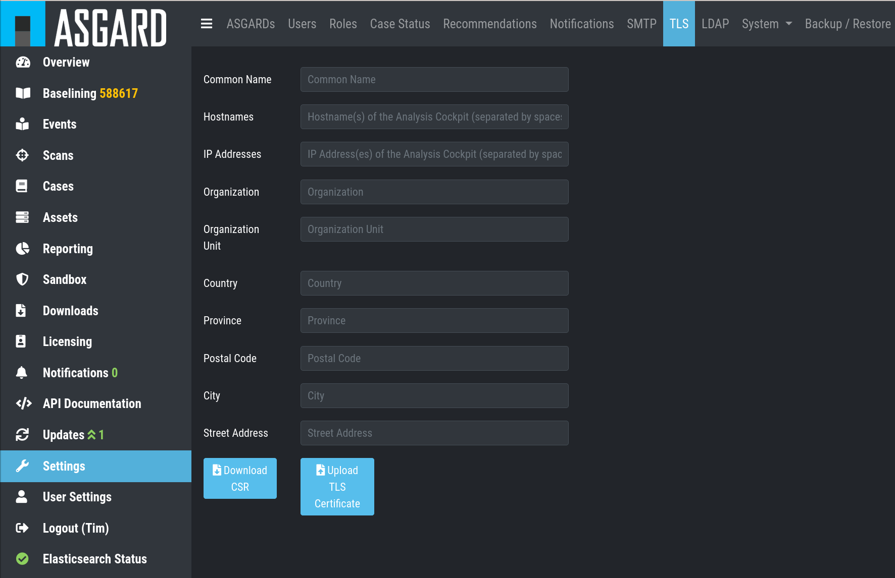
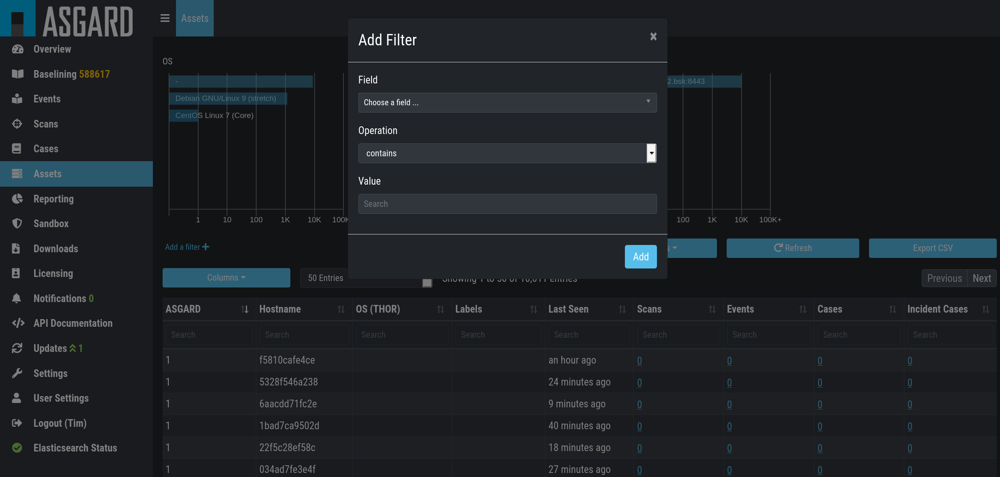

Setup
=====

This chapter assumes, that you have read the :doc:`chapter 6. Basic Concepts <./basic-concepts>`.

In order to configure the Analysis Cockpit for the first use, the
following steps need to be done:

* License installation
* System update
* Set users and set user rights
* Define canned responses
* Decide about syslog forwarding
* Integrate your log source

These steps are described in detail in the following sections.

License Installation
--------------------

Before you can use the cockpit, you must install a license. Navigate to
the Licensing section, click the ``Upload License`` Button, select your
license file and click the ``Upload`` Button.

   Licensing

System Update
-------------

All updates can be done from the Web GUI. Simply navigate to the Updates
section, review the release notes and click the update button. You can
also check for new updates by clicking the ``Check for Updates`` Button.

.. figure:: ../images/image37.png
   :target: ../_images/image37.png
   :alt: Updating the System

   Updating the System

Set Users and User Rights
-------------------------

:ref:`Chapter 6.3 Understanding Users, Roles, Rights and Case Status <usage/basic-concepts:Understanding Users, Roles, Rights and Case Status>` already
described how to set up a 2-level analyst model for working with cases.
The roles defined in that section are non-administrative roles, meaning
they are only allowed to access cases based on the respective status of
a ticket.

Additionally, roles can have the following rights:

* Administrator
* Universal
* View Notifications
* Acknowledge Notifications
* Upload Events
* Delete Events
* Upload File(s) for Sandbox Analysis
* Download File(s) for Sandbox Analysis

Roles can be granted these privileges by choosing them in the ``Add Role``
dialogue.

   Add Role

Configure Canned Recommendations
--------------------------------

Canned recommendations are predefined actions that can be used within a
case. The recommendations are fully configurable and are aimed to
facilitate choice making regarding the action that should be applied for
a specific case. There is no need to set this up, but we suggest doing
some planning and provide recommendations that are suitable for your
organization. Some recommendations such as “Verify Legitimacy”, “Provide
Sample File / Sample Directory”, “Run full Antivirus Scan” are already
generated by default. You are free to use, modify or delete them.
Recommendations can also be added by any user from within a case.

.. figure:: ../images/image39.png
   :target: ../_images/image39.png
   :alt: Settings - Recommendations

   Settings - Recommendations

Syslog Forwarding
-----------------

The Rsyslog Tab in the Settings section allows forwarding of all
incoming THOR events along with all audit logs and all other cockpit
related logs.

Please note, that forwarding THOR Logs through syslog might lead to a
certain loss of information as THOR events might exceed syslog length
restrictions.

.. figure:: ../images/image40.png
   :target: ../_images/image40.png
   :alt: Add Rsyslog Forwarding II 

   Add Rsyslog Forwarding II

Install a Certificate
---------------------

The TLS tab provides an easy-to-use interface for downloading a CSR and
uploading the TLS certificate.

   Download CSR and install TLS Certificate

Configure LDAP
--------------

The LDAP tab in the ``Settings`` section lets you configure an LDAP server
and define mappings for LDAP groups to roles within the Analysis
Cockpit.

The figures below illustrate options of a possible LDAP configuration.

.. figure:: ../images/image42.png
   :target: ../_images/image42.png
   :alt: Configure LDAP 

   Configure LDAP

Configure Notifications
-----------------------

As described in :ref:`chapter 6.2 Log Processing and Cases <usage/basic-concepts:Log Processing and Cases>` the cockpit is
able to forward logs to a SIEM system in case this particular logline
was added automatically to a case with the type “Incident”.

The ``Notifications`` tab allows you to define custom notifications for
event assignments (Event Assignment Notifications). It is recommended to
at least configure an Event Assignment Notification for events that get
added to existing Incident cases.

Additionally, notifications can be defined for changes to cases (Case
Change Notifications), so Level 2 analysts can get notified if a case
gets added to their in-queue (e.g., Finished Level 1).

The notification itself can be a syslog message or an email. In order to
use email for notifications you have to setup an email account in the
``Mail Account`` Tab. Additionally webhook support has been added to
facilitate interfacing to services like Slack.

.. figure:: ../images/image43.png
   :target: ../_images/image43.png
   :alt: Settings - Notifications

   Settings - Notifications

Please note:

The Analysis Cockpit will collect all triggering events and send only
one email every 15 minutes. Syslog and Webhooks are triggered in real
time for every single event.

Configure Event Assignment Notifications
^^^^^^^^^^^^^^^^^^^^^^^^^^^^^^^^^^^^^^^^

To configure log notifications, click the 
``Add Event Assignment Notification`` button in the Notifications Tab of the 
``Settings`` section.
This leads you to a form that allows you to set a name for your
notification, the notification type (syslog, email, webhook or
notification within the Analysis Cockpit) and the condition that will
trigger your notification.

.. figure:: ../images/image44.png
   :target: ../_images/image44.png
   :alt: Configure Log Notification 

   Configure Log Notification

Configure Case Change Notifications
^^^^^^^^^^^^^^^^^^^^^^^^^^^^^^^^^^^

To configure Case Change Notifications, click the 
``Add Case Change Notification`` button in the Notifications Tab of the 
``Settings`` section.
This leads you to a form that allows setting a name for your
notification, the notification type (syslog, email, webhook or
notification within the Analysis Cockpit) and the condition that will
trigger your notification.

.. figure:: ../images/image45.png
   :target: ../_images/image45.png
   :alt: Configure Case Change Notification 

   Configure Case Change Notification

Log File Import
---------------

Basic Concepts
^^^^^^^^^^^^^^

In general, all logs show up in the Events section. Additionally, all
Alerts and Warnings that are not matching a particular case will show up
in the ``Baselining`` section. Notices and informational events will NOT
show up in the Baselining Section as they match the predefined default
cases for these events.

All logs are tagged with a specific scan id – regardless of how the log
was integrated. This enables filtering down to all logs contained in a
specific scan.

If ASGARD Management Center is connected and the events was generated as
part of a group scan the event is also tagged with this particular group
scan id. This allows for filtering down to all logs a particular group
scan.

Assets are identified through the asset ID that was issued by ASGARD
Management Center during the setup of the ASGARD Agent. If this ID is
not available to the Analysis Cockpit (e.g. log has been uploaded
manually or sent through syslog) the hostname (NOT the FQDN) will be
used instead.

Direct Integration with ASGARD Management Center
^^^^^^^^^^^^^^^^^^^^^^^^^^^^^^^^^^^^^^^^^^^^^^^^

If the Analysis Cockpit is linked to one or more ASGARD Management
Centers all THOR logs get integrated automatically and will show up in
the Baselining and/or the Events section.

Connect the Analysis Cockpit with an ASGARD server in ``Settings`` >
``ASGARDs``.

You can retrieve old scans performed by ASGARD Management Center before
connecting it to Analysis Cockpit using the ``Request Events`` button in
the ``Scans`` section.

``Scans`` > ``Select Scans`` > ``Request Events``

Syslog Input
^^^^^^^^^^^^

Another way to import log data is by using SYSLOG messages.

The ANALYSYS COCKPIT listens on port 514/udp and 514/tcp for incoming
log data and all logs will show up in the Baselining and/or the Events
section.

Incoming syslog messages get assigned to single scan using the “ScanID”
value that’s unique in each scan.

File Import Through Web-Based GUI
^^^^^^^^^^^^^^^^^^^^^^^^^^^^^^^^^

Alternatively, logs can be uploaded through the web-based interface by
selecting the particular logfile (must be the .txt format, html import
is not supported) and clicking the ``Upload Scans`` button within the
Scans section.

``Scans`` > ``Upload Scans``

.. figure:: ../images/image46.png
   :target: ../_images/image46.png
   :alt: Upload logs using the web-based interface 

   Upload logs using the web-based interface

After a successful upload, the scans should appear in the list below.

Important: if you can see events in the ``Events`` or ``Baselining`` views,
please make sure that you’ve selected the correct time frame to see the
events. Often manually uploaded scans happened days or weeks before the
upload. The log data gets indexed with the time stamp of their creation
and not the import and can therefore be hidden in the default view

After the upload, you’re able to link the recently uploaded scans with
an existing or new group scan.

.. figure:: ../images/image47.png
   :target: ../_images/image47.png
   :alt: Link scans with an existing or new group scan

   Link scans with an existing or new group scan

File Import Using the Command Line
^^^^^^^^^^^^^^^^^^^^^^^^^^^^^^^^^^

This option can be helpful in an environment where you scan without
ASGARD Management Center but want to automate analysis by dropping the
log data into that import directory.

Log files can be imported by placing the files in the following
directory:

**/var/lib/nextron/analysiscockpit3/events**

Make sure that the file owner of these files is set to **cockpit**.

You can change the owner and group manually by using:

.. code:: bash
   
   sudo chown cockpit:cockpit <file>

Successfully imported files get a new extension named “\ **.ok**\ ”.

When the file is moved to that folder with the wrong permissions,
Analysis Cockpit tries to handle these situations in appropriate ways.
If Analysis cockpit had read access but no rights to
write/delete/rotate/rename the file, the file gets blacklisted in memory
and will not be imported as long as the service doesn’t get restarted. A
restart of the service would cause the service to reindex the log data
placed in that folder.

Important: We highly recommend not to directly copy (scp, rsync) files
into that folder but use a staging folder in which you set the right
permissions and then copy the files to the import folder.

Copying files directly to that folder has many problematic side effects,
e.g. files partly composed of binary zeros because the file transfer is
still in progress.

Connect to ASGARD Management Center
-----------------------------------

In order to receive log data from ASGARD Management Center systems, add
them in the corresponding section in the system settings.

``Settings`` > ``ASGARDs`` > ``Connect ASGARD``

After that all assets along with additional information from ASGARD will
show up in the ``Assets`` section.

.. figure:: ../images/image48.png
   :target: ../_images/image48.png
   :alt: Asset View after a Successful Connection

   Asset View after a Successful Connection

Asset View
----------

In most cases working with the ``Baselining`` section and the ``Cases`` section
can be seen as the best practice approach for setting baselines and
dealing with alerts and warnings.

However, in some cases it makes sense to change perspective and rather
go for a host centric approach. The Analysis Cockpit will calculate
numbers of lines in different case types (Incident, Suspicious, Anomaly,
etc.) on a per host basis for a given timeframe. Along with information
from ASGARD on last scan dates, labels, host availability etc. this
gives an entirely different perspective.

By using the “Asset View” you can e.g., easily answer questions like:

-  Which systems appear most often in “Incident” cases?

-  Which systems haven’t reported a single event for more than a month?

-  Which Domain Controllers have not been scanned yet?

-  Which systems with IP addresses starting “192.168.” appear in
   “Incident” cases?

In combination with the “labels” that integrate from ASGARD you can even
narrow down the events by system group (e.g., Domain Controllers, or
certain locations).

   Filtering within the Assets view
